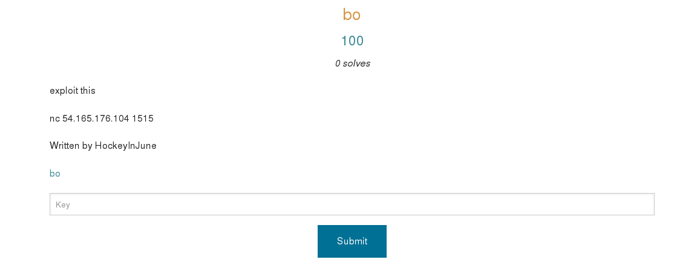
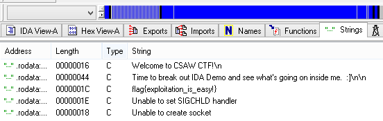

## CSAW CTF 2014
# Exploit 100 : bo

You are provided a executable file

> file bo

> bo: ELF 32-bit LSB executable, Intel 80386, version 1 (SYSV), dynamically linked (uses shared libs), for GNU/Linux 2.6.24, BuildID[sha1]=0x2e3f8e69d13dd81d59ea63c9193dadcd8c8c73aa, not stripped

I threw it into IDA PRO and the flag is immediately viewable in the "strings" panel

Flag is **flag{exploitation_is_easy!}**