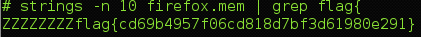

## CSAW CTF 2014
# Forensics 100 : Dumpster Diving

![question]{img/qn.png}

You are provided with zip file which contains what seems like a core dump of a firefox process

The easiest solution is to run strings and grep for "flag{" on the dump file

> strings -n 10 firefox.mem | grep flag{

Flag is **flag{cd69b4957f06cd818d7bf3d61980e291}**
