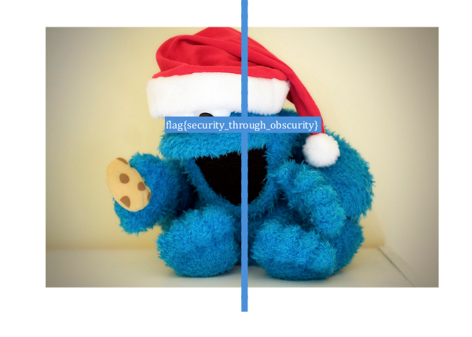

## CSAW CTF 2014
# Forensics 200 : obscurity

![question]{img/qn.png}

You are provided with a pdf file

At first I tried analyzing this file with various pdf tools. However, the solution is extremely simple.

Open up the pdf file in your pdf viewer. I used "Adobe Document Viewer" which is the default viewer on Kali Linux.

Just do a "select all" (CTRL + A) and you will see the flag

Flag is **flag{security_through_obscurity}**