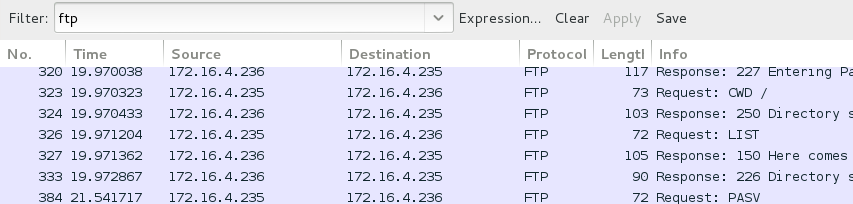
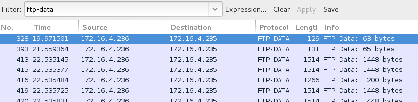
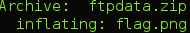

## CSAW CTF 2014
# Forensics 200 : why not sftp?

You are provided with zip file which contains a pcap file

The question itself is a clue, there is a FTP connection within the pcap file

Search for "ftp" in the wireshark filter will bring up this connection. At the end of this connection a data transfer is initiated

In order to see what is sent in the transfer, search for "ftp-data" in wireshark filter. Follow the stream and you should notice its a zip file (with the "PK" header)

Save the stream as a zip file and open it. It contains a image called "flag.png"

Opening it will show the flag

Flag is **flag{91e02cd2b8621d0c05197f645668c5c4}**
