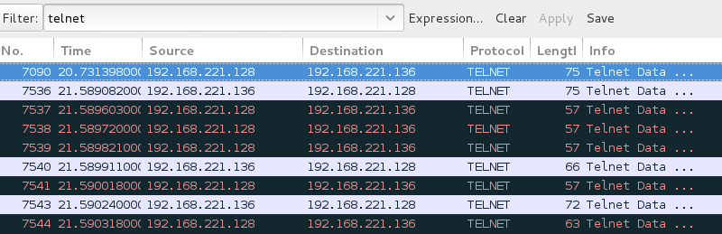
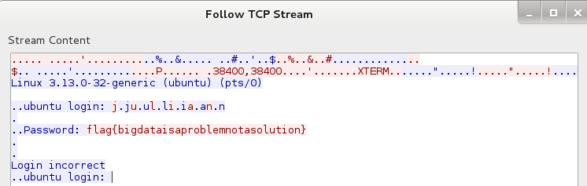

## CSAW CTF 2014
# Networking 100 : Big Data

![question]{img/qn.png}

You are provided with a huge pcap file

Most of the traffic is not relevant to the challenge. Hidden within all these traffic is a telnet connection.

Use the "telnet" filter in Wireshark and you will see the telnet connection. 

Follow the stream and you will get the flag

Flag is **flag{bigdataisaproblemnotasolution}**
