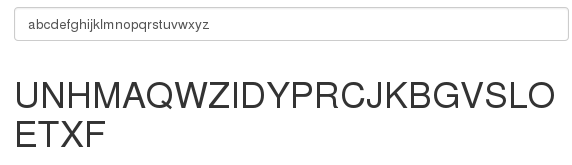

## CSAW CTF 2015
# Crypto 100 : notesy

You are presented with a web application that performs what seems like a substituion cipher

To be honest, in the beginning I have no idea what to do with it.

After the hints was released, it was very straight forward.

These are the hints released

> The flag is not in the flag{} format.

> If you have the ability to encrypt and decrypt, what do you think the flag is?

The key!

> https://www.youtube.com/watch?v=68BjP5f0ccE

After watching the youtube video, it was pretty obvious what to do

For a substituion cipher, the key will be the substituion letters from A to Z

Enter "abcdefghijklmnopqrstuvwxyz" into the application and you will get the substition letters which is also the flag

Flag is **UNHMAQWZIDYPRCJKBGVSLOETXF**

PS : I still have no idea what was the point of this challenge and why it was worth more points that the crypto 50 challenges