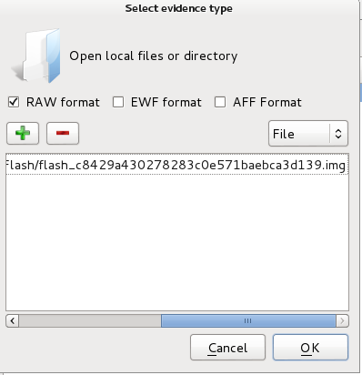
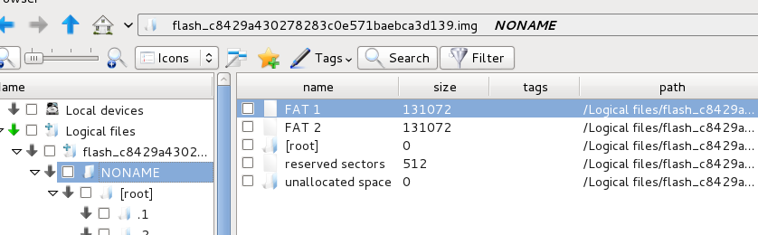
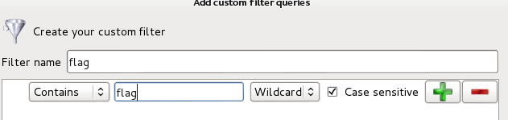
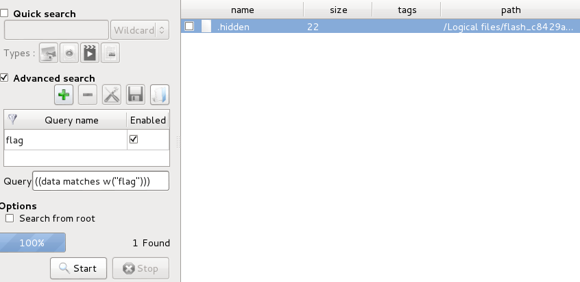
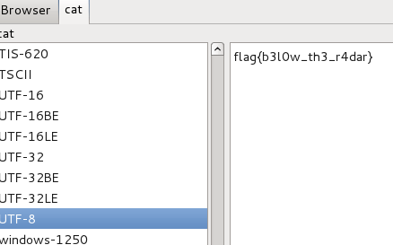

## CSAW CTF 2015
# Forensics 100 : Flash

You are provided with disk image file of presumbably a flash drive.

The image file is too huge to upload to Github, so heres a link [flash_c8429a430278283c0e571baebca3d139.img](https://ctf.isis.poly.edu/static/uploads/b37536034c6de156adf54c86ed61e566/flash_c8429a430278283c0e571baebca3d139.img)

Open the image file with your preferred forensic suite. I'm using "dff gui" on Kali Linux.

Make sure you can browser the file system to ensure that the image is correctly loaded

"dff gui" has a handy search tool, let's use it to search for the string "flag"

First create the filter with the option "contains" and value "flag"

Activate the advanced search and select the filter that we have created.

Run it and there is only 1 result

Open the file to get the flag

Flag is **flag{b3l0w_th3_r4dar}**
