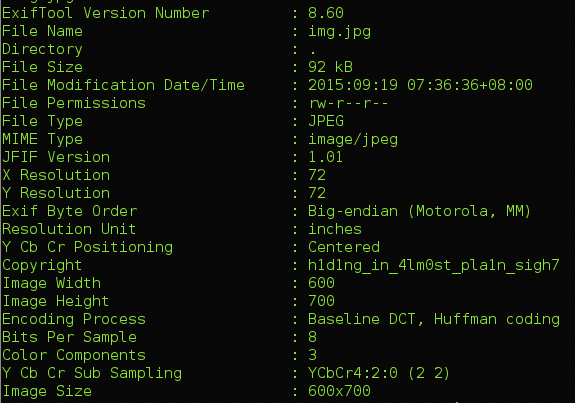

## CSAW CTF 2015
# Forensics 100 : Keep Calm N CTF

This is a straight-forward challenge

Just run exiftool on the image and you will be presented with the flag

Flag is **h1d1ng_in_4lm0st_pla1n_sigh7**
