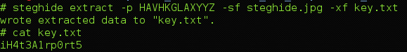

## CSAW CTF 2015
# Forensics 200 : Airport

You are provided with a zip file containing 5 images (4 images of airports and 1 steghide image)

The steghide image hints at the program "steghide" which is an image steganography tool

In order to recover the secret in the "steghidden" image, a pass phrase is required

My guess is the 4 airport images will provide some kind of a pass phrase to extract the secret from the steghide image.

So the first step is to identify these 4 airports.

The first 3 airports are very straight-forward. Just do a reverse image search on Google Image or TinyEye.

The last airport was little more tricky as the reverse image search did not surface any useful result. The image shows a highway "409". Using Google Maps (activate the satellite mode), I searched for "Highway 409". Following the highway eventually leads me to the Toronto Pearson Airport which is a match with the last image.

So the four airports are the following

1. Jose Marti International Airport 	(HAV)
2. Hong Kong International Airport		(HKG)
3. Los Angeles International Airport	(LAX)
4. Toronto Pearson Internation Airport	(YYZ)

After some trial and error, I found that the combination of the airport codes is the pass phrase

> HAVHKGLAXYYZ

Run steghide with the pass phrase to extract the secret

> steghide extract -p HAVHKGLAXYYZ -sf steghide.jpg -xf key.txt

Flag is **iH4t3A1rp0rt5**
