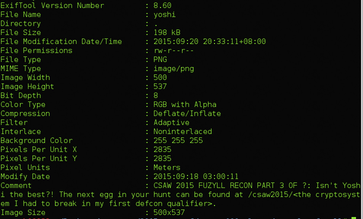

## CSAW CTF 2015
# Recon 100 : Alexander Taylor (fuzyll)

> http://fuzyll.com/csaw2015/start

> CSAW 2015 FUZYLL RECON PART 1 OF ?: Oh, good, you can use HTTP! The next part is at /csaw2015/\<the acronym for my university's hacking club\>.

Alexander Taylor studied in University of South Florida. Its hacking club is called Whitehatters Cyber Security Club (wcsc)

> http://fuzyll.com/csaw2015/wcsc

> CSAW 2015 FUZYLL RECON PART 2 OF ?: TmljZSB3b3JrISBUaGUgbmV4dCBwYXJ0IGlzIGF0IC9jc2F3MjAxNS88bXkgc3VwZXIgc21hc2ggYnJvdGhlcnMgbWFpbj4uCg==

Base64 decoding ([p2.php](p2.php)) that gives: 

> Nice work! The next part is at /csaw2015/\<my super smash brothers main\>.

Searching for "fuzyll smash" will lead u to http://smashboards.com/members/fuzyll.300464/#info which says that his main is yoshi

> http://fuzyll.com/csaw2015/yoshi

We have an image here. 


Running exiftool on it will give 



> CSAW 2015 FUZYLL RECON PART 3 OF ?: Isn't Yoshi the best?! The next egg in your hunt can be found at /csaw2015/\<the cryptosystem I had to break in my first defcon qualifier\>.

I got lucky on this as I just tried enigma and it worked

> http://fuzyll.com/csaw2015/enigma

>CSAW 2015 FUZYLL RECON PART 4 OF 5: Okay, okay. This isn't Engima, but the next location was "encrypted" with the JavaScript below: Pla$ja|p$wpkt$kj$}kqv$uqawp$mw>$+gwes6451+pla}[waa[ia[vkhhmj

```javascript
var s = "THIS IS THE INPUT"
var c = ""
for (i = 0; i < s.length; i++) {
    c += String.fromCharCode((s[i]).charCodeAt(0) ^ 0x4);
}
console.log(c);
```

This is just a simple xor encryption with the byte 4

The string can be decrypted ([p4.html](p4.html)) by xoring the "encrypted" string with byte 4 again

> The next stop on your quest is: /csaw2015/they_see_me_rollin

> http://fuzyll.com/csaw2015/they_see_me_rollin

> CSAW 2015 FUZYLL RECON PART 5 OF 5: Congratulations! Here's your flag{I_S3ARCH3D_HI6H_4ND_L0W_4ND_4LL_I_F0UND_W4S_TH1S_L0USY_FL4G}!

Flag is **flag{I_S3ARCH3D_HI6H_4ND_L0W_4ND_4LL_I_F0UND_W4S_TH1S_L0USY_FL4G}**
