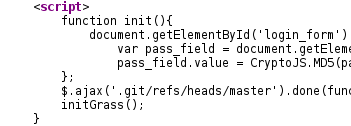
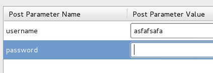
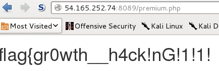

## CSAW CTF 2015
# Web 200 : Lawn Care Simulator

Website located at http://54.165.252.74:8089/

Viewing the source on the main page shows this little javascript snippet



Notice the path to a ".git" directory. This means a git repository is at this location. Lets try to clone it

> git clone http://54.165.252.74:8089/.git/

This will download most of the source code of the site

From here on, there are several ways to solve this challenge. I'll describe the easiest way.

Looking at the validate_pass function which is responsible for validating your username and password

```php
function validate($user, $pass) {
    require_once 'db.php';
    $link = mysql_connect($DB_HOST, $SQL_USER, $SQL_PASSWORD) or die('Could not connect: ' . mysql_error());
    mysql_select_db('users') or die("Mysql error");
    $user = mysql_real_escape_string($user);
    $query = "SELECT hash FROM users WHERE username='$user';";
    $result = mysql_query($query) or die('Query failed: ' . mysql_error());
    $line = mysql_fetch_row($result, MYSQL_ASSOC);
    $hash = $line['hash'];

    if (strlen($pass) != strlen($hash))
        return False;

    $index = 0;
    while($hash[$index]){
        if ($pass[$index] != $hash[$index])
            return false;
        # Protect against brute force attacks
        usleep(300000);
        $index+=1;
    }
    return true;
}
```

Imagine what would happen if a non-existent username is supplied to the query?

The "$line" variable will contain a empty result hence "$hash" will also be empty.

The authentication will pass if we supplied a empty password.

Thus, tamper the login request and provide a non-existant username with empty password and you will get the flag



 

Flag is **flag{gr0wth__h4ck!nG!1!1!}**

PS: 

One other way to solve is to use sign_up.php to find an existant username (just pass "%a%" into the username). After that, perform a timing attack to guess the hash (as there is a sleep call during the hash checking loop).

Another way highlighted by @\_jsoo\_ is to unpack a certain object in the .git folder which contains the password hash of the user. After that, perform a brute force attack on that hash to recover the password