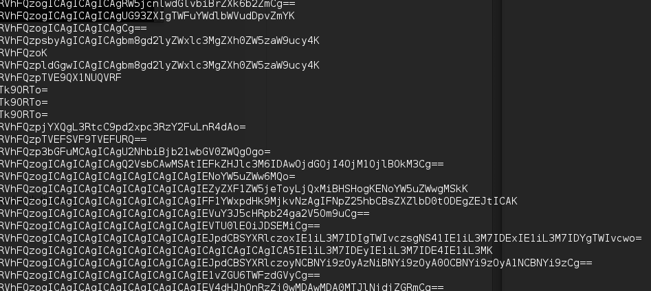
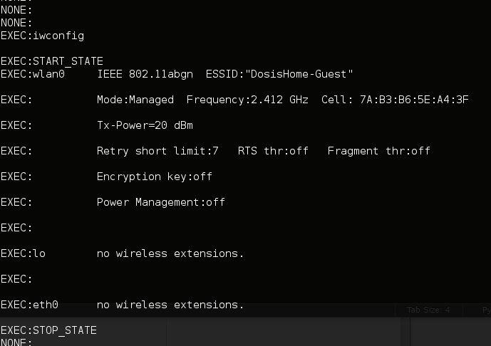
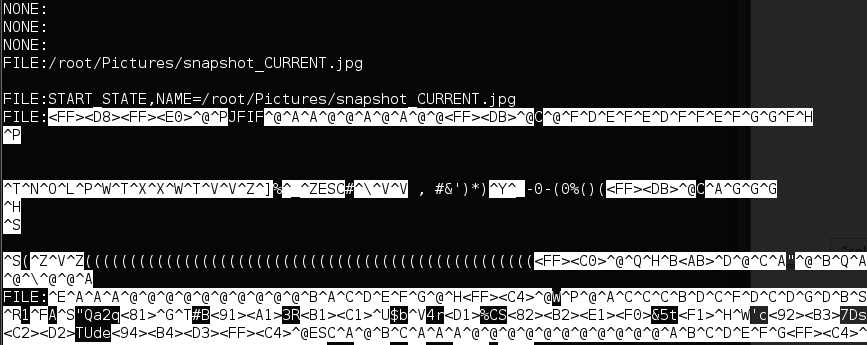

## Holiday Hack Challenge 2015
# Level 1 : Curious Packets

You are provided a [pcap](giyh-capture.pcap) file by Joshua Dosis and he asks you to find the text in the picture

Thus, the goal is to find an image and the flag will be the text in the image

The pcap file contains a bunch of broadcast packets and some very suspicious DNS packets

If you played the game, the hint given was to use [scapy](http://www.secdev.org/projects/scapy/) to comb through the file for DNS packets

The following script will comb through the pcap file and print out the contents of all the DNS response packets

```py
from scapy.all import *

pcap = 'giyh-capture.pcap'
pkts = rdpcap(pcap)

i = 0
for p in pkts:
	i = i+1
	if p.haslayer(DNSRR):
		data = p[DNSRR].rdata
		data = data[1:]
		print data
```



There seems to be a bunch of base64 encoded data in the DNS responses. Decode them!!





There seems to be a bunch of commands and response

Looking through it, there is 3 possible commands
- 'None' : Does Nothing
- 'EXEC' : Execute some command line command and returns the response
- 'FILE' : Transfers a file

The decoded data shows that a jpg is being transmitted through the 'FILE' command

Modify the [script](soln.py) to extract the image out

```py
from scapy.all import *
import base64

pcap = 'giyh-capture.pcap'
pkts = rdpcap(pcap)
myjpg = ''			# stores the output img
ignorecount = 2		# for ignoring the first 2 FILE packets

i = 0
for p in pkts:
	i = i+1
	if p.haslayer(DNSRR):
		data = p[DNSRR].rdata
		data = data[1:]
		plain = base64.b64decode(data)
		pos = plain.find(":")		# Remove the "XXXX: " from each packet
		cmd = plain[:pos]
		res = plain[pos+1:]
		
		if cmd == "FILE":
			if ignorecount > 0:		# Ignore the first 2 FILE packets as it 
				ignorecount -= 1	# contains the command itself and not the image data
			else:
				myjpg += res
		elif cmd == "EXEC":			# write 'EXEC' packets into a file
			efile = open('exec.txt', 'a')
			efile.write(res)
			efile.close()
		elif cmd == "NONE":
			a = 1					# Do nothing
		else :
			print "Unknown Command " + cmd

imgfile = open('res.jpg', 'w')		# Write the final jpg into a file
imgfile.write(myjpg)
imgfile.close()
```

This will give us the following image


Flag is **GnomeNET-NorthAmerica**

My answers to the Challenge Questions

1) Which commands are sent across the Gnome’s command-and-control channel?

> NONE, EXEC, FILE 

2) What image appears in the photo the Gnome sent across the channel from the Dosis home?

> An image of the kids' bedroom, taken from the perspective of the toy gnome (i guess)

Proceed to the next stage! :)