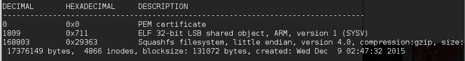
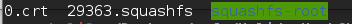
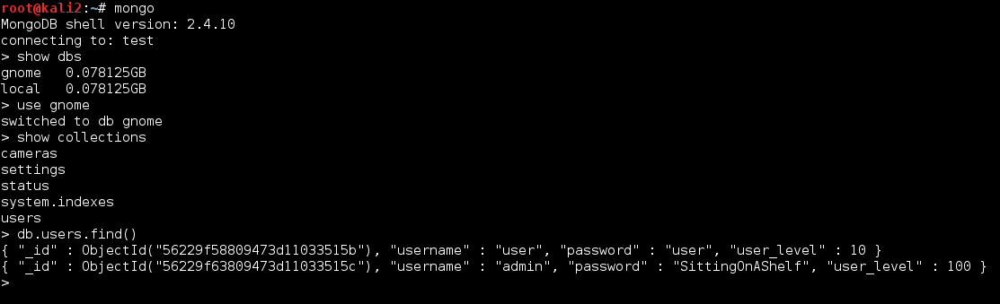

## Holiday Hack Challenge 2015
# Level 2 : Firmware Analysis

You are provided a [firmware dump](giyh-firmware-dump.bin) file by Jessica Dosis and she asks you to find a password from the filesystem

Thus, the goal here is to extract the filesystem and find the aforementioned password

If you played the game, the hints given was to use the tool [binwalk](http://binwalk.org/) to extract the filesystem and to explore the "init.d" folder for startup scripts

Use binwalk to look at the dump file

> binwalk giyh-firmware-dump.bin



The firmware uses the SquashFS filesystem. If you have squashfs-tools installed, you can use binwalk to directly extract the filesystem

If you are on Ubuntu or Kali, you can install squashfs-tools using apt-get

> sudo apt-get install squashfs-tools

Use binwalk to extract the filesystem

> binwalk -e giyh-firmware-dump.bin

The filesystem will be extracted into a folder



Due to its large size, I will not upload the filesystem here. You can extract it yourself using the [dump](giyh-firmware-dump.bin) file that is uploaded

Explore the filesystem and look for interesting files. Based on the hints, take a close look at all the startup scripts in /etc/init.d/ folder

Here's a few interesting files

**/etc/hosts** (The IP will be useful for the next level)

```
127.0.0.1 localhost

::1     localhost ip6-localhost ip6-loopback
ff02::1 ip6-allnodes
ff02::2 ip6-allrouters

# LOUISE: NorthAmerica build
52.2.229.189    supergnome1.atnascorp.com sg1.atnascorp.com supergnome.atnascorp.com sg.atnascorp.com
```

**/etc/init.d/sgstatd** (Interesting comments....)

```
#!/bin/sh /etc/rc.common
# BUGID: 570523-1
# OWNER: STUART
#  LOUISE: The sgstatd process fails to start on the Gnome hardware.
#  LOUISE: I rewrote the startup script, testing in DEV works fine. Closing ticket.
#  LOUISE changed status from OPEN to CLOSED
#  AUGGIE: Process still fails to startup, re-opening ticket.
#  AUGGIE changed status from CLOSED to OPEN
#  LOUISE: It works just find in DEV Auggie.
#  NEDFORD: Confirm process fails to startup, delegate to Stuart for resolution.
#  LOUISE: Status on this Stuart?
#  NEDFORD changed owner from LOUISE to STUART
#  NEDFORD: Can we get a status on this Stuart?
#  NEDFORD: Can we get a status on this Stuart?
#  LOUISE: Blocking on this ticket, we may have to ship without resolution.
START=98

PROG=/usr/bin/sgstatd

start_service() {
	$PROG &
}
stop_service() {
	killall sgstatd
}
```

**/www/routes/index.js** (Source code for the SuperGnome Web Application)

Reading the sources in **www** folder reveals that the web application is running off NodeJS framework

**/etc/banner** (Hmm it runs OpenWrt)

```
  _______                     ________        __
 |       |.-----.-----.-----.|  |  |  |.----.|  |_
 |   -   ||  _  |  -__|     ||  |  |  ||   _||   _|
 |_______||   __|_____|__|__||________||__|  |____|
          |__| W I R E L E S S   F R E E D O M
 -----------------------------------------------------
 DESIGNATED DRIVER (Bleeding Edge, r47650)
 -----------------------------------------------------
  * 2 oz. Orange Juice         Combine all juices in a
  * 2 oz. Pineapple Juice      tall glass filled with
  * 2 oz. Grapefruit Juice     ice, stir well.
  * 2 oz. Cranberry Juice
 -----------------------------------------------------
```

For this level, the important file is the mongodb startup script

**/etc/init.d/mongod**

```
#!/bin/sh /etc/rc.common
# OWNER: STUART
#  STUART: Startup MongoDB process before node; give Mongo a few seconds to start
#  AUGGIE: Function verified, ready for production.

START=97

PROG=/usr/bin/mongod
CONFIG=/etc/mongod.conf
PIDFILE=/var/run/mongod.pid

save_pid() {
	ps | grep $PROG | grep -v grep | awk '{print $1}' >$PIDFILE
}

start_service() {
	$PROG --config $CONFIG &
	sleep 10
	save_pid
}
stop_service() {
	killall mongod
}
```

From here, look at the config file stated in the scriot

**/etc/mongod.conf**

```
# LOUISE: No logging, YAY for /dev/null
# AUGGIE: Louise, stop being so excited to basic Unix functionality
# LOUISE: Auggie, stop trying to ruin my excitement!

systemLog:
  destination: file
  path: /dev/null
  logAppend: true
storage:
  dbPath: /opt/mongodb
net:
  bindIp: 127.0.0.1
```

The mongoDB file is stored at **/opt/mongodb**

Open the DB file using mongoDB

For Ubuntu or Kali users, you can install mongoDB using apt-get

> sudo apt-get install mongodb

Start the mongoDB server using the mongoDB files (replace the /your/path/to with your directory path)

> mongod --dbpath /your/path/to/opt/mongodb

Start another terminal and connect to your mongoDB server

> mongo

The mongoDB contains a "users" collection. Show it to get the needed password

```
> show dbs
> use gnome
> show collections
> db.users.find()
```



Flag is **SittingOnAShelf**

My answers to the Challenge Questions

3) What operating system and CPU type are used in the Gnome?  What type of web framework is the Gnome web interface built in?

> CPU: ARM Little Endian

> Operating System: OpenWrt (Bleeding Edge)

> Web Framework: Nodejs (Express) 

4) What kind of a database engine is used to support the Gnome web interface? What is the plaintext password stored in the Gnome database?

> Database Engine: MongoDB

> User Accounts in the Gnome Database are "user:user" and "admin:SittingOnAShelf"