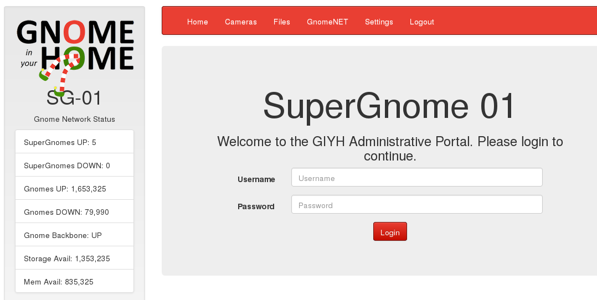
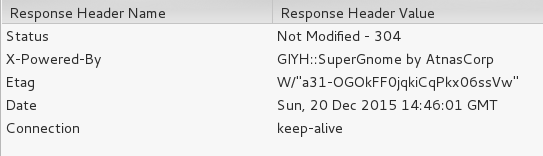
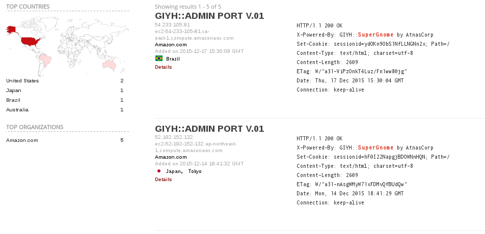
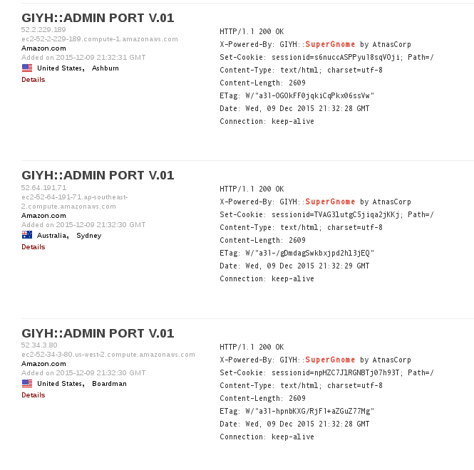

## Holiday Hack Challenge 2015
# Level 3 : Scavenger Hunt

You are now tasked to find all the SuperGnome servers on the Internet

The first clue lies in the **/etc/hosts** file

```
127.0.0.1 localhost

::1     localhost ip6-localhost ip6-loopback
ff02::1 ip6-allnodes
ff02::2 ip6-allrouters

# LOUISE: NorthAmerica build
52.2.229.189    supergnome1.atnascorp.com sg1.atnascorp.com supergnome.atnascorp.com sg.atnascorp.com
```

Checking with Tom Hessman in the game confirms that the IP '52.2.229.189' is in scope

Navigate to it and you will see the login screen for SG-01 server



Take a look at the response header from the website



The term 'SuperGnome' seems quite unique to be searchable from Shodan

Go to [Shodan](https://www.shodan.io/) and search using the term 'SuperGnome' and the 5 servers will be shown





Verifying these IPs with Tom Hessman in the game confirms that they are in scope

My answers to the Challenge Questions

5) What are the IP addresses of the five SuperGnomes scattered around the world, as verified by Tom Hessman in the Dosis neighborhood?

6) Where is each SuperGnome located geographically?

> SG-01 (52.2.229.189) 	[United States, Ashburn]

> SG-02 (52.34.3.80)		[United States, Boardman]

> SG-03 (52.64.191.71)	[Australia, Sydney]

> SG-04 (52.192.152.132)	[Japan, Tokyo]

> SG-05 (54.233.105.81)	[Brazil]
