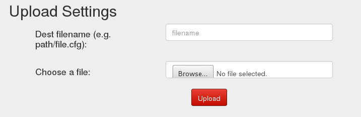
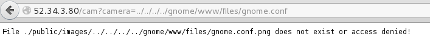
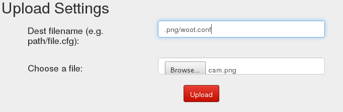
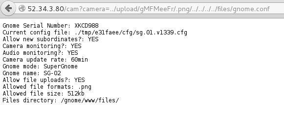

## Holiday Hack Challenge 2015
# Level 4-2 : Gnomage Pwnage (SG-02)

The goal for Level 4 is to get access to all 5 of the SuperGnome servers and download the **/gnome/www/files/gnome.conf** file from each of them

Login into SG-02 (52.34.3.80) using the admin credentials (admin:SittingOnAShelf)

This time around, the website is a little different
- File download has been disabled
- 'Settings' page now has an upload form



Some partial source code was in the filesystem dump in Level 2

Read the source code from **/www/routes/index.js** that handles the SettingsUpload

```js
// SETTINGS UPLOAD
router.post('/settings', function(req, res, next) {
  if (sessions[sessionid].logged_in === true && sessions[sessionid].user_level > 99) { // AUGGIE: settings upload allowed for admins (admins are 100, currently)
    var filen = req.body.filen;
    var dirname = '/gnome/www/public/upload/' + newdir() + '/' + filen;
    var msgs = [];
    var free = 0;
    disk.check('/', function(e, info) {
      free = info.free;
    });
    try {
      fs.mknewdir(dirname.substr(0,dirname.lastIndexOf('/')));
      msgs.push('Dir ' + dirname.substr(0,dirname.lastIndexOf('/')) + '/ created successfully!');
    } catch(e) {
      if (e.code != 'EEXIST')
	throw e;
    }
    if (free < 99999999999) { // AUGGIE: I think this is breaking uploads?  Stuart why did you set this so high?
      msgs.push('Insufficient space!  File creation error!');
    }
    res.msgs = msgs;
    next();
  } else
    res.render('index', { title: 'GIYH::ADMIN PORT V.01', session: sessions[sessionid], res: res });
});
```

The code basically takes the filepath provided in the 'filen' (which is the 'Dest filename' field in the form) parameter and creates all its parent directories. It does not actually upload the file. Therefore, this code can only create directories but there's no way to read/download the gnome.conf file from it.
The next interesting part of the code is in the Camera Viewer part

```js
// CAMERA VIEWER
// STUART: Note: to limit disclosure issues, this code checks to make sure the user asked for a .png file
router.get('/cam', function(req, res, next) {
  var camera = unescape(req.query.camera);
  // check for .png
  //if (camera.indexOf('.png') == -1) // STUART: Removing this...I think this is a better solution... right?
  camera = camera + '.png'; // add .png if its not found
  console.log("Cam:" + camera);
  fs.access('./public/images/' + camera, fs.F_OK | fs.R_OK, function(e) {
    if (e) {
	    res.end('File ./public/images/' + camera + ' does not exist or access denied!');
    }
  });
  fs.readFile('./public/images/' + camera, function (e, data) {
    res.end(data);
  });
});
```

The code takes the user input 'camera' parameter, append a '.png' to the end of it and tries to access the file **"./public/images/"+camera**

This look like a Local File Inclusion vulnerability. Let's try exploiting it!



As expected, it doesn't work as '.png' is appended to the end of the filepath

Take a closer look at the code, specifically on the following commented line

> //if (camera.indexOf('.png') == -1) // STUART: Removing this...I think this is a better solution... right?

> camera = camera + '.png'; // add .png if its not found

What if the current SG-02 server is running with a version of the code which includes this line. With this line included in the code, the '.png' will only be appended to the filepath if the filepath does not contain '.png' in any part of the path. Combining this with the previous Settings Upload capability, it is possible to create a '.png' folder and then use that folder as part of the path to our gnome.conf objective.

First, create the '.png' folder



The second paramter can be any random file as it is not processed at all


Take note of the filepath that is created. In my case it is '/gnome/www/public/upload/gMFMeeFr/.png/'

Looking at the Camera Viewer code again, the camera image path start in './public/images' which I guess is at '/gnome/www/public/images'

So, in order to reach gnome.conf in '/gnome/www/files/', the injection parameter should be '../upload/gMFMeeFr/.png/../../../../files/gnome.conf'



[SG02_gnome.conf](SG02_gnome.conf)

```
Gnome Serial Number: XKCD988
Current config file: ./tmp/e31faee/cfg/sg.01.v1339.cfg
Allow new subordinates?: YES
Camera monitoring?: YES
Audio monitoring?: YES
Camera update rate: 60min
Gnome mode: SuperGnome
Gnome name: SG-02
Allow file uploads?: YES
Allowed file formats: .png
Allowed file size: 512kb
Files directory: /gnome/www/files/
```

PS: Use the same method to download the factory_cam_2.zip and 20150225093040.zip for Level 5 too