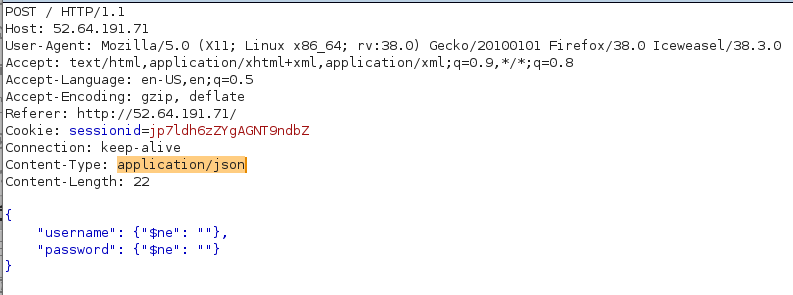
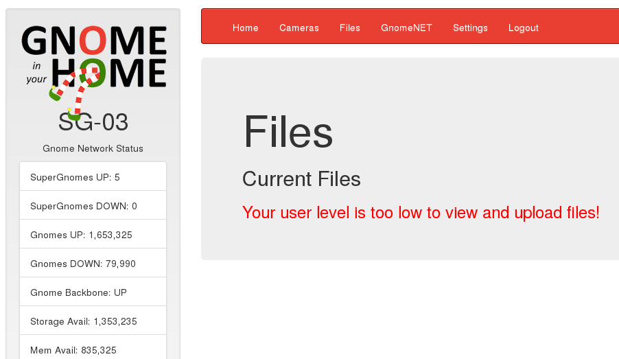
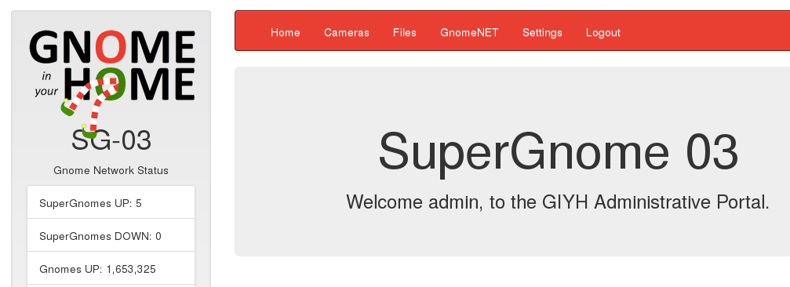

## Holiday Hack Challenge 2015
# Level 4-3 : Gnomage Pwnage (SG-03)

The goal for Level 4 is to get access to all 5 of the SuperGnome servers and download the **/gnome/www/files/gnome.conf** file from each of them

Try to login into SG-03 (52.64.191.71) using the admin credentials (admin:SittingOnAShelf)

This time around, the login failed.

Looks like we got to find some sort of authentication bypass vulnerability this time

Look at the "Login Post" portion of the source code in **/www/routes/index.js** 

```js
// LOGIN POST
router.post('/', function(req, res, next) {
  var db = req.db;
  var msgs = [];
  db.get('users').findOne({username: req.body.username, password: req.body.password}, function (err, user) { // STUART: Removed this in favor of below.  Really guys?
  //db.get('users').findOne({username: (req.body.username || "").toString(10), password: (req.body.password || "").toString(10)}, function (err, user) { // LOUISE: allow passwords longer than 10 chars
    if (err || !user) {
      console.log('Invalid username and password: ' + req.body.username + '/' + req.body.password);
      msgs.push('Invalid username or password!');
      res.msgs = msgs;
      res.render('index', { title: 'GIYH::ADMIN PORT V.01', session: sessions[req.cookies.sessionid], res: res });
    } else {
      sessionid = gen_session();
      sessions[sessionid] = { username: user.username, logged_in: true, user_level: user.user_level };
      console.log("User level:" + user.user_level);
      res.cookie('sessionid', sessionid);
      res.writeHead(301,{ Location: '/' });
      res.end();
    }
  });
});
```

The "username" (req.body.username) and "password" (req.body.password) parameters are used directly in a NoSQL query without any satisation. This means that it is vulnerable to NoSQL Injection

This [article](http://blog.websecurify.com/2014/08/hacking-nodejs-and-mongodb.html) describes how to perform basic NoSQL injection

The main idea is to change the "Content-Type" to "application/json" and the POST data to be in the format of a serialized JSON object. 



The "$ne" is a shorthand for NoSQL which will be evaluated as "Not Equal" comparison. In this case, it is equivalent to running the query **username != "" AND password != ""** in a MySQL query. This should return the first user account



However, this user account does not have access to the "Files" section. Let's try to get the admin account instead

Logout and try to login with the following injection (Remember to change the "Content-Type" to "application/json")


This injection is equivalent to running the query **username = "admin" AND password != ""**. The injection should work unless the admin's password is really empty ("")



Now, we are logged in as admin. Go to the "Files" section and download the gnome.conf file

[SG03_gnome.conf](SG03_gnome.conf)

```
Gnome Serial Number: THX1138
Current config file: ./tmp/e31faee/cfg/sg.01.v1339.cfg
Allow new subordinates?: YES
Camera monitoring?: YES
Audio monitoring?: YES
Camera update rate: 60min
Gnome mode: SuperGnome
Gnome name: SG-03
Allow file uploads?: YES
Allowed file formats: .png
Allowed file size: 512kb
Files directory: /gnome/www/files/
```

PS: Also download the factory_cam_3.zip and 20151201113356.zip for Level 5 too