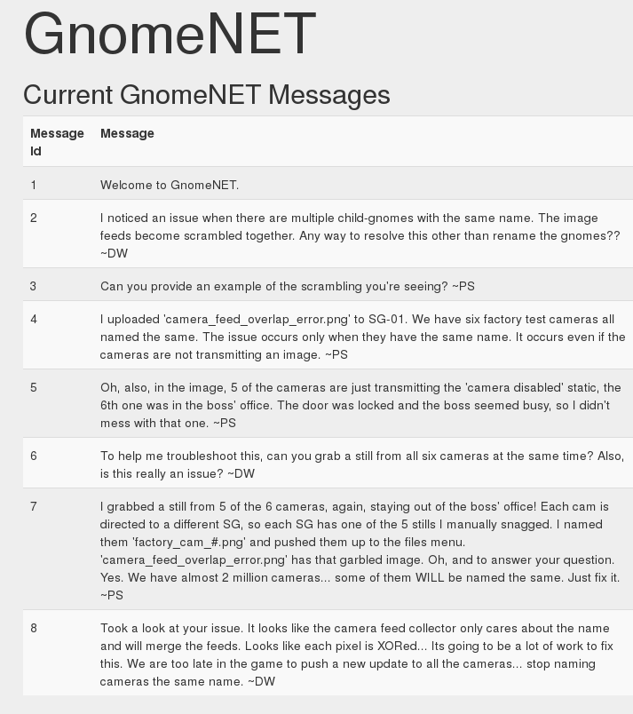
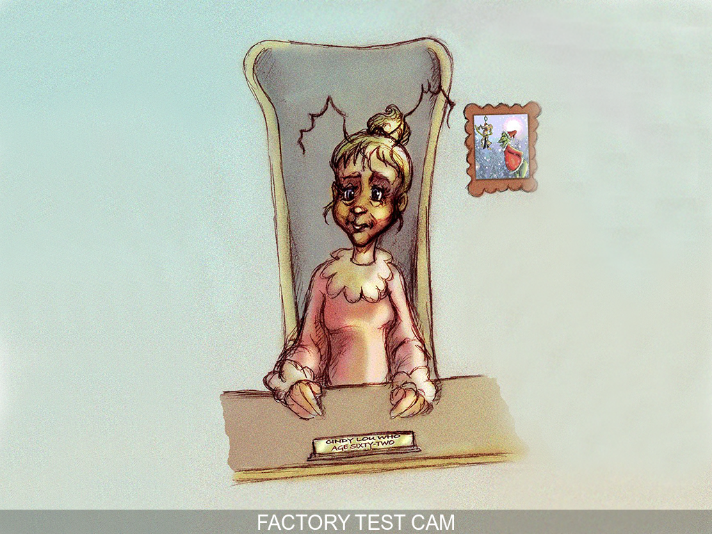

## Holiday Hack Challenge 2015
# Level 5-2 : Attribution (PNG)

The goal for Level 5 is to figure out the evil plot and the mastermind behind it

Technically, you could solve Level 5 with just the emails alone. This is something extra.

During the pwning of the SuperGnome Servers, if you looked into the 'GnomeNet' page, you would have seen the following messages



The user 'DW' is complaining about images from several cameras have been XOR'ed together. What is interesting is that he/she mentions that one of these image is of the boss's office. This may give us more clues to reinforce who the mastermind is

For each of the SuperGnome servers that you managed to pwn, you should have downloaded these zip files as well. If not, go back to those servers and download them

- camera_feed_overlap_error.zip (SG-01)
- factory_cam_1.zip (SG-01)
- factory_cam_2.zip (SG-02)
- factory_cam_3.zip (SG-03)
- factory_cam_4.zip (SG-04)
- factory_cam_5.zip (SG-05)

Each of these zip files contain a PNG image file. Extract them all out into the same folder

### XOR

The XOR operation is commutative and assosciative. If 6 images was xor'ed together and we manage to get 5 of the original images, we can recover the last image.

```
A ^ B ^ C ^ D ^ E ^ F = X
A = X ^ B ^ C ^ D ^ E ^ F
```

In this case, we have the final 'X' image and 5 of the original image. The following [script](pngxor.php) will perform the Xor-ing of these images to recover the last image. 

Do note that the script requires 'PHP Imagick' to be installed to run. It can be installed on Ubuntu/Kali thru apt-get

> sudo apt-get install php5-imagick

```php
function xorimg($imagick1, $imagick2){
  // Use the iterator functions for iter1, iterate iter2 manually 
  $iter1 = new ImagickPixelIterator($imagick1);
  $iter2 = new ImagickPixelIterator($imagick2);
  $count = 0;

  foreach ($iter1 as $pixelRow1){
    if (!$iter2->valid()){
      break; // make sure iter2 is still valid
    }
    $pixelRow2 = $iter2->current();

    foreach($pixelRow1 as $column=>$pixel1){
      $pixel2 = $pixelRow2[$column];

      $color1 = $pixel1->getColor();
      $color2 = $pixel2->getColor();

      $newcolor = array();
      $newR = $color1['r'] ^ $color2['r'];
      $newG = $color1['g'] ^ $color2['g'];
      $newB = $color1['b'] ^ $color2['b'];
      $pixel1->setColor("rgb($newR, $newG, $newB)");
      $count++;
    }
    $iter2->next();
    $iter1->syncIterator();
  }

  return $imagick1;
}

$corrupt = new Imagick('camera_feed_overlap_error.png');
$cam1 = new Imagick('factory_cam_1.png');
$cam2 = new Imagick('factory_cam_2.png');
$cam3 = new Imagick('factory_cam_3.png');
$cam4 = new Imagick('factory_cam_4.png');
$cam5 = new Imagick('factory_cam_5.png');

echo "Xoring with cam1...\n";
$tmp = xorimg($corrupt, $cam1);
echo "Xoring with cam2...\n";
$tmp = xorimg($tmp, $cam2);
echo "Xoring with cam3...\n";
$tmp = xorimg($tmp, $cam3);
echo "Xoring with cam4...\n";
$tmp = xorimg($tmp, $cam4);
echo "Xoring with cam5...\n";
$tmp = xorimg($tmp, $cam5);
echo "Done :) \n";
$tmp->writeImage('restored.png');
```

The 'xorimg' function basically takes the 'R','G' and 'B' values of each pixel and xor them with the same pixel in the second image. After running the script, the final image is restored



Its an image of a 62 years old Cindy Lou Who. This further reinforces the idea that Cindy is the mastermind behind this plot. Interestingly, there is a picture of the Grinch and her on the wall from a time long past.

With all these information, its time to write the report to "Dad's Law Enforcement Friend" :)