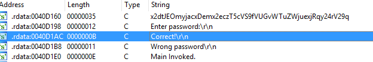
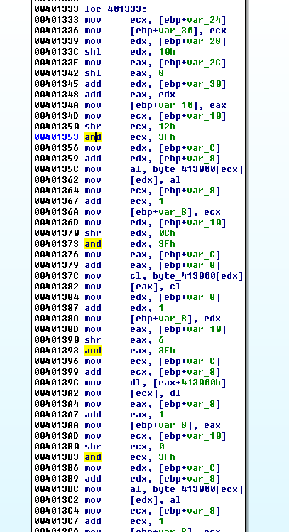
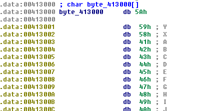
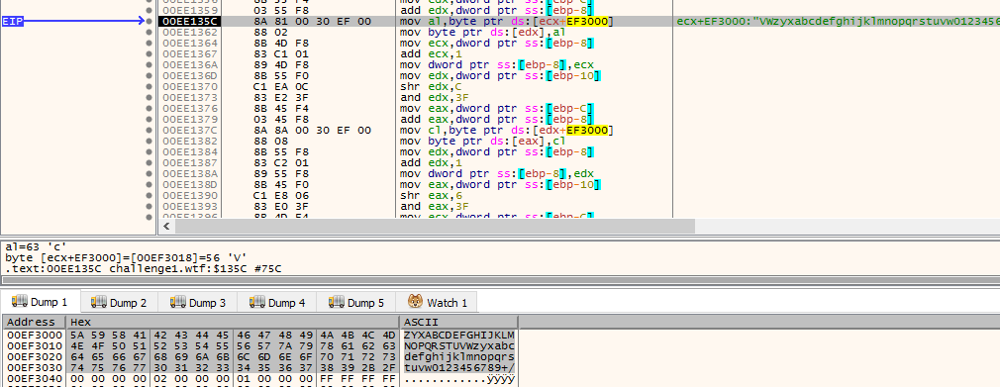
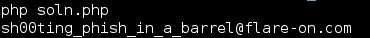

## Flare-On CTF 2016
# Challenge 01 : challenge1

Throw the binary into IDA Pro and look at the Strings tab.

A few interesting strings catches my attention.



Do a x-ref on the "Correct!" string and you will end up in the main function


Looks like some kind of password is read from the standard input. This password is passed through some kind of encoding function and then compared to the string at [ebp+10] which is the string highlighted in green at the top.

Looking through the encoding function, one part of it caught my eye.



Notice the 4 occurences of "and 0x3f". I've seen similar patterns in another challenge from LabyREnth CTF 2016. These patterns point towards Base64 encoding.

A summary of Base64 encoding is as follow
- Processes 3 bytes (24 bits) at a time
- Separate the 24 bits into 4 parts of 6 bits each (hence the "and 0x3f")
- Each 6 bit part is used as a numerical index into a dictionary of characters.
- This character is then used to represent these 6 bits

Looking back at the code, the result from the "and 0x3f" operation is used as an index into byte_413000 array

Looking at the byte_413000 array reveals that it is likely the dictionary



If you attach a debugger and break at this point, the dictionary can be extracted easily



The dictionary is "ZYXABCDEFGHIJKLMNOPQRSTUVWzyxabcdefghijklmnopqrstuvw0123456789+/"

Therefore, the goal is to decode the "green string" previously using this custom base64 dictionary.

PHP has a simple way to perform custom base64 decoding. I wrote the following [php script](soln.php) to solve this challenge

```php
$default = "ABCDEFGHIJKLMNOPQRSTUVWXYZabcdefghijklmnopqrstuvwxyz0123456789+/";
$custom  = "ZYXABCDEFGHIJKLMNOPQRSTUVWzyxabcdefghijklmnopqrstuvw0123456789+/";

$enc = "x2dtJEOmyjacxDemx2eczT5cVS9fVUGvWTuZWjuexjRqy24rV29q";
$defenc = strtr($enc, $custom, $default); // "translate" each char from custom to default
echo base64_decode($defenc)."\n"; // use the default base64 decode
```

Running it will reveal the flag



The flag is `**sh00ting_phish_in_a_barrel@flare-on.com**`

