## Flare-On CTF 2016
# Challenge 02 : DudeLocker

This time, 2 files are provided. A binary executable and a "doc" file which seems to be encrypted.

It is recommended to use IDA Pro and a debugger at the same time to better understand what the code is doing. Also, I've renamed most of the function names in the screenshots to something that reflects what it does.

### Setting up the Crypto

Let's start with the strings in IDA Pro again

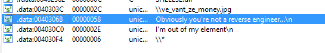

X-ref the interesting "you're not a reverse engineer string" will bring us to the main function

At the beginning of this function, there are basically 2 checks. If any of them fails, the program exits. I believe this was a safeguard put in by the creator to prevent accidentally encrypting all your files. (Spoiler: this challenge is imitating a ransomware)

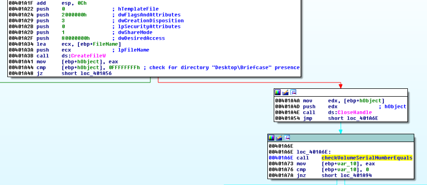

The first check basically checks if a directory named "Briefcase" exists on the Desktop. To bypass it, just create a folder named "Briefcase" on the Desktop. You can put a txt file in it with some data too.

The second check checks for your volume serial number

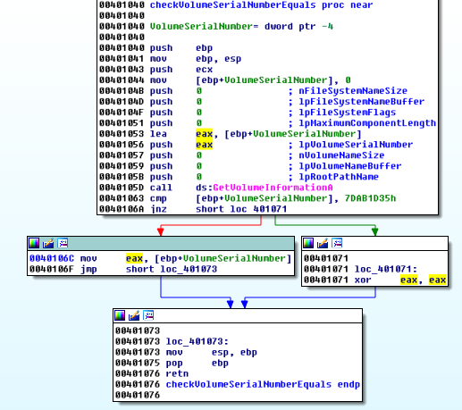

It checks if your volume serial number is 0x7dab1d35. If it matches, the serial number is returned, else a 0 is returned.

To bypass this, put a breakpoint at this function call in a Debugger. Change to eax value immediately after the function call

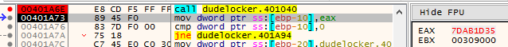

It is important to set this value to 0x7dab1d35. It will be used later

If the checks are successfullhy bypassed, this part of the code is reached.

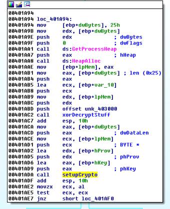

The "xorDecryptStuff" function takes in the return value before and uses it as a 4-byte xor key to decrypt some data in it's memory. 

After executing the function and if you have set the value to 0x7dab1d35 before, you should see the following in one of the buffer pointers on the stack.

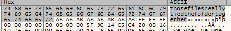

This "thosefilesreallytiedthefoldertogether" string is then passed into the "setupCrypto" function. This function sets up a crypto container using Microsoft Crypto API.

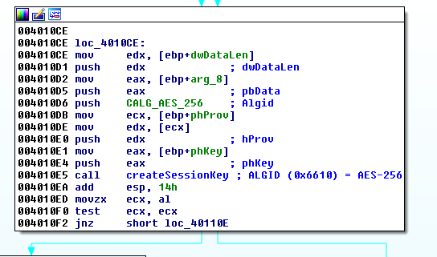

It then calls the "createSessionKey" function, passing the previous string as an argument. Take note of the AlgID argument also. It suggests AES-256 is being used

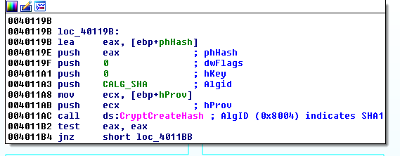

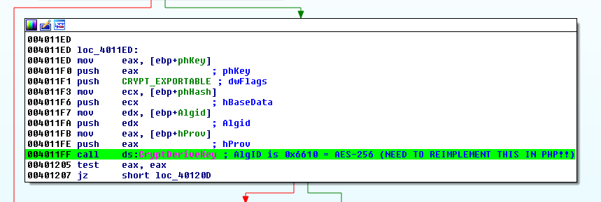

This function sets up a SHA1 container. It then calls the "CryptDeriveKey" Windows API function with the previous string as an argument. This suggests that the string "thosefilesreallytiedthefoldertogether" is the password to a AES-256 encryption.

Take note of this "CryptDeriveKey" function. We will come back to it later

Right after the "createSessionKey" function call, the following code is hit.

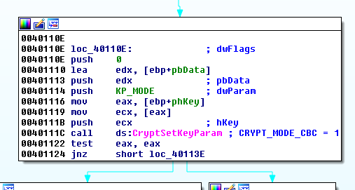

It sets the crypto container to use CBC Mode

### Doing the Crypto

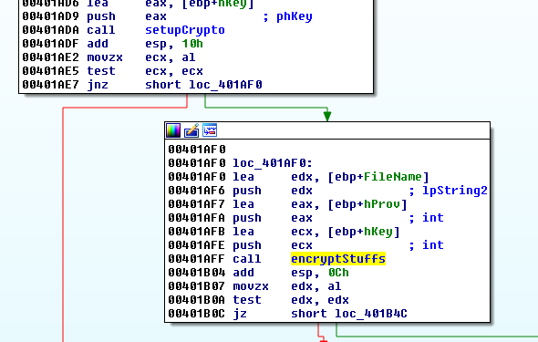

Right after the "setupCrypto" function call, the "encryptStuffs" function is called.

This function loops through all the files in the "Briefcase" folder and perform 2 main functions on them.

First is the "SetIVToMD5Filename" function.

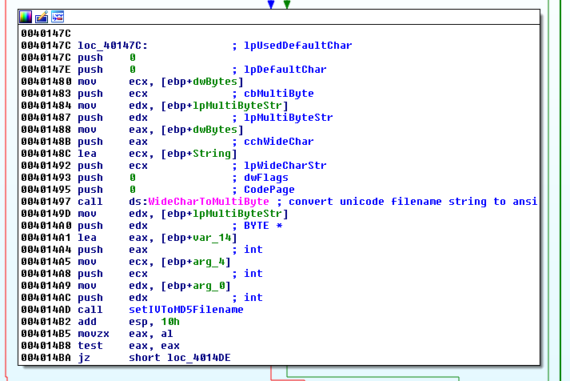

This function first transform the filename to all lowercase characters, then performs MD5 on it.

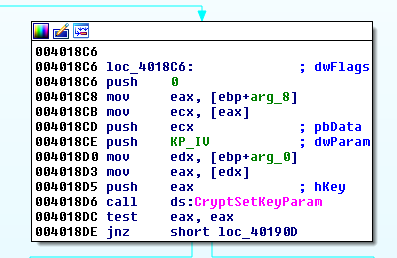

Afterwhich, the resulting md5 hash is set as the IV of the pervious AES-256 crypto container

The 2nd main function does the actual encryption

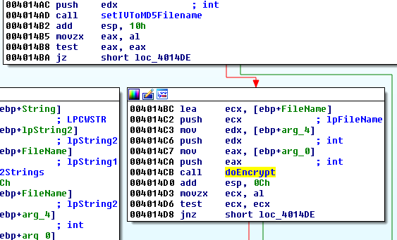

### Solving the Challenge

Let's summarize the findings so far.
- Crypto Algorithm is AES-256 in CBC mode
- Password is "thosefilesreallytiedthefoldertogether"
 - Key derivation is set to SHA1
- IV is the MD5 hash of lowercase filename

Performing the decryption with these info still would not work.

I was stuck on this for awhile until I read MSDN's page on [CryptDeriveKey](https://msdn.microsoft.com/en-us/library/windows/desktop/aa379916%28v=vs.85%29.aspx). In particular, the "Remarks" portion at the bottom of the page


It describes the algorithm used when the specified key derivation algorithm does not produce a key that is long enough for the specified encryption algorithm.

In this case, AES-256 needs a key that is 32 bytes long. However, SHA1 produces hashes that are only 20 bytes long.

I re-implemented this algorithm into the following php function

```php
function deriveKey($password, $keysize){
	$basedata = sha1($password, true);
	$buffer1 = "";
	$buffer2 = "";
	
	for ($i=0; $i<64; $i++){
		$buffer1 .= chr(0x36);
		$buffer2 .= chr(0x5c);
		if ($i < strlen($basedata)){
			$buffer1[$i] = $buffer1[$i] ^ $basedata[$i];
			$buffer2[$i] = $buffer2[$i] ^ $basedata[$i];
		}
	}
	
	$b1 = sha1($buffer1, true);
	$b2 = sha1($buffer2, true);
	$outbuff = $b1.$b2;
	return substr($outbuff,0,($keysize/8));
}
```

I then wrote the following [php script](soln.php) that would decrypt the doc file

```php
$enc = file_get_contents("BusinessPapers.doc");
$iv = md5("businesspapers.doc", true);
$pw = deriveKey("thosefilesreallytiedthefoldertogether", 256);
echo "Key is ".bin2hex($pw)."\n";
echo "IV is ".bin2hex($iv)."\n";

$plain = openssl_decrypt($enc, "aes-256-cbc", $pw, OPENSSL_RAW_DATA||OPENSSL_ZERO_PADDING, $iv);

if ($plain === false){
	echo openssl_error_string();
}

file_put_contents("decrypted", $plain);
```

Running the script will produce the decrypted file. However, it is not a doc file. 

Opening it in a hex editor will reveal what type of file it is

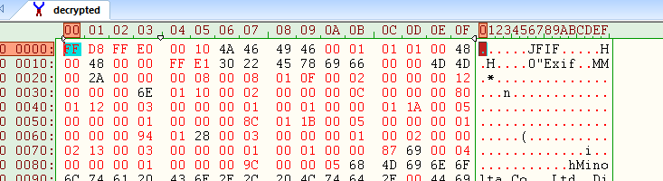

Opening it in a image viewer will reveal the flag

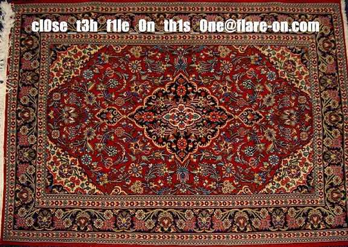

The flag is `cl0se_t3h_f1le_0n_th1s_0ne@flare-on.com`

