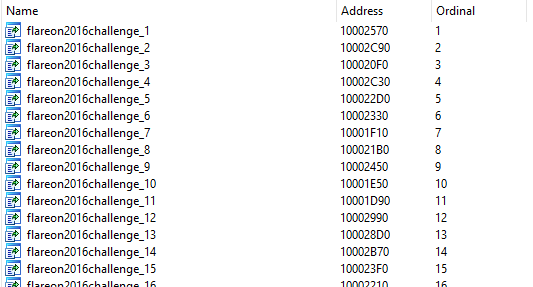
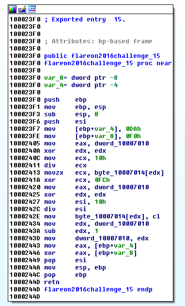
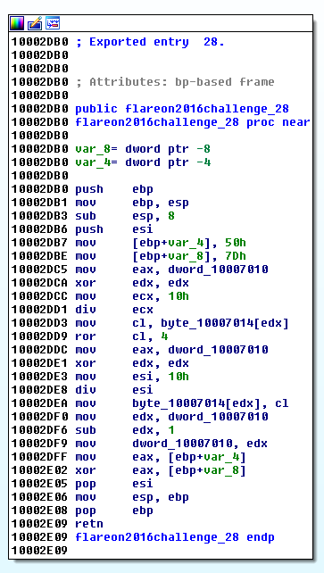
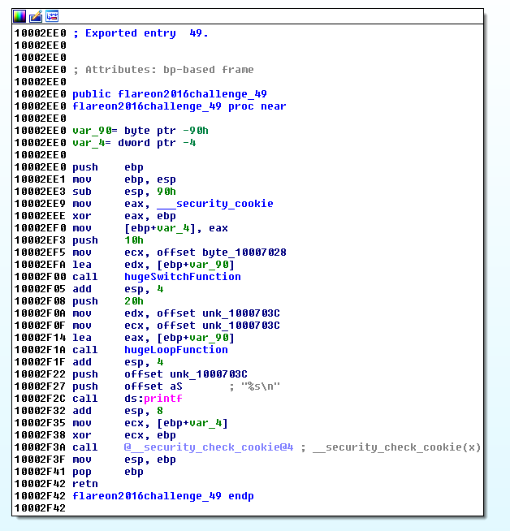
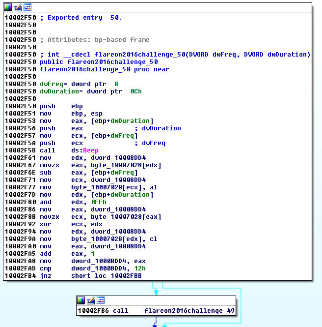
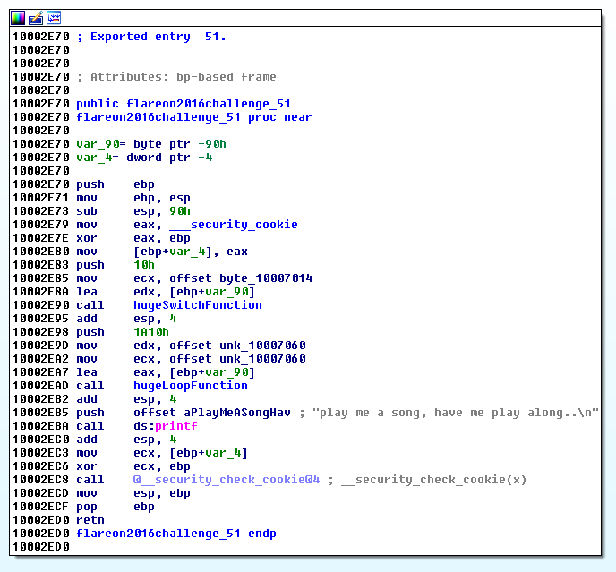
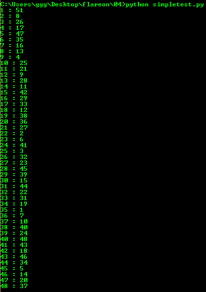
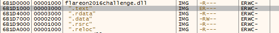
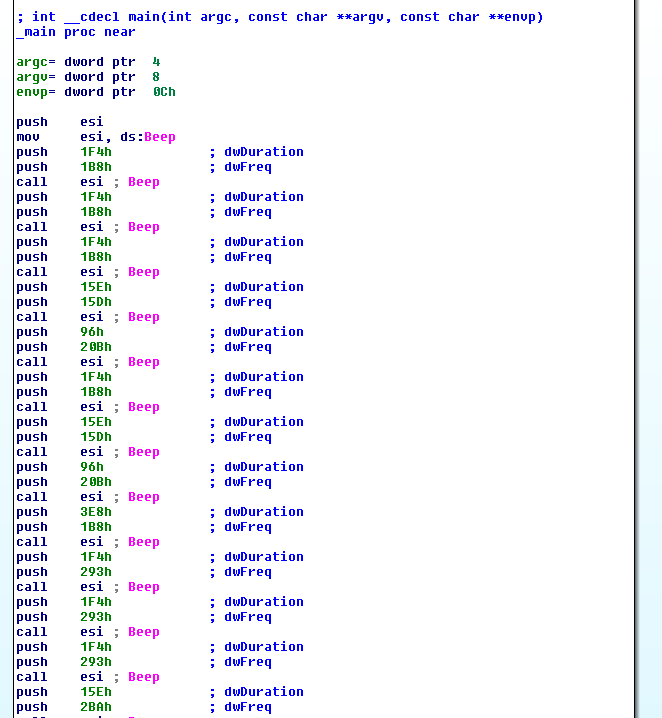
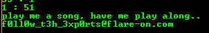

## Flare-On CTF 2016
# Challenge 04 : flareon2016challenge

I'm not sure if I solved this challenge the intended way as I found most of the crucial clues by chance.

Throw the binary into IDA Pro and look at the Export tab



Looks like this is a DLL with a bunch of exported functions

Looking through the functions, here are a summary of what they do

**Function 1 to 48 all perform similar operations**





They each perform some arithmetic operation (xor, sub, rotate, etc...) with the 0x10007010 value and 0x10007014 array.

At the end, each always returns a constant number.

**Function 49**



Function 49 calls 2 functions which are a huge loop and a huge switch function. It then prints something. This seems like the final function where the flag will be printed from.

**Function 50**



Function 50 takes in 2 arguments (Frequency and Duration) and passes them to the Beep function. The 2 arguments are also used to perform some kind of xor operations. At the end, it calls function 49.

**Function 51**



Similar to function 49 with the same huge loop and huge switch function is called. It then prints a constant string

### Return numbers

The constant return numbers in functions 1 to 48 seems strange and out of place. Let's look at what these functions return.

There is an easy way to load and call exported DLL functions in Python. I wrote a [simple script](simpletest.py) to test these functions.

```py
from ctypes import *

chaldll = cdll.LoadLibrary("flareon2016challenge.dll")

for ordinal in range(1,49):
	res = chaldll[ordinal]()
	print str(ordinal) + " : " + str(res)
```



The return numbers does not repeat and are in between 1 and 51.

I was stuck here for awhile as there are many patterns that could be formed. Ascending/Descending/Reverse order of the return numbers are all possible. There is a fair amount of guesswork needed here.

The correct order is that the returned number specifies the next function to call. 

Besides functions 49 and 50 which are special functions, the only other function number that was not returned is 30. This suggests that function 30 is the first function to call. The next function to call after function 30 is specified by function 30's returned value.

This will go on until function 1 which has a return value of 51. This would call function 51 and print the "play me a song" string

### Beep Beep Beep

All functions have a role now, except 49 and 50. Most likely function 50 should be called first as it will eventually call 49. However, function 50 takes in 2 arguments, what values should be passed to it??

I was stuck here for a while until a friend suggested attaching a debugger to see what exactly did functions 1 to 48 modify.

I wrote this testing script to facilitate attaching a debugger

```py
from ctypes import *
import time

chaldll = cdll.LoadLibrary("flareon2016challenge.dll")
ordinal = 30 # starting point is 30 because there is no function that returns 30
while True:
	tmp = chaldll[ordinal]()
	print str(ordinal) + " : " + str(tmp)
	ordinal = tmp
	
	if ordinal == 51:
		chaldll[51]()
		break

time.sleep(30)
chaldll[50]()
```

The idea is as follow
- Run functions 1 to 48 in the correct order
- Attach a debugger when the script is running the sleep function
- Once a debugger is attached, find function 50 and put a breakpoint in it
 - Use the memory map to find where the dll is loaded. 
 - Take note of the address of the ".text" section
 - Add the offset of function 50 (0x2f50) to locate function 50
 
- Resume ("Continue") the python script such that function 50's breakpoint will be hit
- Figure out what function 50 is doing

I placed a breakpoint just before the call to the "Beep" function"

Looking through the memory areas used after the "Beep" function call, I noticed something interesting


When dumping the memory area referened by "edx+6b1d7028", I noticed the file headers of a Windows PE executable. (Also, there is a string "usetheforceluke" that I didnt notice before lol)

Dump the memory space starting from the "MZ" header till the end of this memory region into a file. Throwing this file into IDA Pro reveals the following code.



This is a sequence of frequency and duration values to pass to a beep function.

I added this values to the previous python script

```py
from ctypes import *
import time

chaldll = cdll.LoadLibrary("flareon2016challenge.dll")
ordinal = 30 # starting point is 30 because there is no function that returns 30
while True:
	tmp = chaldll[ordinal]()
	print str(ordinal) + " : " + str(tmp)
	ordinal = tmp
	
	if ordinal == 51:
		chaldll[51]()
		break

chaldll[50](0x1B8, 0x1F4)
chaldll[50](0x1B8, 0x1F4)
chaldll[50](0x1B8, 0x1F4)
chaldll[50](0x15D, 0x15E)
chaldll[50](0x20B, 0x96)
chaldll[50](0x1B8, 0x1F4)
chaldll[50](0x15D, 0x15E)
chaldll[50](0x20B, 0x96)
chaldll[50](0x1B8, 0x3E8)
chaldll[50](0x293, 0x1F4)
chaldll[50](0x293, 0x1F4)
chaldll[50](0x293, 0x1F4)
chaldll[50](0x2BA, 0x15E)
chaldll[50](0x20B, 0x96)
chaldll[50](0x19F, 0x1F4)
chaldll[50](0x15D, 0x15E)
chaldll[50](0x20B, 0x96)
chaldll[50](0x1B8, 0x3E8)
```

Running the script will play the Imperial March and reveal the flag.



The flag is `f0ll0w_t3h_3xp0rts@flare-on.com`

