## Flare-On CTF 2016
# Challenge 09 : GUI

First of all, running the binary reveals the goal of this challenge

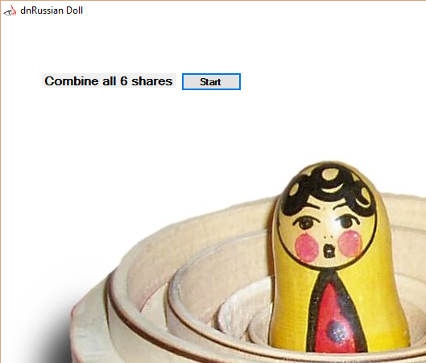

The goal is to "Combine all 6 shares" to get the flag

Opening the binary in IDA Pro reveals that his is a .Net binary.

Let's open it in dnSpy instead. The main code is in 'Form1' class, specifically the 'button1_Click' function

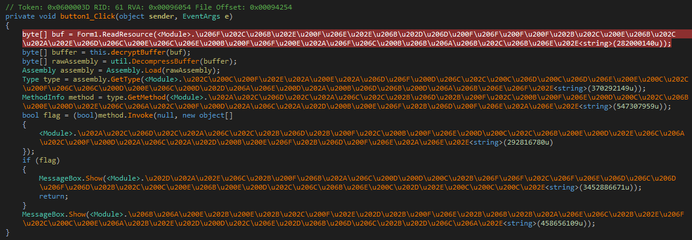

First of all, many of the function names are obfuscated using unicode characters. Strings are also obfuscated. This function reads in a certain resource, decrypts it, decompresses it, loads it and then calls a certain method from it.

### dnSpy Debugger

dnSpy is powerful for .Net applications because it includes a very powerful .Net Debugger. Let's use that. Stepping through the debugger is pretty straight-forward and I won't go through it step by step except for one thing. One powerful feature of the dnSpy debugger is that it is able to follow execution into dynamicly loaded libraries (DLLs). This is how to do it.

Let's use the code in button1_Click as an example. Put a breakpoint on the line with the "method.Invoke" call and run the debugger till the breakpoint

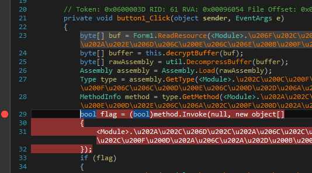

Press "Step Into" (F11) and then "Step Out" (Shift + F11) to run the string deobfuscation method

Press "Step Into" (F11) 3 times. You should now be in the "Invoke" object

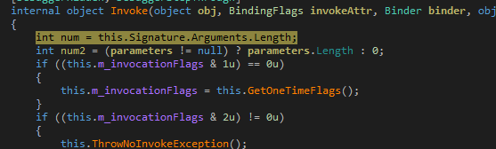

Press "Step Over" (F10) until you reach the line with a call to "InvokeMethodFast"

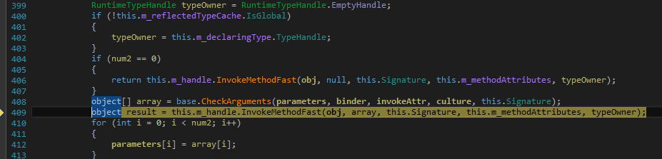

Press "Step Into" (F11) and then Step out of the signature function. Press "Step Into" (F11) again. You should reach here

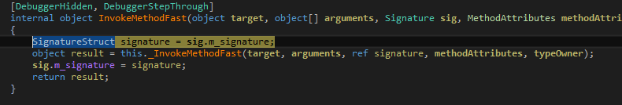

Step into the "_InvokeMethodFast" function call and you will end up in the loaded binary's code

The newly loaded binary is packed. Step into the 2nd function twice to allow it to unpack and follow it to the correct point

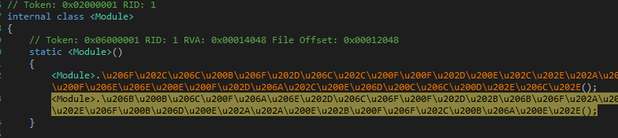

### Russian Dolls

As the hint picture suggests, this is a russian doll style challenge. 

Multiple binaries (layers) are packed in the Resources section. Each layer checks for certain conditions or values to unpack the next layer. Solving this challenge requires using a debugger to step through the code and provide whatever is needed to unpack the next layer. The above guide will allow you to follow the execution into the next layer without killing the application.

There is a total of 4 layers in this challenge (GUI, Layer1, Layer2, Layer3). As the debugging is pretty straight-forward, I will not go through it step-by-step. Below is the summary of what each layer is doing

**GUI**
- Reads in "layer1" resource
- Decrypts it using the key "flareOnStartKey"
- Decompresses and load "layer1" into memory
- Calls Layer1.Start() with the argument "no/-|-\\no/-|-\\no/-|-\\2/-|-\\share**Share:2-f81ae6f5710cb1340f90cd80d9c33107a1469615bf299e6057dea7f4337f67a3**"

Hmm that looks interesting

**Layer1**

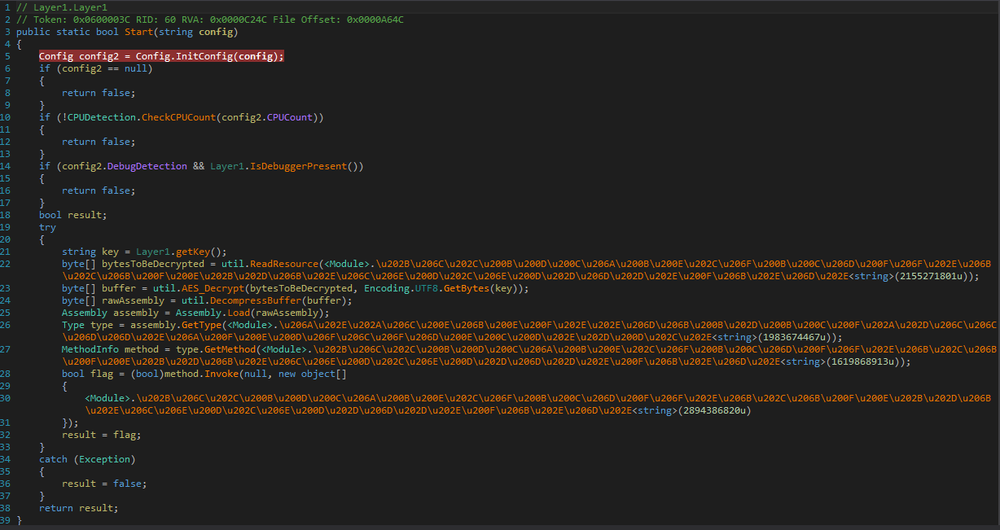

- First, some anti-debugging and anti-vm checks are done
 - Bypass them by changing return results in the debugger
 - Strangely, dnSpy's debugger does not trigger the isDebuggerPresent flag
- Retrieves a key using the "Layer1.GetKey" function
 - Gets all the subdirectories of the current working directory
 - Tries to find a folder named "sharing" 
  - "UtYSc3XYLz4wCCfrR5ssZQ==" is base64_encode(md5("sharing"))
  - If found, returns the key "flare-sharing" (This is the correct key)
  - If not found, returns the value "flare-layer1-key"
- Reads in "layer2" resource
- Decrypts it using the key ("flare-sharing" is the correct key)
- Decompresses and load "layer2" into memory
- Calls Layer2.Start() with the argument "Nothing useful to see here!"

**Layer2**

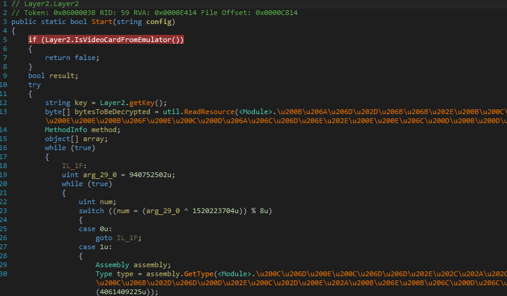

Do note, the code obfuscation style has changed a little.

- First, the "IsVideoCardFromEmulator" is a anti-vm check. It checks if the video card driver name has certain words from a pre-defined blacklist.
 - Bypass this by changing the "text" variable below to something that does not contain any words from the "array" variable. I used "nvidia".
 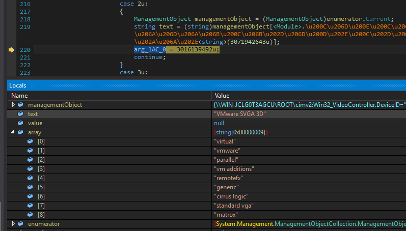
- Retrieves a key using the "Layer2.GetKey" function
 - Gets the Subkeys of the CurrentUser Registry
 - Tries to find a subkey named "secret" 
  - "Xr4ilOzQ4PCOq3aQ0qbuaQ==" is base64_encode(md5("secret"))
  - If found, returns the key "flare-secret" (This is the correct key)
  - If not found, returns the value "**Share:3-523cb5c21996113beae6550ea06f5a71983efcac186e36b23c030c86363ad294**" (hmmmm...)
 - Bypass the check by just changing the return value to "flare-secret"
- Reads in "layer3" resource
- Decrypts it with the key
- Decompresses and load "layer3" into memory
- Calls Layer3.Start() with the argument "layer2 -> layer3, almost there!"

**Layer3**

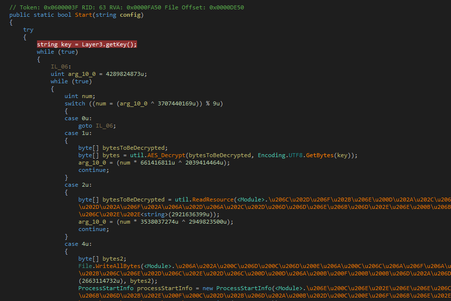

- Retrieves a key using the Layer3.GetKey" function
 - Gets a list of all users of the system
 - Tries to find a user named "shamir" 
  - "KTUxM5ElLBtBBAdJXNCW/g==" is base64_encode(md5("shamir"))
  - If found, returns the key "flare-shamir" (This is the correct key)
  - If not found, returns the value "again..."
 - Bypass the check by changing the return value to "flare-shamir"
- Reads in "share6" resource, decrypts it with the key, writes it to a file named "share6-decoded.png"
 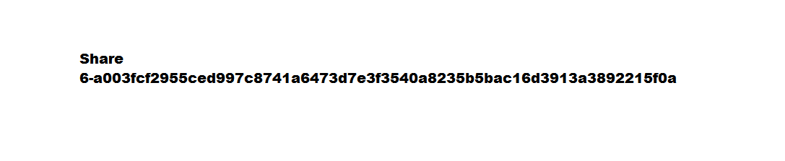
 - This image file shows the string "**Share:6-a003fcf2955ced997c8741a6473d7e3f3540a8235b5bac16d3913a3892215f0a**"
- Reads in "combine" resource, writes it to a file named "ssss-combine.exe"
- Execute "ssss-combine.exe"

### Shamir Secret Sharing Scheme (SSSS)

Googling about "ssss-combine" leads me to this [site](http://point-at-infinity.org/ssss/) which describes the "Shamir Secret Sharing Scheme". In short, this scheme allows a secret to be separated and shared among x number of people. However, the secret can be recovered with only y out of the total x parts of the secret. The values of x and y can be set by the user when separating the secret.

Therefore to solve this challenge, we must recover the "6 Shares" to get the secret. Till now, 3 of them have been found (2,3,6). The other 3 are hidden among the 4 binaries

**Share:1** is hidden in the initial "GUI" binary.

Look into the {} namespace and Share:1 is one of the classname

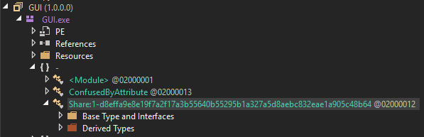

**Getting Share:4 and Share:5**

Share:4 and Share:5 are hidden in the StringUtils class of Layer2 and Layer3 respectively

The StringUtils class contains thousands of obfuscated string constants. It is extrememly time consuming to step through it manually. I found a easier way to do it.

Put a breakpoint at the beginning of the StringsUtils class

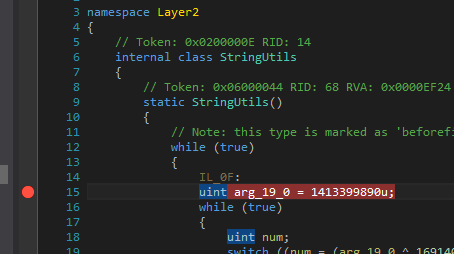

Step through the code till that breakpoint is hit. It should get hit when the "getKey" function is called

Step over till it hits one of the obfuscated function calls

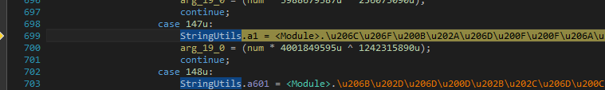

Step into (F11) the function, then Step Over till the end of the function (when it hits the return line)

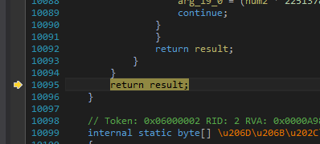

Right Click the "result" variable and Select "Show in Memory Window -> Memory 1". This will display the memory area where result is in the memory window

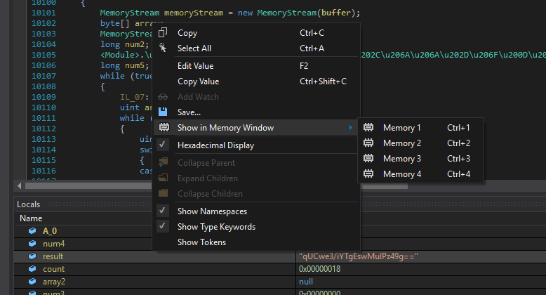

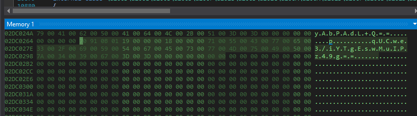

Continue the code and step out of the StringUtils class entirely

The memory window would have been populated by all the strings in the StringUtils class. Now, we can dump this entire memory region and search it using a hex editor.

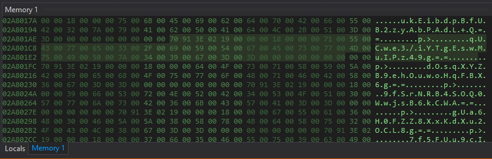

Click to select the start of the memory dump, scroll down to find the end of the bunch of strings, shift click at the last byte. This will select the entire region. Right click and select "Save selection as"

Open the file in a Hex editor and do a unicode text search for "Share" and Share4 will be revealed

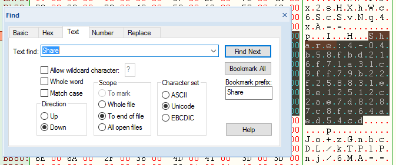

Repeat the same procdeure for Layer3's StringUtils class. Do note, for my system, the first few strings in Layer3's StringUtils class is stored at a different location that the rest. To get the correct memory location, wait till after the 5th string before marking the memory region. Share5 will be revealed in similar fashion

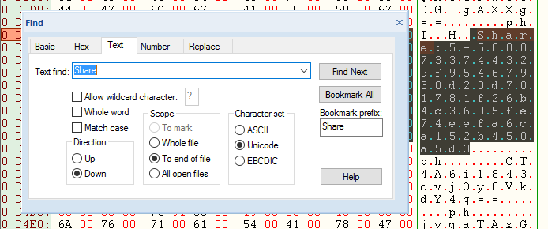


### Combining the Shares

All 6 shares have been found

```
1-d8effa9e8e19f7a2f17a3b55640b55295b1a327a5d8aebc832eae1a905c48b64
2-f81ae6f5710cb1340f90cd80d9c33107a1469615bf299e6057dea7f4337f67a3
3-523cb5c21996113beae6550ea06f5a71983efcac186e36b23c030c86363ad294
4-04b58fbd216f71a31c9ff79b22f258831e3e12512c2ae7d8287c8fe64aed54cd
5-5888733744329f95467930d20d701781f26b4c3605fe74eefa6ca152b450a5d3
6-a003fcf2955ced997c8741a6473d7e3f3540a8235b5bac16d3913a3892215f0a
```

To recap, here is a summary of where they are

1. in GUI.exe {} namespace
2. Passed as a argument from GUI.exe to layer1.dll
3. Layer2.getKey() returns it when it fails to find what it was looking for
4. Inside Layer2.StringUtils (Dump and Search using hex editor)
5. Inside Layer3.StringUtils (Method same as four, but step through a few strings first, as the string storage changes location after a3/4)
6. Inside a png file written to disk after layer3

Run the ssss-combine executable as follows

> ssss-combine.exe -t 6

Enter the 6 shares and the flag will be revealed

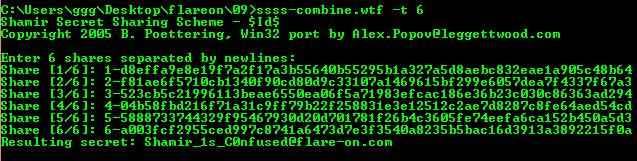

The flag is `Shamir_1s_C0nfused@flare-on.com`