## Flare-On CTF 2016
# Challenge 10 : flava

As this writeup is long, here is a mini-menu to help navigate
- [PCAP](#pcap)
- [Javascript 1](#javascript-1)
- [Javascript 2](#javascript-2)
- [Javascript 3](#javascript-3)
- [Breaking the Diffie-Hellman](#breaking-the-diffie-hellman)
- [Flash 1](#flash-1)
- [Flash 2](#flash-2)
- [Flash 3](#flash-3)

### PCAP

We are provided with a pcap file

Open the pcap file in wireshark. There are thousands of packets in here. One way to try and find the interesting packets is by using the statistics tools in Wireshark

Click on "Statistics->Conversations" and sort the list by Packets or Bytes.

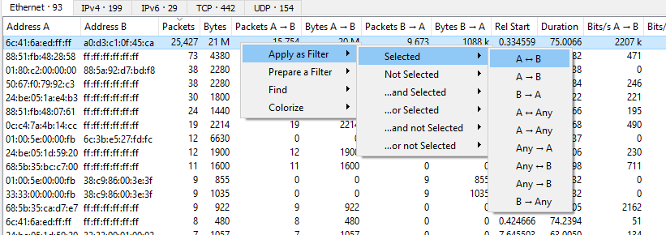

There is one connection with a overwhelming number of packets and bytes. Filter it out by Right-clicking it and selecting "Apply as Filter -> Selected -> A<->B"

Follow the first HTTP traffic you see. (it should be to a page called "lessons_you_will_learn_from_pokemon_go.html"

Hidden in all these traffic is an iframe. Search for "iframe" and you should see this

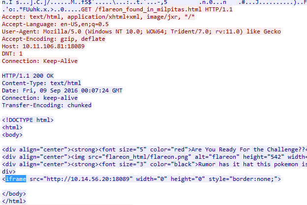

Let's use Wireshark to filter out this ip using the following filter.

>ip.addr == 10.14.56.20

Once filtered, follow the first http traffic again. Scrolling down a little bit reveals a huge chunk of base64-encoded text and obfuscated Javascript

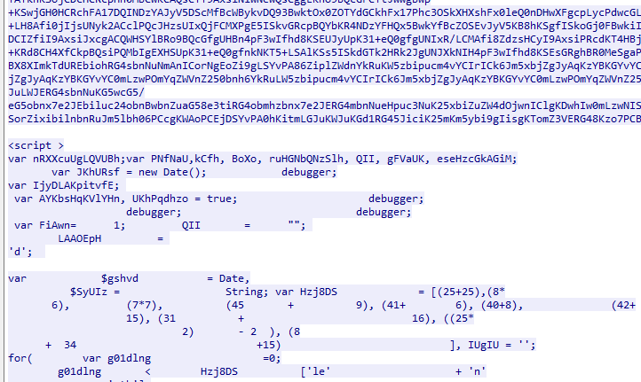

A common technique for exploit kits is for the Javascript code to somehow use the base64-encoded text. For now, just take note that the base64-encoded text is in the HTML element "oq6iFsbdiAj"

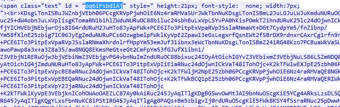

Scrolling down some more reveals that a flash file called "will_tom_hiddleston_be_taylor_swifts_last_song_of_her_career.meh" is also downloaded. I know its a Flash file because of the "CWS" header which is the file header of a compressed SWF.

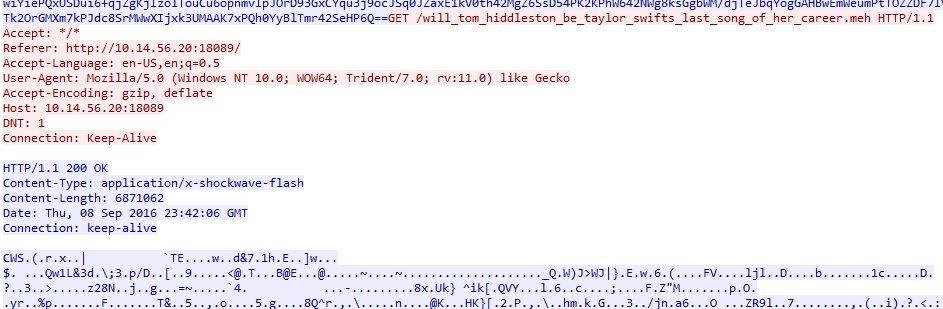

Dump these HTTP objects by clicking "File->Export Objects->HTTP". Save the 4 objects that came form "10.14.56.20"

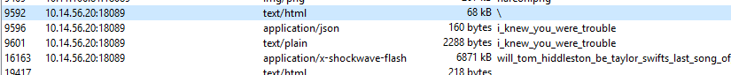

### Javascript 1

The obfuscated javascript is in the "\\" object. I copied out the Javascript portions and passed it through js-beautifier. This is the [resulting Javascript MISSING js1]()

The JS code is obfuscated. I will not go through the deobfuscation step by step as it is quite straight-forward. This is the [deobfuscated version of js1](jsstuffs/js1_deobfus.js)

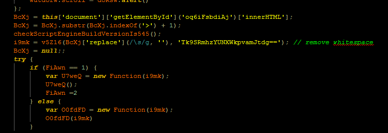

The code calls the "v5Z16" function with 2 base64-encoded values. The result from this function is then executed using the "new function" method (this is similar to a eval)

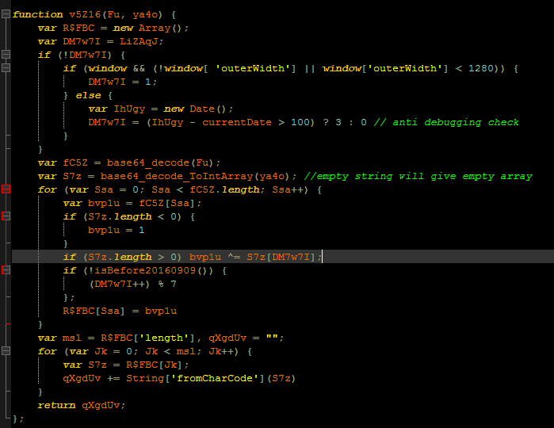

The "v5Z16" basically base64-decodes both input arguments and then perform xor decryption of the first argument using the 2nd argument as a key.

I reimplemented the program logic into this [php script](soln_part1_js1.php)

Running the script will reveal the next part of the challenge

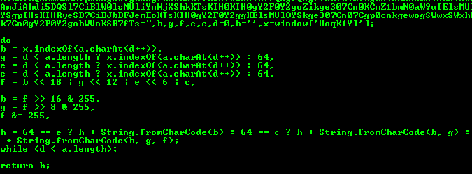

Looks like its more Javascript. Save the output into a [file](jsstuffs/js2.js).

### Javascript 2

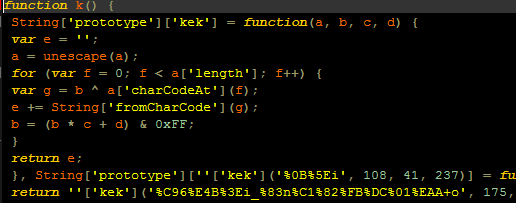

1 important function is the "kek" function. It is a String deobfuscation function that is used throughout this JS code (and the next). I re-implemented it as a php function as so

```php
function kek($inputstr, $startxorkey, $n1, $n2){
	$input = rawurldecode($inputstr);
	$xorkey = $startxorkey;
	$out = '';
	
	for ($i=0; $i<strlen($input); $i++){
		$tmp = $xorkey ^ ord($input[$i]);
		$out .= chr($tmp);
		$xorkey = ($xorkey * $n1 + $n2) & 0xff;
	}
	
	return $out;
}
```

This is the [deobfuscated version of js2](jsstuffs/js2_deobfus.js)

This piece of code selects one of 2 base64 dictionaries based on some environment conditions. This dictionary is then used to decode the huge base64 chunk in the code.

From my testing, this base64 chunk is encoded using the standard base64 dictionary. I wrote this [php script](soln_part2_js2.php) that will perform this decoding.

Running it reveals even more Javascript. Save it to a [file](jsstuffs/js3.js)

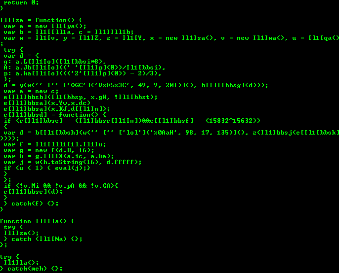

### Javascript 3

This time, the code is even more heavily obfuscated. The same "kek" function is still used as a String deobfuscation function.

This is the [somewhat deobfuscated version of js3](jsstuffs/js3_deobfus.js)

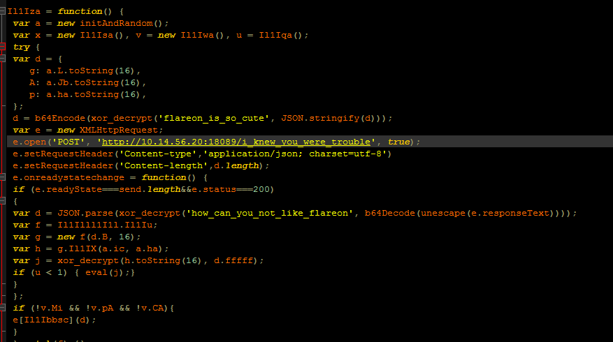

The interesting code is near the end of the file. This is what it is doing
- Initializse some random hex values
- Xor encrypts them with the key "flareon_is_so_cute", base64 encodes them and sends them to a page.
- The response is base64 decoded and xor decrypted with the key "how_can_you_not_like_flareon"
- Some operation is performed on the decrypted response and finally the result is passed to a eval call

The important function that needs to be reversed is the "Il1IX" function. I reversed it to a point that it is performing lots of mathematical operations. Also, the function parameters was named "e" and "m". For some reason, the names reminded me of "exponent" and "modulus" and I thought maybe this is a powmod function.

I tested it using some dummy values in php using the bcpowmod function and the code in this Javascript file. The results is positive and "Il1IX" is a powmod function.

Note: powmod(x,e,m) means ((x ^ e) mod m) where ^ is "power" operator.

The powmod function is used in many crypto algorithms (E.g. AES, etc...)

To figure out which algorithm is being used here, Let's take a look back at the pcap file again. You would have seen the following exchange just before the flash file.

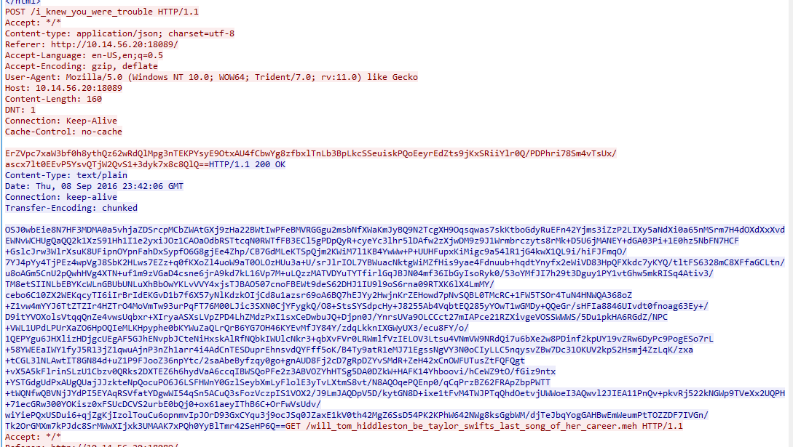

These are the data being sent and received by the Javascript code shown before. I reimplemented the "xor_decrypt" function into php as follow

```php
function decrypt($key, $msg){
	$b = rawurldecode($msg);
	$b = $msg;
	$c = array();
	$d = 0;
	$e = 0; // tmp variable for sbox switching
	$f = '';
	for ($g=0; $g<256; $g++){
		$c[$g] = $g;
	}
	
	for ($g=0; $g<256; $g++){ // key is a IV that initializes the sbox
		$d = ($d + $c[$g] + ord($key[$g % strlen($key)])) & 0xff;
		$e = $c[$g];
		$c[$g] = $c[$d];
		$c[$d] = $e;
	}
	
	$d = 0;
	$g = 0;
	for ($h = 0; $h<strlen($b); $h++){
		$g = ($g + 1) & 0xff;
		$d = ($d + $c[$g]) & 0xff;
		$e = $c[$g];
		$c[$g] = $c[$d];
		$c[$d] = $e;
		$f .= chr(ord($b[$h]) ^ $c[($c[$g] + $c[$d]) & 0xff]);
	}
	
	return $f;
}
```

This is actually RC4 algorithm. Decrypting the request with the key "flareon_is_so_cute" reveals the following

> {"g":"91a812d65f3fea132099f2825312edbb","A":"16f2c65920ebeae43aabb5c9af923953","p":"3a3d4c3d7e2a5d4c5c4d5b7e1c5a3c3e"}

Decrypting the response with the key "how_can_you_not_like_flareon" reveals the following

> {"B":"3101c01f6b522602ae415d5df764587b","fffff":"-redacted- whole bunch of binary stuff-"}

Do note the "fffff" containes binary stuff and cant be displayed here, hence I redacted it.

Doing some googling based on the values being sent and received eventually leads to the conclusion that it is using a Diffie-Hellman key exchange.

### Breaking the Diffie-Hellman

This [video](https://www.youtube.com/watch?v=M-0qt6tdHzk) is an excellent way to understand how Diffie-Hellman key exchange works.

Now we know what that function is doing, let's take a look at the code again

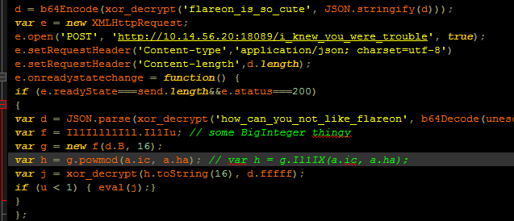

I am guessing f is some kind of BigInteger class to support the calculation of the powmod function. This is what the code is doing
- initAndRandom creates 3 random values (generator, modulus and a private key)
 - A public key is calculated using these 3 values (public key = generator ^ private key mod modulus)
 - Take note, the private key is the "ic" value (we do not know this value)
- It sends 3 values (generator g, modulus p and public key A) to the server
- The server responds with public key B and a encrypted msg fffff
- The client then decrypts the msg using its own private key (ic) and public key B
 - the result is passed to a eval call

In order to decrypt the msg, we need to figure out what is the private key "a.ic"

Googling about breaking Diffie-Hellman key exchange led me to this [SecureList article](https://securelist.com/blog/research/72097/attacking-diffie-hellman-protocol-implementation-in-the-angler-exploit-kit/). The code shown in the article looks extremely similar to the code that we are dealing with.

I'm not going to pretend I know what all the Math is doing here, but here is a summary of what I figured out in "layman" terms.

Basically, this article explains that there is a vulnerability in this particular implementation of the Diffie-Hellman key exchange due to the way the generator g and modulus p values are selected. In a proper Diffie-Hellman, the modulus p is supposed to be a huge prime number and the generator g is a root primitive of that number. This ensures that the resulting modulus result would be sufficiently pseudo-random. However, in this implementation, the modulus p and generator g values are selected randomly. In particular, the modulus p is not prime.

To recover the exponent (which a.ic is) of a powmod function, a [Discrete Logarithm](https://en.wikipedia.org/wiki/Discrete_logarithm) operation is needed. Think of it as some kind of brute-forcing function whose execution time depends on the size of the modulus p value. The larger the value, the longer it would take. Also, another property of logarithm operations is this

> log x*y*z == log x + log y + log z

This means that if we could break the modulus p value into its factors, we can significantly reduce the brute-forcing time. Since the modulus p is not prime in thi case, we could make use of this property to significantly shorten the brute-forcing time. This is also why a proper Diffie-Hellman implementation using a huge prime number for p will take forever to break.

Included in the article is a POC Java code that performed the attack. We need to modify this code with our values.

I downloaded the Java code and also [Cryptool](https://www.cryptool.org/en/) which is a tool used to teach concepts about cryptography. In this case, we are using it to perform some mathematical functions (e.g. finding factors, calculating eulers and phis, etc...)

Before we do that, let's convert the hex values of g,p,A,B into their decimal form.

I wrote the following [php script](diffie01_bchex.php) to do it

```
g : 193610747328724640041538830579413478843 (0x91a812d65f3fea132099f2825312edbb)
p : 77413500198989862721437805355107761214 (0x3a3d4c3d7e2a5d4c5c4d5b7e1c5a3c3e)
A : 30503574725630291415992915730067765587 (0x16f2c65920ebeae43aabb5c9af923953)
B : 65141260802250559130299518756239726715 (0x3101c01f6b522602ae415d5df764587b)
```

According to the article, the first step is to find the prime factors of the modulus p. I used the "Factorization with Quadratic Sieve" tool in Cryptool to perform the factorization.

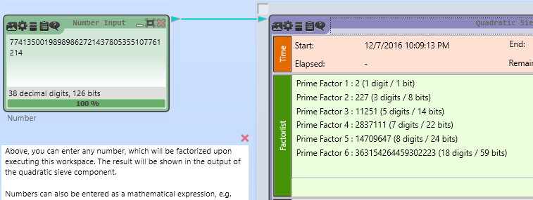

The prime factors are as follows

```
2
227
11251
2837111
14709647
363154264459302223
```

Next, we find the Euler-Phi of P. This [script](diffie02_euler.php) does the calculation as follows.

```
(2-1) * (227-1) * (11251-1) * (2837111-1) * (14709647-1) * (363154264459302223-1) = 38532794441885460791256898927871100000
```

The Euler-Phi of p is 38532794441885460791256898927871100000

Next, we find the prime factors of the previous Euler-Phi value. I used the same tool in Cryptool to perform the factorization

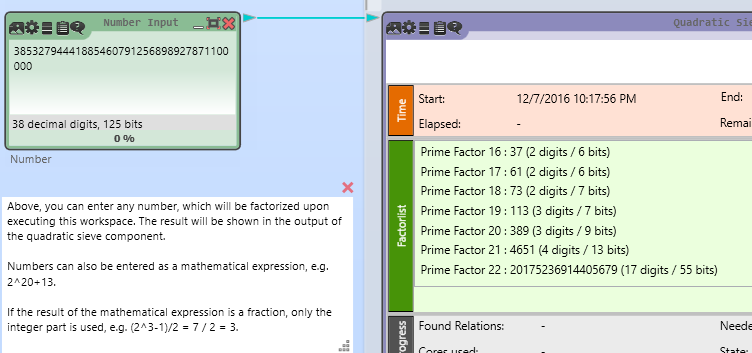

The prime factors are as follows

```
2
2
2
2
2
3
3
3
3
5
5
5
5
5
7
37
61
73
113
389
4651
20175236914405679
```

The same factors can be collapsed together as follows

```
32
81
3125
7
37
61
73
113
389
4651
20175236914405679
```

We have all the values we need. Modify the JAVA poc code as follows, putting in our g, p, A, B, Euler-Phi and Euler-Phi factor values. This is a [copy of the modified JAVA code](Runme.java)

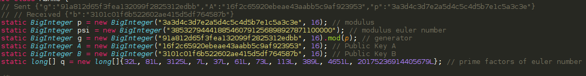

Running it will give us the session key needed to decrypt the 'fffff' message. Do note that this will run for some time. On my machine, the code took about 6 hours to complete.

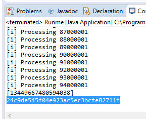

I modified [Javascript file](jsstuffs/js3_decrypt.html) further to include this session key to decrypt the message. I also replaced the "eval" code with "console.log" to see the result instead of executing it.

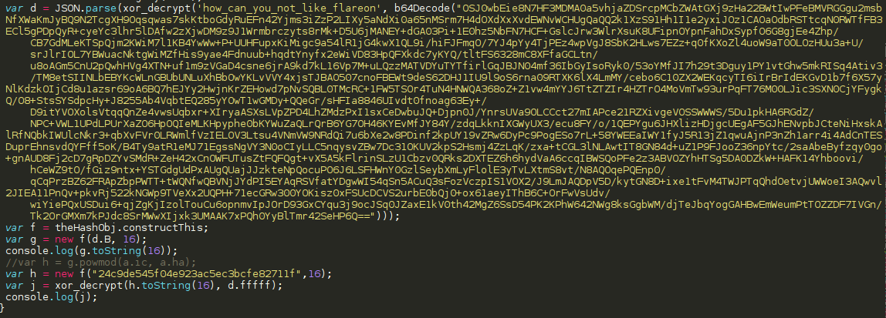

Opening the file in the browser will decrypt the message and display it in the debugger console

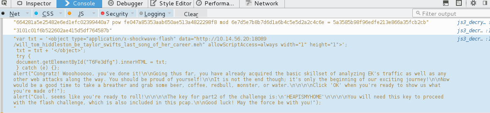

```js
var txt = '<object type="application/x-shockwave-flash" data="http://10.14.56.20:18089/will_tom_hiddleston_be_taylor_swifts_last_song_of_her_career.meh" allowScriptAccess=always width="1" height="1">';
 txt = txt + '</object>';
 try {
 document.getElementById("T6Fe3dfg").innerHTML = txt;
 } catch (e) {};
alert("Congratz! Wooohooooo, you've done it!\n\nGoing thus far, you have already acquired the basic skillset of analyzing EK's traffic as well as any other web attacks along the way. You should be proud of yourself!\n\nIt is not the end though; it's only the beginning of our exciting journey!\n\nNow would be a good time to take a breather and grab some beer, coffee, redbull, monster, or water.\n\n\n\nClick 'OK' when you're ready to show us what you're made of!");
alert("Cool, seems like you're ready to roll!\n\n\n\nThe key for part2 of the challenge is:\n'HEAPISMYHOME'\n\n\n\nYou will need this key to proceed with the flash challenge, which is also included in this pcap.\n\nGood luck! May the force be with you!");
```

We have solved the first part of this challenge. The password "HEAPISMYHOME" is needed for the next part of this challenge which is the Flash file that was downloaded before.

### FLASH 1

I used [JPEXS Free Flash Decompiler](https://www.free-decompiler.com/flash/) to decompile all the flash files in this challenge.

Open the flash file in JPEXS. Try running it.

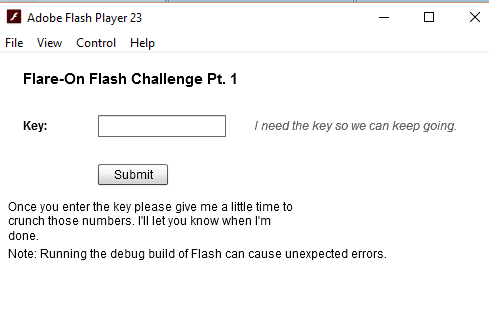

It is expecting some kind of key. If we input the key "HEAPISMYHOME", a bunch of messages pops up and nothing happens. Let's take a look at the code, starting with the click handler of the submit button

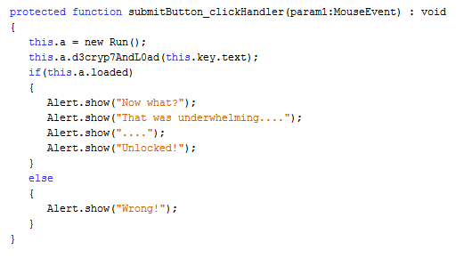

It takes the input key and pass it to the "d3cryp7AndL0ad" function of the "Run" class. After which, it pops a bunch of alert messages which was what we saw. Let's look at the "d3cryp7AndL0ad" function which can be found under the Scripts->SwfLoader folder

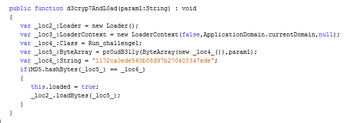

The code loads the class "Run_challenge1" as a byte array and passes it together with the input key into the "pr0udB3lly" function. If the MD5 hash of the output is equal to the one listed, it calls the loadBytes function. The [loadBytes](http://help.adobe.com/en_US/FlashPlatform/reference/actionscript/3/flash/display/Loader.html#loadBytes\(\)) function is similar to Javascript's "eval" function.

This is similar to what the Javascript code was doing. The "Run_challenge1" class is a binary resource located in the binaryData folder. The code loads it, performs some decryption using the "pr0udB3lly" function and the executes the results. The "pr0udB3lly" functions looks like some sort of RC4 algorithm.

In order to get the next stage, the correct key "HEAPISMYHOME" needs to be entered. Wait till the alert messages start showing. After that, dump out the next stage flash file from memory. JPEXS actually has a tool that does this (Tools->Search SWF in memory). However, I'll go through how to do it manually using a debugger

First, run the flash file and input the key "HEAPISMYHOME" and wait for the alert message. Then attach x64dbg to the flash player process. As the decryption function is some kind of RC4 algorithm, the decrypted file should have the same length as the encrypted file. Let's check how big is "Run_challenge1"

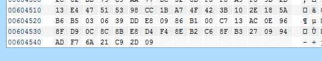

It is approx 0x604546 bytes long. Look at the "Memory Map" in x64dbg and sort it by size. There is one mapped region that is approximately that size


Displaying it in the dump confirms that it does contain a flash file (from the FWS header)

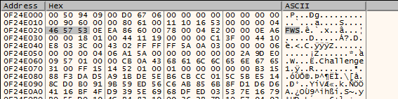

Dump it my right-clicking on the memory map and selecting "Dump memory to File". Let's clean the file up. Open it in Hex Editor and delete the starting bytes such that the first bytes of the file is "FWS". Also delete off all the null bytes at the end of the file.

### Flash 2

Open the new flash file in JPEXS

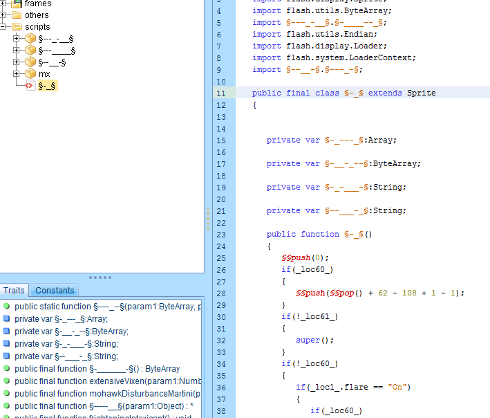

Looks like the code is heavily obfuscated. Luckily, JPEXS has a tool that can help to deobfuscate such code.

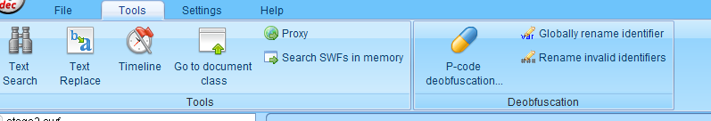

Run the "P-code Deobfuscation" and "Rename Invalid Identifiers" tools. The code is much more manageable now.

I will not go through reversing these code step by step. Below is a summary of what it is doing. I also uploaded the [class_1.as](flashstuffs/actionScripts/class_1.as) with renamed function names and comments.

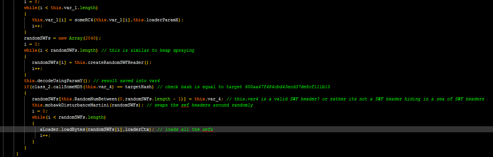

- Checks for a parameter named "flare" with value "On"
- If present, store the parameters named "x" and "y"
- Creates an array of encrypted blob using most of the binary resources in the BinaryData folder
- Decrypts each of these encrypted blobs using RC4 with parameter "x" as the key
- Process parameter "y" which is a string in the format "11:123,22:764,..."
 - Each pair contains 2 numbers and is separated by commas
 - Left number refers to the Blob Index
 - Right number refers to the Byte Index
- Builds the decrypted file using Blobs\[BlobIndex\]\[ByteIndex\]
- If the hash is equal to "600aa47f484cbd43ecd37de5cf111b10"
 - Hides the decrypted file among the 2048 random SWF headers and calls loadBytes on it.

There are 2 important values here. The parameter "x" and "y". I was stuck here for a longest time. There were no mention of these 2 parameters anyway else in the code, not even in the Javascript code which is where normal exploit kits would have placed them.

I only managed to find them after a hint from @peta909. I still feel it doesn't make sense.

### Huh really??

First of all export all the binary resources using the "Export all" button

Within the binary resources in the BinaryData folder, there are 2 resource that was not used to create the encrypted blobs I mentioned before.

- Int3lIns1de_t3stImgurvnUziJP
- class_25

The first filename looks interesting, it seems to have a imgur url in it. Visit [imgur.com/vnUziJP](http://imgur.com/vnUziJP). 

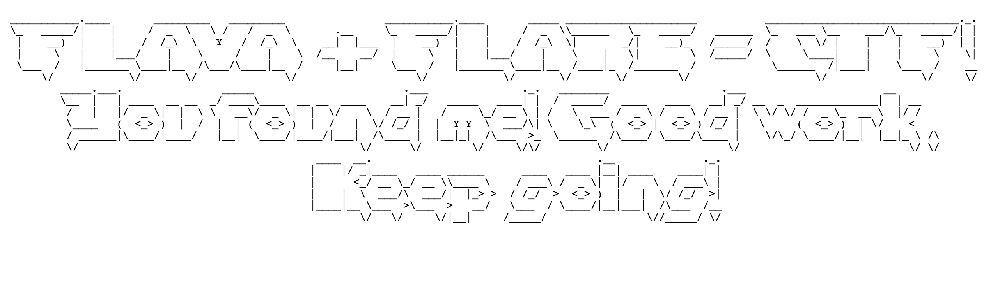

Download and save the file. 

Notice that, this png is the same filesize as Int3lIns1de_t3stImgurvnUziJP.bin. This is because the binary resource in the flash file is the encrypted form of this png. Recall, that all the encrypted blobs were decrypted using RC4 with the same key "x".

This [article](http://crypto.stackexchange.com/questions/24546/rc4-is-it-possible-to-find-the-key-if-we-know-the-plaintext-and-ciphertext) explains the key reuse vulnerability in RC4. Below is a summary of what I understood from it.

- RC4 uses the key to initialize a keystream of infinite length
 - The same key will always generate the same keystream
- Encryption is basically performing a xor operation between the data byte and a byte from the keystream
 - If we know a pair of plaintext and ciphertext, we can recover the keystream
 - The keystream can then be used to decrypt any other message encrypted by the same key

I recovered the keystream by just xoring the encrypted and plain images from before. Using the keystream to decrypt "class_25.bin" reveals parameter "x" and "y"

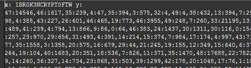

I reimplemented the decryption logic in this [php script](flashstuffs/soln_part4_stage2swf.php). It will recover the keystream, decrypts x and y, uses x and y to decrypt the other blobs and combine them into the output swf file

### Flash 3

This flash file will fail to decompile due to the obfuscation. Do the same "P-code deobfuscation" and "Rename Invalid Identifiers" using JPEXS. The code will then be able to decompile.

The code seems to be very simple. It is checking thousands of if conditions and printing 1 byte out each time a correct condition is met.

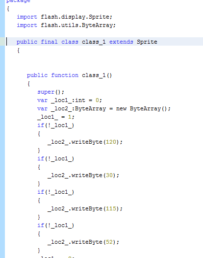

I copied the code whole chunk into this [php script](flashstuffs/soln_part5_stage3swf). I used Find and Replace the modify it into php syntax. Specifically, these 3 strings

- Replace "\_loc1\_" with "$addFlag"
- Replace "\_loc2\_" with "$out"
- Replace ".writeByte" with "[] = "

Running it will reveal the flag

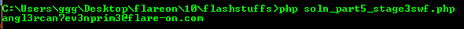

The flag is `angl3rcan7ev3nprim3@flare-on.com`