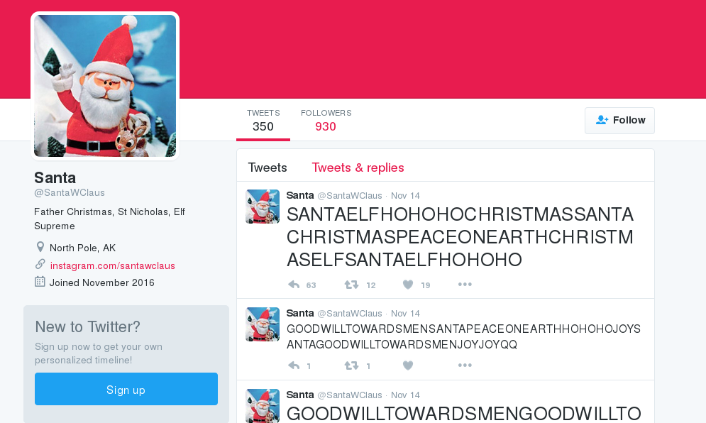
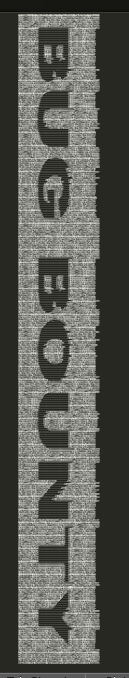
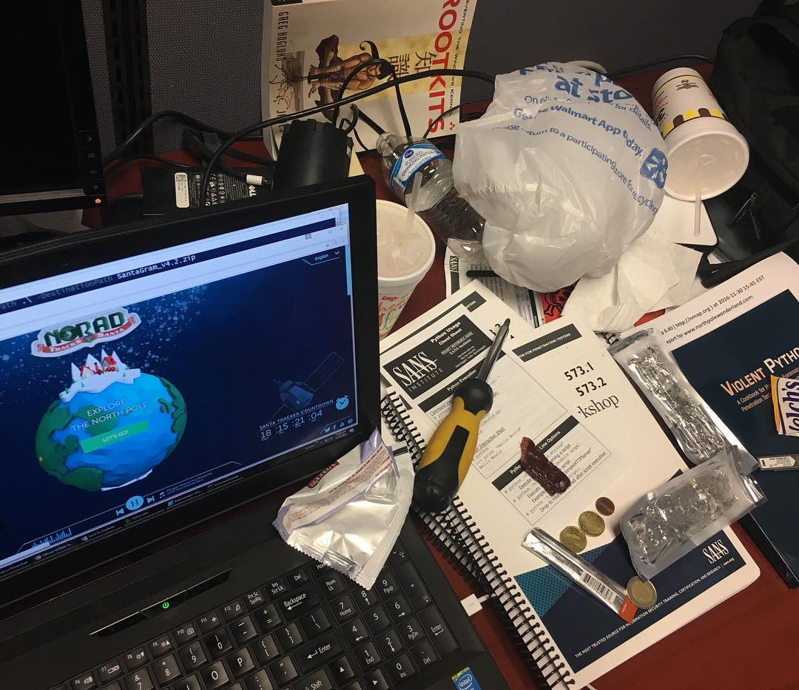
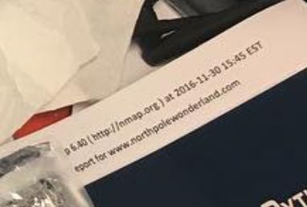
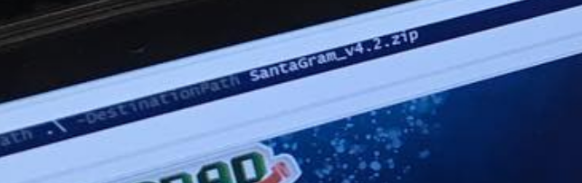

## SANS Holiday Hack Challenge 2016
# Part 01 : A Most Curious Business Card

Looking at Santa's business card reveals a Twitter account and an Instagram account

Let's look at the Twitter account [@santawclaus](https://twitter.com/santawclaus) first.

Santa has tweeted 350 tweets with seemingly random looking content. Download all these tweets. You can use some kind of twitter crawler but I was too lazy to setup a development twitter account, so I did it the old fashioned way. 

I copied and pasted all 350 tweets into this [file](tweets.txt).

When combined, the tweets reveal the secret message "Bug Bounty".

Now, let's look at the Instagram account [@santawclaus](https://www.instagram.com/santawclaus/)

The important picture is the first picture as shown below

There are 2 important info in this picture

Combining these 2 info will give the location of the zip file

> http://www.northpolewonderland.com/SantaGram_v4.2.zip

Download the zip file. The file is password protected. Guess what the password is?

The password is "bugbounty" all in lower case.

Unzipping the zip file produces an Android APK file.

Move on to Part 2

### Answering the Questions

1) What is the secret message in Santa's tweets?

> The secret message is "bugbounty" which is the password for the zip file

2) What is inside the ZIP file distributed by Santa's team?

> The zip file contains the SantaGram Android APK file.