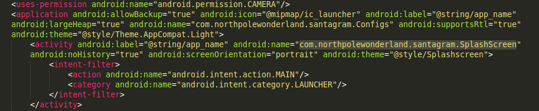
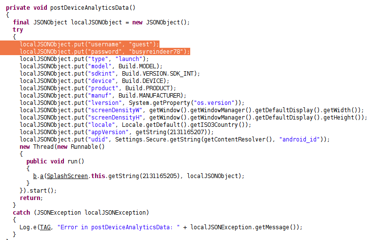
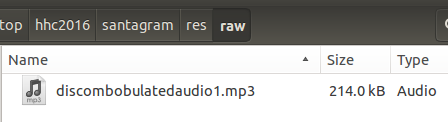

## SANS Holiday Hack Challenge 2016
# Part 02 : Awesome Package Konveyance

Unzip the [zip file](SantaGram_v4.2.zip) with the password that we got from Part 1 ("bugbounty"). Inside is an APK file.

The goal of this part of the challenge is to find a **set of credentials** and an **audio file** hidden in the apk.

There is 2 ways to analyze an APK. First, is to attempt to decompile it into JAVA code using [dex2jar](https://github.com/pxb1988/dex2jar) and [jd-gui](http://jd.benow.ca/). The other is to decompile it into smali code using [apktool](https://ibotpeaches.github.io/Apktool/). Most of the time I use both.

Decompiling to JAVA
```
unzip -d santagram SantaGram_4.2.apk
cd santagram
d2j-dex2jar.sh classes.dex
jd-gui classes-dex2jar.jar
```

Decompiling to Smali
```
apktool d SantaGram_4.2.apk
(This will decompile the app into a "SantaGram_4.2" sub folder)
```

Let's look for the entry point in the AndroidManifest file.

```
subl SantaGram_4.2/AndroidManifest.xml
```



The entry point is the class with the intent filter "android.intent.action.MAIN". In this case its the "com.northpolewonderland.santagram.SplashScreen"

Looking at this class in jd-gui reveals the following function in the class



There is a set of credential (guest:busyreindeer78) for some kind of Analytics Server. Also notice that jd-gui fails to decompile some parts of the code. This is the problem with this approach. I would suggest going the Smali route for in-depth Android analysis.

If you have any experience writing and Android App, you would know that normally media files are stored as raw resources in an APK. Look at the raw resource folder and the audio is there



That's all for this part. 

Don't worry, we need to analyze this app further in Part 4. For now, proceed to Part 3

### Answering the Questions

3) What username and password are embedded in the APK file?

> guest:busyreindeer78

4) What is the name of the audible component (audio file) in the SantaGram APK file?

> discombobulatedaudio1.mp3