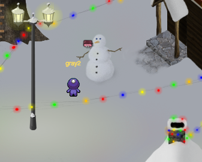
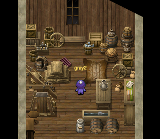
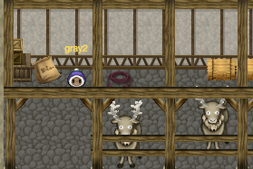
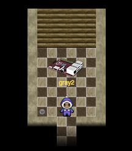
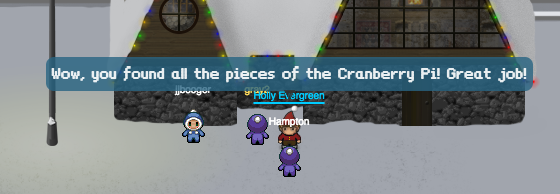
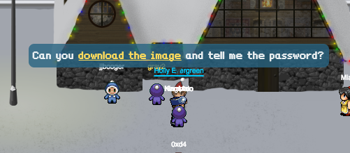
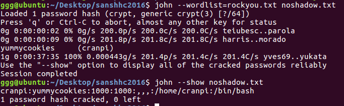
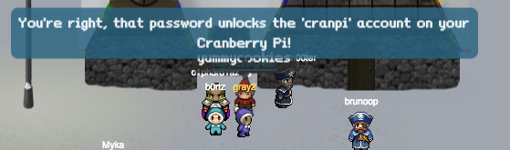
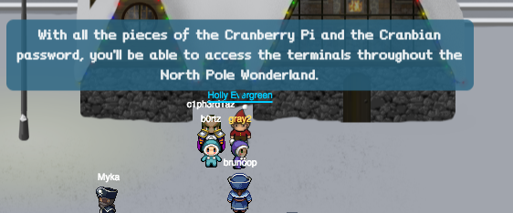
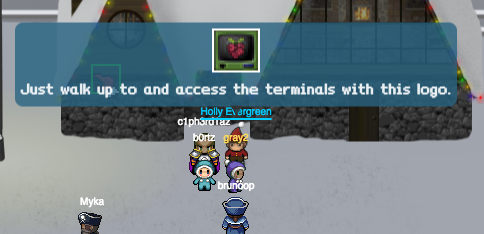

## SANS Holiday Hack Challenge 2016
# Part 03a : A Fresh-Baked Holiday Pi (Cranpi Image)

The goal of this part of the challenge is to find the password of the "cranpi" account on the cranpi image provided.

To get access to this image, you need to collect 5 parts of the Cranpi system in the game to create the Cranpi first.

### Building the Cranberry Pi

So, here is where all the parts of the Cranpi are.

By the snowman in the central plaza, behind the christmas tree



In the upstairs room of the house to the right of the christmas tree



Ledge to the left of the house in the clouds


Inside the house in the clouds



Inside the secret room of the house to the left of the christmas tree (Entry to secret room is through the fireplace in this house)



Once you have all 5 parts, bring them to Holly Evergreen at the entrance of North Pole to construct the Cranpi.



After which, Holly will give you a link to a Cranpi image for us to analyze



### Analzying the image

As the image file is huge, I will not be uploading it. Here is a [link](https://www.northpolewonderland.com/cranbian.img.zip) to the file

Use fdisk to check the image.

> fdisk -l cranbian-jessie.img

```
Disk cranbian-jessie.img: 1.3 GiB, 1389363200 bytes, 2713600 sectors
Units: sectors of 1 * 512 = 512 bytes
Sector size (logical/physical): 512 bytes / 512 bytes
I/O size (minimum/optimal): 512 bytes / 512 bytes
Disklabel type: dos
Disk identifier: 0x5a7089a1

Device               Boot  Start     End Sectors  Size Id Type
cranbian-jessie.img1        8192  137215  129024   63M  c W95 FAT32 (LBA)
cranbian-jessie.img2      137216 2713599 2576384  1.2G 83 Linux
```

Note that there are 2 partitions. One looks like a Windows 95 partition while the other is a linux partition.

We can mount both of them as follows, using the (Start*512) address as an offset

> mkdir cranpi1

> sudo mount cranbian-jessie.img cranpi1 -o loop,offset=4194304

> mkdir cranpi2

> sudo mount cranbian-jessie.img cranpi2 -o loop,offset=70254592

We can now explore the 2 partitions. 

The file that we are interested in is the passwd and shadow file of the linux partition

> sudo cat cranpi2/etc/shadow

```
root:*:17067:0:99999:7:::
daemon:*:17067:0:99999:7:::
bin:*:17067:0:99999:7:::
sys:*:17067:0:99999:7:::
sync:*:17067:0:99999:7:::
games:*:17067:0:99999:7:::
man:*:17067:0:99999:7:::
lp:*:17067:0:99999:7:::
mail:*:17067:0:99999:7:::
news:*:17067:0:99999:7:::
uucp:*:17067:0:99999:7:::
proxy:*:17067:0:99999:7:::
www-data:*:17067:0:99999:7:::
backup:*:17067:0:99999:7:::
list:*:17067:0:99999:7:::
irc:*:17067:0:99999:7:::
gnats:*:17067:0:99999:7:::
nobody:*:17067:0:99999:7:::
systemd-timesync:*:17067:0:99999:7:::
systemd-network:*:17067:0:99999:7:::
systemd-resolve:*:17067:0:99999:7:::
systemd-bus-proxy:*:17067:0:99999:7:::
messagebus:*:17067:0:99999:7:::
avahi:*:17067:0:99999:7:::
ntp:*:17067:0:99999:7:::
sshd:*:17067:0:99999:7:::
statd:*:17067:0:99999:7:::
cranpi:$6$2AXLbEoG$zZlWSwrUSD02cm8ncL6pmaYY/39DUai3OGfnBbDNjtx2G99qKbhnidxinanEhahBINm/2YyjFihxg7tgc343b0:17140:0:99999:7:::
```

The "cranpi" acconunt has been found. I used "John the Ripper" to crack this hash. 

First of all, we need to "unshadow" it first. The "unshadow" tool is installed together with "john"

> sudo unshadow cranpi2/etc/passwd cranpi2/etc/shadow > noshadow.txt

```
<... redacted for brevity ...>
cranpi:$6$2AXLbEoG$zZlWSwrUSD02cm8ncL6pmaYY/39DUai3OGfnBbDNjtx2G99qKbhnidxinanEhahBINm/2YyjFihxg7tgc343b0:1000:1000:,,,:/home/cranpi:/bin/bash
```

Download the [rockyout.txt](https://wiki.skullsecurity.org/index.php?title=Passwords) wordlist. Using john with this wordlist will crack the password



The password is "yummycookies"

Returning to Holly Evergreen and telling her this password will unlock access to the cranpi terminals scattered throughout the game.







These will be covered in the next part.

### Answering the Questions

5) What is the password for the "cranpi" account on the Cranberry Pi system?

> yummycookies
