## SANS Holiday Hack Challenge 2016
# Part 03b : A Fresh-Baked Holiday Pi (Cranpi Terminals)

Each of these terminals a small sandboxed terminal. The goal is to find a password that will unlock the "door" protected by these terminals.

Most of these terminals are testing our knowledge of linux commandline-fu 

Here is a list of all the terminals in the game

- [Right Elf House](#right-elf-house)
- [House in the Cloud: Stairway](#house-in-the-cloud-stairway)
 - [Santa's Office](#house-in-the-cloud-santa-office)
- [House in the Cloud: Barn Door](#house-in-the-cloud-barn-door)
- [House in the Cloud: Train](#house-in-the-cloud-train)

*****

### Right Elf House

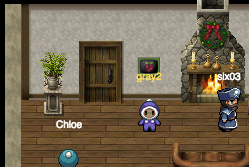

Accessing the terminal shows the following message

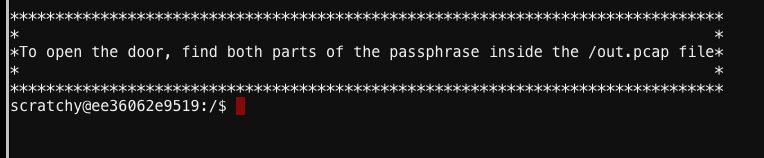

There is a out.pcap file in the root directory but it is owned by the user "itchy". The current user is scratchy and we do not have permissions to read the file.

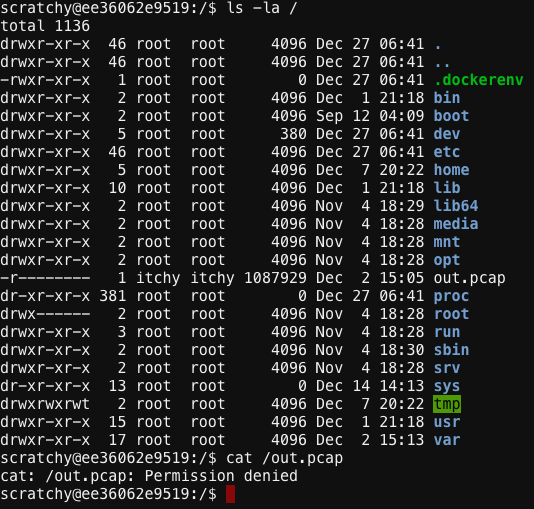

Let's check what we have access to first

> sudo -l

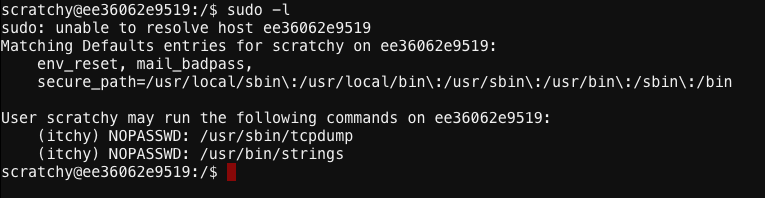

Looks like we have permission to use the "strings" and "tcpdump" commands as the user "itchy"

Let's try running strings on the pcap file first

> sudo -u itchy strings -n 10 /out.pcap

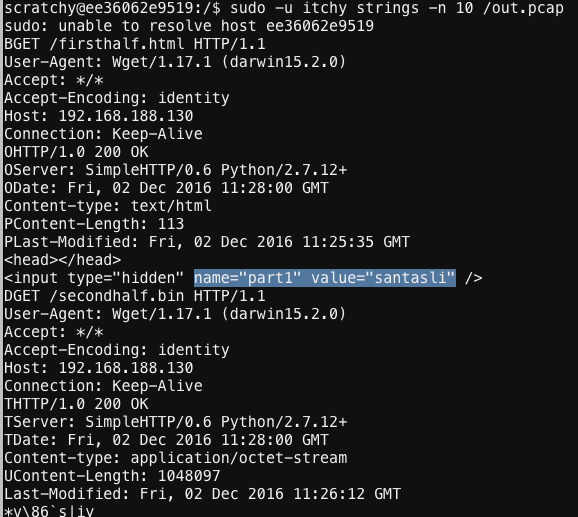

From these strings, we can see 2 GET requests.

One that goes to "firsthalf.html" which reveals the first part of our pass phrase "santasli".

The other request goes to "secondhalf.bin". This was where I was stuck for awhile. I use tcpdump to dump out the traffic and reconstructed secondhalf.bin but it does not seem to be a valid file. This was actually a red herring.

The second half could be gotten through the strings command using another encoding.

> sudo -u itchy strings -n 10 -e l /out.pcap

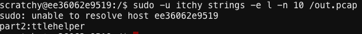

Combining the 2 halfs give the pass phrase "santaslittlehelper"

Entering this pass phrase into the door gives access to some kind of Elf bunk room

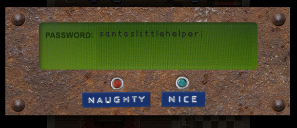

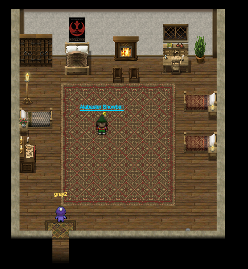

*****

### House in the Cloud: Stairway

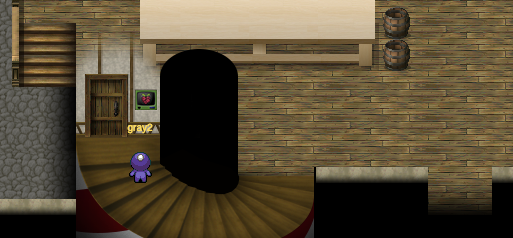

Accessing the terminal shows the following message

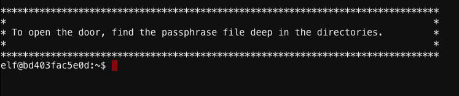

Hmm, we need to find some deep directory. Let's start with the user's home directory

> ls -la

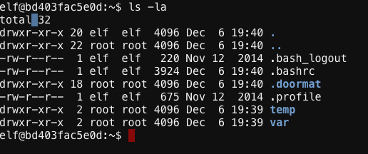

There is a hidden folder names ".doormat". Let's look inside it.

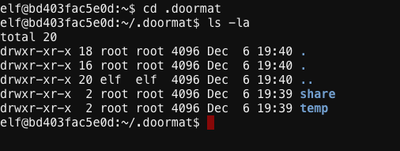

Hmm, that looks strange.

Let's use the "find" command to check what is in this folder exactly

> find -mindepth 2 -maxdepth 10

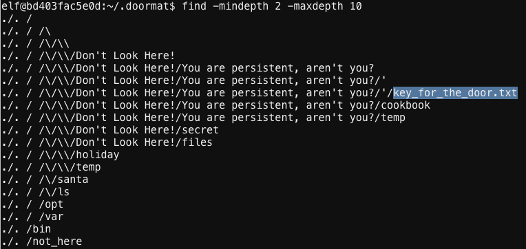

The "key_for_the_door.txt" file seems to be the goal.

The full path returned by "find" gives us clues on how to reach the file.

Below is the sequence of commands to enter to reach the file

```
elf@d62a31b9e18e:~/.doormat$ cd ". "
elf@d62a31b9e18e:~/.doormat/. $ cd " "
elf@d62a31b9e18e:~/.doormat/. / $ cd \\
elf@d62a31b9e18e:~/.doormat/. / /\$ cd \\\\
elf@d62a31b9e18e:~/.doormat/. / /\/\\$ cd "Don't Look Here!"
elf@d62a31b9e18e:~/.doormat/. / /\/\\/Don't Look Here!$ cd "You are persistent, aren't you?"
elf@d62a31b9e18e:~/.doormat/. / /\/\\/Don't Look Here!/You are persistent, aren't you?$ cd "'"
elf@d62a31b9e18e:~/.doormat/. / /\/\\/Don't Look Here!/You are persistent, aren't you?/'$ cat key_for_the_door.txt
key: open_sesame
```

The password is "open_sesame". Using it on the door gives access to Santa's Office which contains another terminal

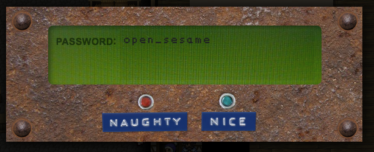

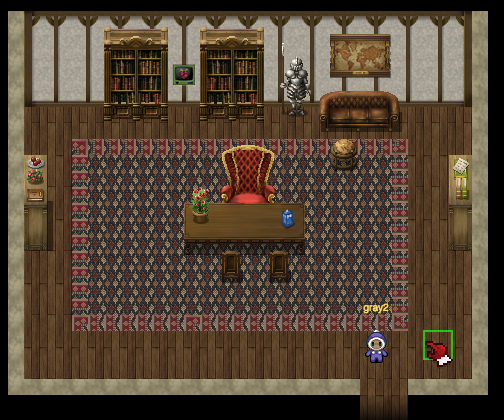

*****

# House in the Cloud: Santa Office

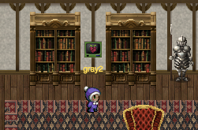

Accessing the terminal shows the following message

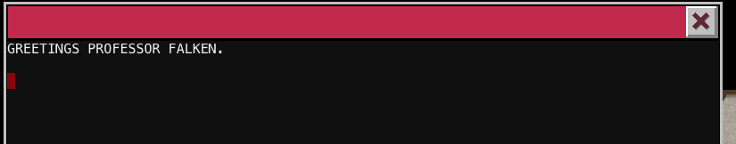

Googling the line "Greetings Professor Falken" reveals that it is from a movie scene.

The [scene in question](https://www.youtube.com/watch?v=KXzNo0vR_dU) is from the movie "Wargames"

The goal is to re-create this scene. Watch the clip and type in exactly what the main actor typed. (Take note of the punctuations)

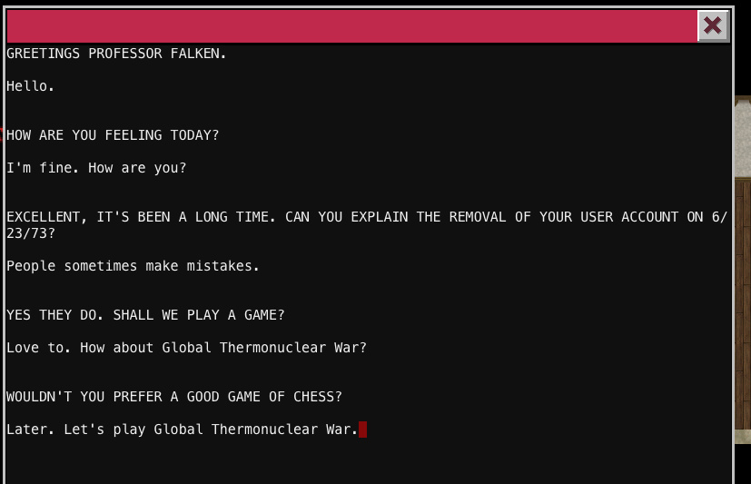

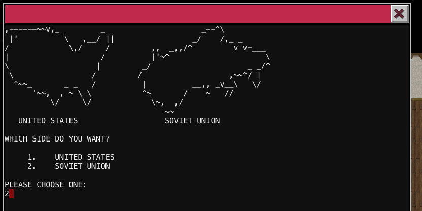

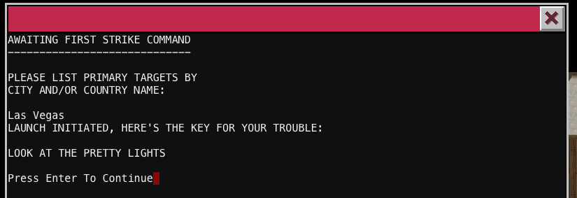

Here is the full transcript for easier copying

```
GREETINGS PROFESSOR FALKEN.
Hello.
HOW ARE YOU FEELING TODAY?
I'm fine. How are you?
EXCELLENT, IT'S BEEN A LONG TIME. CAN YOU EXPLAIN THE REMOVAL OF YOUR USER ACCOUNT ON 6/23/73?
People sometimes make mistakes.
YES THEY DO. SHALL WE PLAY A GAME?
Love to. How about Global Thermonuclear War?
WOULDN'T YOU PREFER A GOOD GAME OF CHESS?
Later. Let's play Global Thermonuclear War.
FINE

,------~~v,_         _                     _--^\
 |'          \   ,__/ ||                 _/    /,_ _
/             \,/     /         ,,  _,,/^         v v-___
|                    /          |'~^                     \
\                   |         _/                     _ _/^
 \                 /         /                   ,~~^/ | 
  ^~~_       _ _   /          |          __,, _v__\   \/
      '~~,  , ~ \ \           ^~       /    ~   //
          \/     \/             \~,  ,/          
                                   ~~
   UNITED STATES                   SOVIET UNION
WHICH SIDE DO YOU WANT?
     1.    UNITED STATES
     2.    SOVIET UNION
PLEASE CHOOSE ONE: 
2

AWAITING FIRST STRIKE COMMAND
-----------------------------
PLEASE LIST PRIMARY TARGETS BY
CITY AND/OR COUNTRY NAME: 
Las Vegas
LAUNCH INITIATED, HERE'S THE KEY FOR YOUR TROUBLE: 
LOOK AT THE PRETTY LIGHTS
Press Enter To Continue
```

Using the pasword "LOOK AT THE PRETTY LIGHTS" on the bookcase reveals a corridor passage

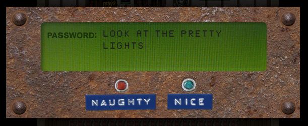

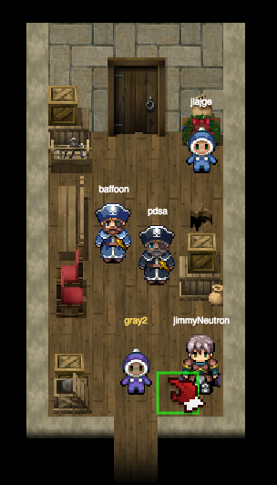

This time the door is still locked by a pass phrase but there are no cranpi terminals around.

Maybe, we have to come back here later.

*****

### House in the Cloud: Barn Door

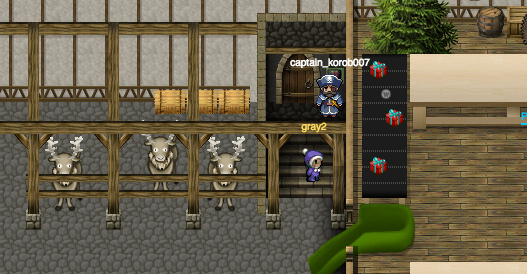

Accessing this terminal shows the following message

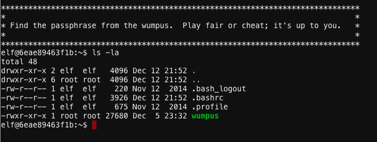

Looks like we got to play the [Wumpus](https://en.wikipedia.org/wiki/Hunt_the_Wumpus) game.

You can try to beat it the legit way but I'm going to describe the "cheating" way

The terminal does not have "gdb" but it does have "objdump"

Use objdump to disassemble the binary (-d flag) and look around the code.

> objdump -m Intel -d wumpus

The interesting part is the "kill_wump" function. 

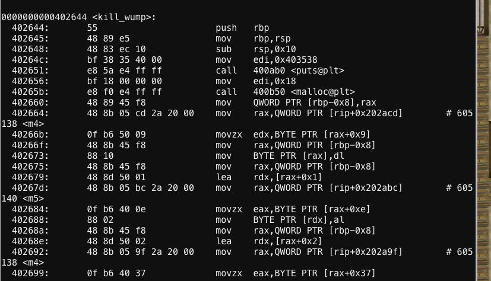

It seems like after printing something using the "puts" function, it mallocs a buffer and starts copying bytes into this buffer, 1 byte at a time.

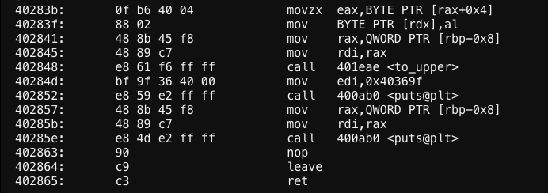

After the copying completes, the buffer is converted to all upper case and then printed using the "puts" function.

Let's take a look at the first byte that is copied into the buffer.

```
402664:       48 8b 05 cd 2a 20 00    mov    rax,QWORD PTR [rip+0x202acd]        # 605138 <m4>
40266b:       0f b6 50 09             movzx  edx,BYTE PTR [rax+0x9]
```

Check what is at 0x605138 using the "-s" flag of objdump

> objdump -s wumpus

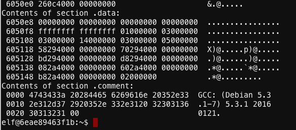

0x605138 seems to contain a pointer to 0x00402a08. Also, looking around the same area, there seems to be multiple pointers pointing to the 0x4029\*\* to 0x402a\*\* addresses.

Scroll up to see what these addresses contains

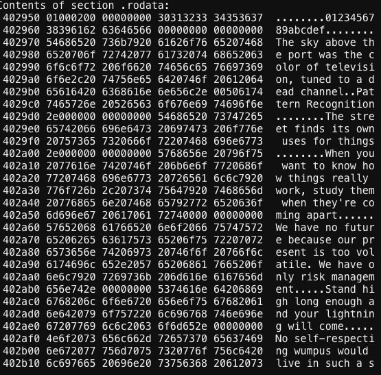

They contain text!! Seems like the code is copying bytes, one at a time from this area to form a string which is then printed. Sounds like a pass phrase to me.

I have copied the "kill_wump" function code into [this file](wumpus_code.txt). I've also copied the memory areas that are referenced by the code [here](wumpus_data.txt)

Running through the code will reveal the password

```
0x605118 -> 0x402958
0x605120 -> 0x402970
0x605128 -> 0x4029bd
0x605130 -> 0x4029d8
0x605138 -> 0x402a08
0x605140 -> 0x402a60
0x605148 -> 0x402ab8

Contents of section .rodata:
 402950 01000200 00000000 30313233 34353637  ........01234567
 402960 38396162 63646566 00000000 00000000  89abcdef........
 402970 54686520 736b7920 61626f76 65207468  The sky above th
 402980 6520706f 72742077 61732074 68652063  e port was the c
 402990 6f6c6f72 206f6620 74656c65 76697369  olor of televisi
 4029a0 6f6e2c20 74756e65 6420746f 20612064  on, tuned to a d
 4029b0 65616420 6368616e 6e656c2e 00506174  ead channel..Pat
 4029c0 7465726e 20526563 6f676e69 74696f6e  tern Recognition
 4029d0 2e000000 00000000 54686520 73747265  ........The stre
 4029e0 65742066 696e6473 20697473 206f776e  et finds its own
 4029f0 20757365 7320666f 72207468 696e6773   uses for things
 402a00 2e000000 00000000 5768656e 20796f75  ........When you
 402a10 2077616e 7420746f 206b6e6f 7720686f   want to know ho
 402a20 77207468 696e6773 20726561 6c6c7920  w things really 
 402a30 776f726b 2c207374 75647920 7468656d  work, study them
 402a40 20776865 6e207468 65792772 6520636f   when they're co
 402a50 6d696e67 20617061 72740000 00000000  ming apart......
 402a60 57652068 61766520 6e6f2066 75747572  We have no futur
 402a70 65206265 63617573 65206f75 72207072  e because our pr
 402a80 6573656e 74206973 20746f6f 20766f6c  esent is too vol
 402a90 6174696c 652e2057 65206861 7665206f  atile. We have o
 402aa0 6e6c7920 7269736b 206d616e 6167656d  nly risk managem
 402ab0 656e742e 00000000 5374616e 64206869  ent.....Stand hi
 402ac0 6768206c 6f6e6720 656e6f75 67682061  gh long enough a
 402ad0 6e642079 6f757220 6c696768 746e696e  nd your lightnin
 402ae0 67207769 6c6c2063 6f6d652e 00000000  g will come.....
 402af0 4e6f2073 656c662d 72657370 65637469  No self-respecti

mov    rax,QWORD PTR [rip+0x202acd]        	# 605138 -> 0x402a08
movzx  edx,BYTE PTR [rax+0x9]				# 0x402a08 + 0x9 = 0x402a11 -> 0x77 'w'

mov    rax,QWORD PTR [rip+0x202abc]        	# 605140 -> 0x402a60
movzx  eax,BYTE PTR [rax+0xe]				# 0x402a60 + 0xe = 0x402a6e -> 0x75 'u'

mov    rax,QWORD PTR [rip+0x202a9f]        	# 605138 -> 0x402a08
movzx  eax,BYTE PTR [rax+0x37]				# 0x402a08 + 0x37 = 0x402a3f -> 0x6d 'm'

mov    rax,QWORD PTR [rip+0x202a72]        	# 605120 -> 0x402970
movzx  eax,BYTE PTR [rax+0x12]				# 0x402970 + 0x12 = 0x402982 -> 0x70 'p'

mov    rax,QWORD PTR [rip+0x202a85]        	# 605148 -> 0x402ab8
movzx  eax,BYTE PTR [rax+0x1d]				# 0x402ab8 + 0x1d = 0x402ad5 -> 0x75 'u'

mov    rax,QWORD PTR [rip+0x202a58]        	# 605130 -> 0x4029d8
movzx  eax,BYTE PTR [rax+0x4]				# 0x4029d8 + 0x4 = 0x4029dc -> 0x73 's'

mov    rax,QWORD PTR [rip+0x202a5b]        	# 605148 -> 0x402ab8
movzx  eax,BYTE PTR [rax+0x16]				# 0x402ab8 + 0x16 = 0x402ace -> 0x20 ' '

mov    rax,QWORD PTR [rip+0x202a26]        	# 605128 -> 0x4029bd
movzx  eax,BYTE PTR [rax+0xe]				# 0x4029bd + 0xe = 0x4029cb -> 0x69 'i'

mov    rax,QWORD PTR [rip+0x202a21]        	# 605138 -> 0x402a08
movzx  eax,BYTE PTR [rax+0x2e]				# 0x402a08 + 0x2e = 0x402a36 -> 0x73 's'

mov    rax,QWORD PTR [rip+0x202a14]        	# 605140 -> 0x402a60
movzx  eax,BYTE PTR [rax+0x7]				# 0x402a60 + 0x7 = 0x402a67 -> 0x20 ' '

mov    rax,QWORD PTR [rip+0x2029ff]        	# 605140 -> 0x402a60
movzx  eax,BYTE PTR [rax+0x49]				# 0x402a60 + 0x49 = 0x402aa9 -> 0x6d 'm'

mov    rax,QWORD PTR [rip+0x2029f2]        	# 605148 -> 0x402ab8
movzx  eax,BYTE PTR [rax+0x7]				# 0x402ab8 + 0x7 = 0x402abf -> 0x69 'i'

mov    rax,QWORD PTR [rip+0x2029c5]        	# 605130 -> 0x4029d8
movzx  eax,BYTE PTR [rax+0x4]				# 0x4029d8 + 0x4 = 0x4029dc -> 0x73 's'

mov    rax,QWORD PTR [rip+0x2029b8]        	# 605138 -> 0x402a08
movzx  eax,BYTE PTR [rax+0x7]				# 0x402a08 + 0x7 = 0x402a0f -> 0x75 'u'

mov    rax,QWORD PTR [rip+0x2029b3]        	# 605148 -> 0x402ab8
movzx  eax,BYTE PTR [rax+0x3]				# 0x402ab8 + 0x3 = 0x402abb -> 0x6e 'n'

mov    rax,QWORD PTR [rip+0x20296e]        	# 605118 -> 0x402958
movzx  eax,BYTE PTR [rax+0xd]				# 0x402958 + 0xd = 0x402965 -> 0x64 'd'

mov    rax,QWORD PTR [rip+0x202959]        	# 605118 -> 0x402958
movzx  eax,BYTE PTR [rax+0xe]				# 0x402958 + 0xe = 0x402966 -> 0x65 'e'

mov    rax,QWORD PTR [rip+0x20295c]        	# 605130 -> 0x4029d8
movzx  eax,BYTE PTR [rax+0x6]				# 0x4029d8 + 0x6 = 0x4029de -> 0x72 'r'

mov    rax,QWORD PTR [rip+0x20295f]        	# 605148 -> 0x402ab8
movzx  eax,BYTE PTR [rax]					# 0x402ab8 + 0x0 = 0x402ab8 -> 0x53 'S'

mov    rax,QWORD PTR [rip+0x202923]        	# 605120 -> 0x402970
movzx  eax,BYTE PTR [rax]					# 0x402970 + 0x0 = 0x402970 -> 0x54 'T'

mov    rax,QWORD PTR [rip+0x202927]        	# 605138 -> 0x402a08
movzx  eax,BYTE PTR [rax+0x6]				# 0x402a08 + 0x6 = 0x402a0e -> 0x6f 'o'

mov    rax,QWORD PTR [rip+0x2028fa]        	# 605120 -> 0x402970
movzx  eax,BYTE PTR [rax+0xa]				# 0x402970 + 0xa = 0x40297a -> 0x6f 'o'

mov    rax,QWORD PTR [rip+0x20290d]        	# 605148 -> 0x402ab8
movzx  eax,BYTE PTR [rax+0x4]				# 0x402ab8 + 0x4 = 0x402abc -> 0x64 'd'
```

Therefore, the password is "WUMPUS IS MISUNDERSTOOD" (Remember to convert them all to upper case)

Entering this password at the door will give access to the DFER (which we will later learn means "Dungeon of Errant Reindeer")

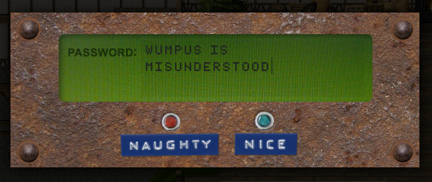

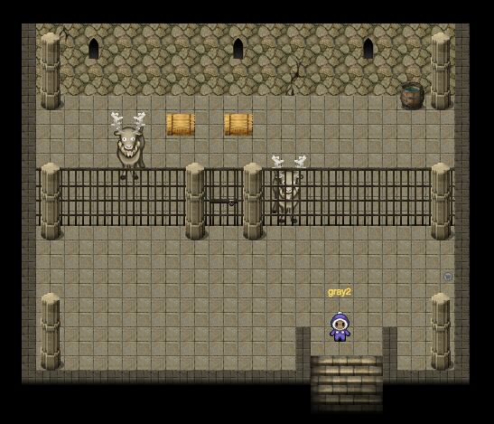

*****

### House in the Cloud: Train


Accessing the terminal presents the following menu

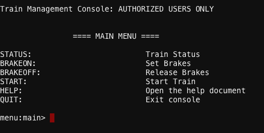

To start the train, we need to issue the "BRAKEOFF" command followed by "START"

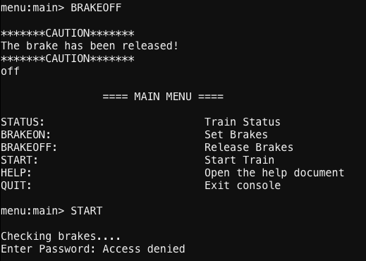

However, we need a password to start the train.

The "HELP" command is interesting as it seems to open a text file in a "vi" viewer

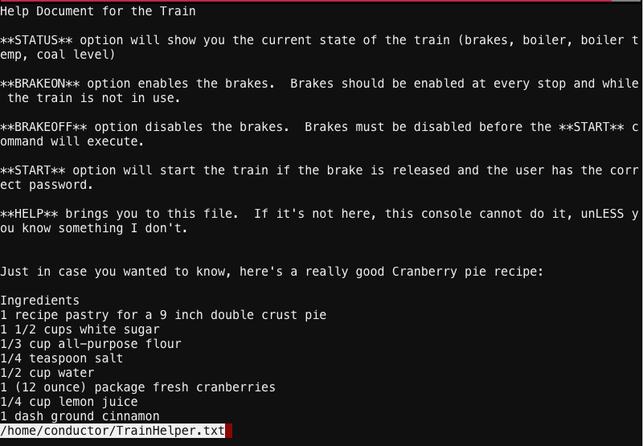

"vi" is able to open other files using the ":e" command. It can also cycle through files in a directory using the "TAB" button.

Press the follwing buttons after the help file has been opened

> :e

> ./

> [TAB] until TrainConsole appears

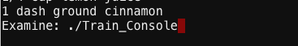

> [Enter] to open the file

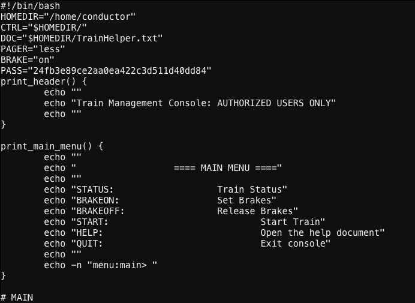

Looks like the [source code](train_source.txt) of the previous menu.

There is a "PASS" variable containing the code "24fb3e89ce2aa0ea422c3d511d40dd84"

Try entering this password to the "START" command

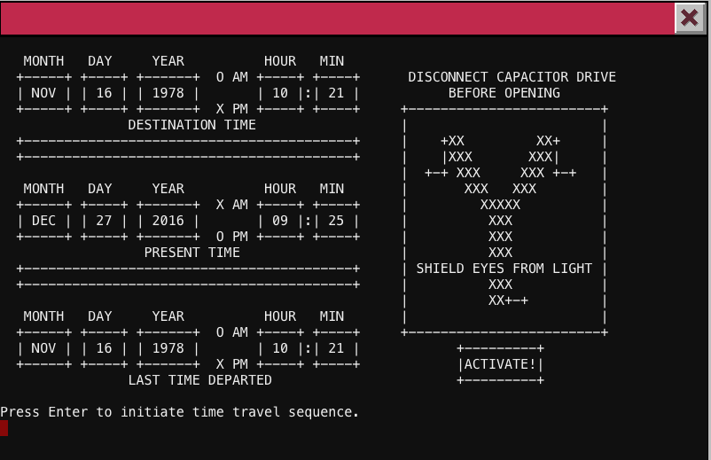

Oh my gawd!! It's the Delorean Train!! LOL! Press enter to hack time :)

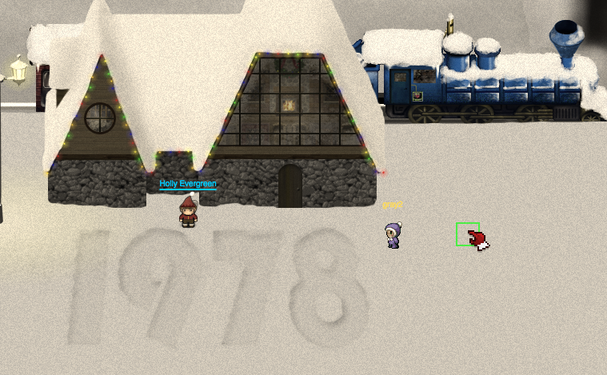

Explore the town and talk to all the punny elves :)

If you enter the DFER room in 1978 (behind the barn door in the house in the cloud), you will see this

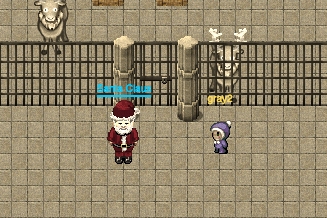

Talking to Santa will complete your quest for this part and roll the Star Wars credits.

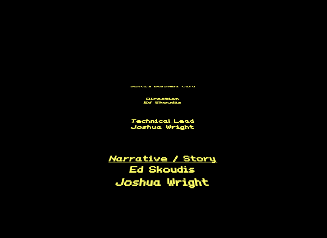

Santa has been rescued but this is not the end of the story yet. We still need to find out who the culprit was. 

Go back to the train and go back to present time. Move on to Part 4.

*****

### Answering the Questions

6) How did you open each terminal door and where had the villain imprisoned Santa?

> Santa has been imprisoned in the DFER room in Nov 16 1978.

> Refer above on how I opened each terminal door
