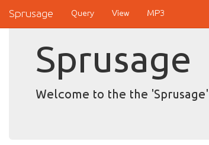

## SANS Holiday Hack Challenge 2016
# Part 04a : Full of Holes (Analytics 1)

Santa has been rescued!! But the culprit has not been identified.

This part focuses on finding and exploiting several vulnerabilities in multiple SantaGram servers. The "flag" is a mp3 audio file hidden on each of these servers.

The urls of the various servers can be found in the "strings.xml" of the SantaGram APK we got in Part 2.

These are the servers in flag order
- Analytics 1
- [Dungeon](../04b/#dungeon)
- [Debug](../04c/#debug)
- [Ads](../04d/#ads)
- [Exception](../04e/#exception)
- [Analytics 2](../04f/#analytics-2)

---

### Analytics 1

Access the analytics site at https://analytics.northpolewonderland.com/

Login with the credentials that we found in Part 2 (guest:busyreindeer78)

Once logged in, the audio file can be found in the top navigation bar.

Click on the "MP3" link to download the mp3 file named "[discombobulatedaudio2.mp3](../05/discombobulatedaudio2.mp3)"