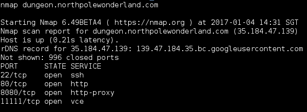
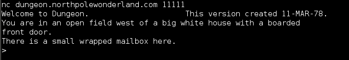
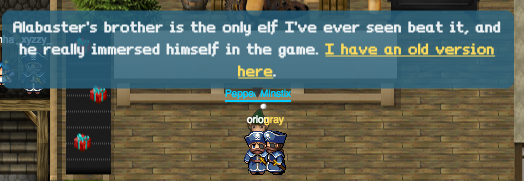
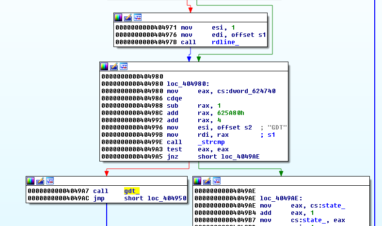
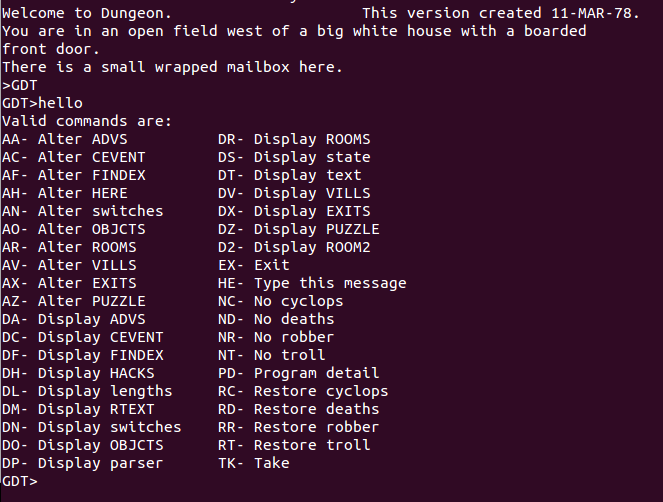
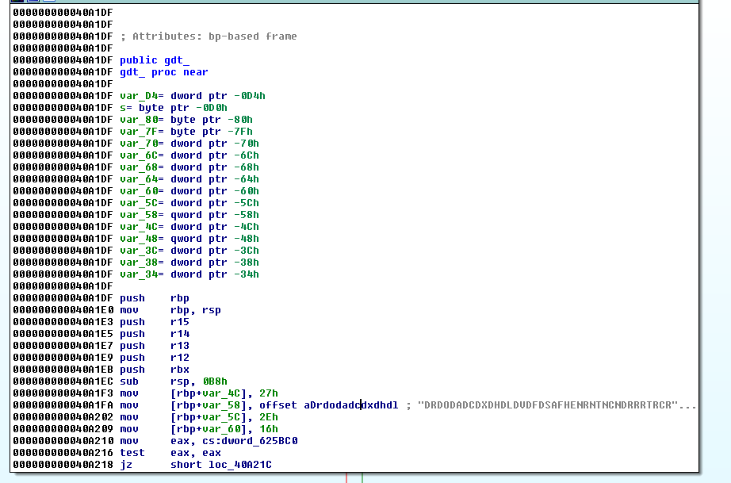
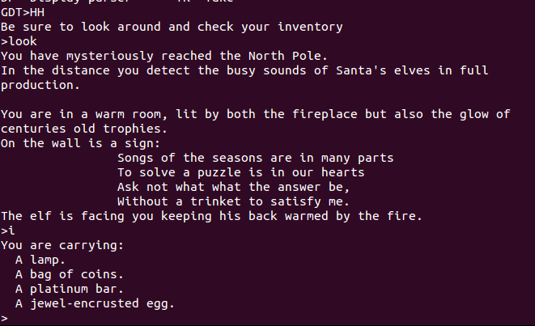
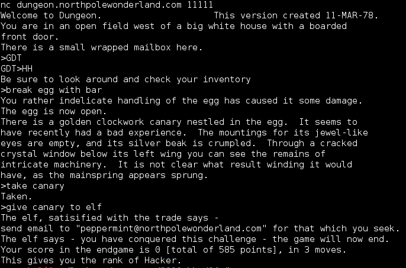

## SANS Holiday Hack Challenge 2016
# Part 04b : Full of Holes (Dungeon)

Santa has been rescued!! But the culprit has not been identified.

This part focuses on finding and exploiting several vulnerabilities in multiple SantaGram servers. The "flag" is a mp3 audio file hidden on each of these servers.

The urls of the various servers can be found in the "strings.xml" of the SantaGram APK we got in Part 2.


These are the servers in flag order
- [Analytics 1](../04a/#analytics-1)
- Dungeon
- [Debug](../04c/#debug)
- [Ads](../04d/#ads)
- [Exception](../04e/#exception)
- [Analytics 2](../04f/#analytics-2)

---

### Dungeon

The Dungeon help manual can be accessed at http://dungeon.northpolewonderland.com/

However, you need to perform a nmap on the server to find where is the actual game hosted.

> nmap dungeon.northpolewonderland.com



The game is hosted on port "11111"



### Analyzing the Binary

First of all, one of the elves provide a download of the dungeon game in a zip file. Find him and download the file



Unzip and throw the binary into IDA Pro

At first, I thought this would be an exploit challenge but its not.

The games's main logic is in the "game_" function. Let's look at the beginning of this function.



There is a call to "rdline" which basically reads in a line of user input. It then compares it against the string "GDT". If it matches, it calls the "gdt_" function, else it carries on with the rest of the code.

This looks like a secret command, lets try it.



Interesting, it opens up some kind of debug menu. There is a bunch of commands that we can issue. Let's look back at the "gdt_" function in IDA Pro



Right at the beginning of the function, a long string "DRDODADCDXDHDLDVDFDSAFHENRNTNCNDRRRTRCRDTKEXARAOAAACAXAVD2DNANDMDTAHDPPDDZAZHH" is assigned. 

If the long string is split into 2 characters string, it matches the available commands in the GDT console

> DR DO DA DC DX DH DL DV DF DS AF HE NR NT NC ND RR RT RC RD TK EX AR AO AA AC AX AV D2 DN AN DM DT AH DP PD DZ AZ HH

All of these commands except 1 is shown on the "Help" message before. The one that is not shown is "HH". Let's try entering that in the game.



We got transported back into the game.

Issue the "look" and "i" (inventory) command to look around and check our inventory. Looks like we are now in North Pole, in a room with an elf. We also have a bunch of stuffs in our bag.

From here on, it was just a matter of figuring out what the game wants us to do. To solve it, issue the following commands

```
> break egg with bar

You rather indelicate handling of the egg has caused it some damage.
The egg is now open.
There is a golden clockwork canary nestled in the egg.  It seems to
have recently had a bad experience.  The mountings for its jewel-like
eyes are empty, and its silver beak is crumpled.  Through a cracked
crystal window below its left wing you can see the remains of
intricate machinery.  It is not clear what result winding it would
have, as the mainspring appears sprung.

> take canary
Taken.

> give canary to elf
The elf, satisified with the trade says - 
Try the online version for the true prize
The elf says - you have conquered this challenge - the game will now end.
Your score in the endgame is 0 [total of 585 points], in 5 moves.
This gives you the rank of Hacker.
The game is over.
```

Now, we just need to do the same thing on the actual live hosted version of the binary at dungeon.northpolewonderland.com:11111



Send an email to "peppermint[at]northpolewonderland.com" and you should receive a reply with the audio file as an attachment.


Download and save "[discombobulatedaudio3.mp3](../05/discombobulatedaudio3.mp3)"