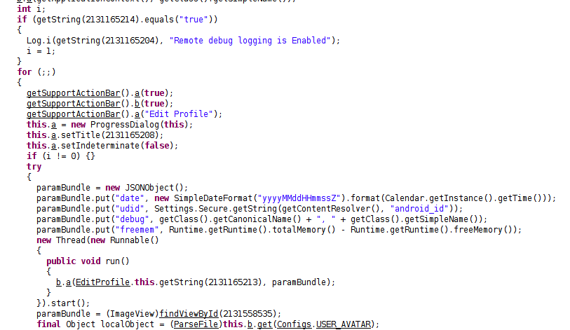
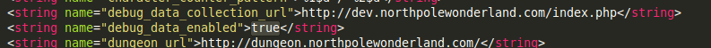
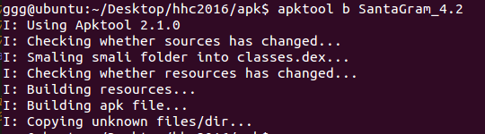
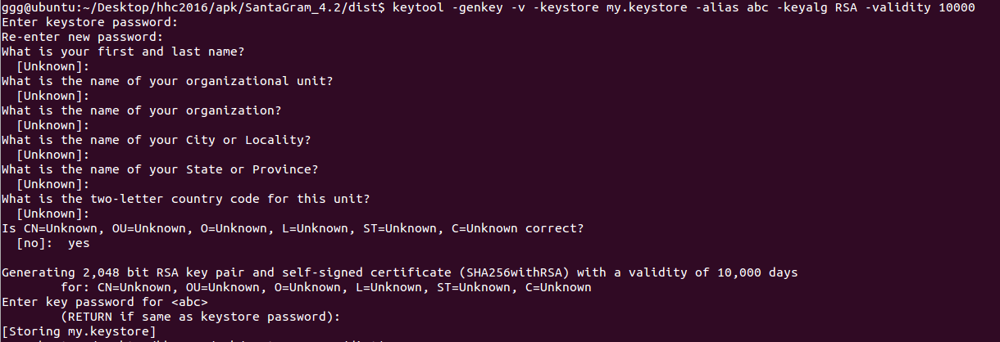
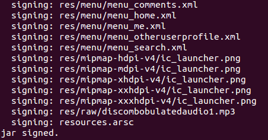
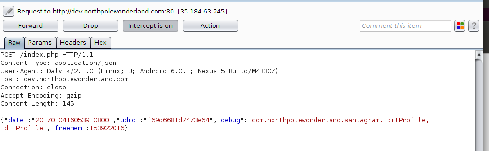
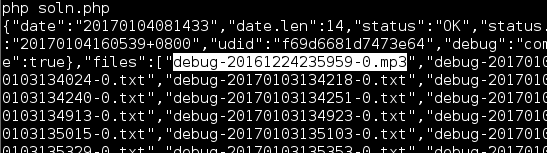

## SANS Holiday Hack Challenge 2016
# Part 04c : Full of Holes (Debug)

Santa has been rescued!! But the culprit has not been identified.

This part focuses on finding and exploiting several vulnerabilities in multiple SantaGram servers. The "flag" is a mp3 audio file hidden on each of these servers.

The urls of the various servers can be found in the "strings.xml" of the SantaGram APK we got in Part 2.


These are the servers in flag order
- [Analytics 1](../04a/#analytics-1)
- [Dungeon](../04b/#dungeon)
- [Debug](../04c/#debug)
- [Ads](../04d/#ads)
- [Exception](../04e/#exception)
- [Analytics 2](../04f/#analytics-2)

---

### Debug

The debug server is lcoated at http://dev.northpolewonderland.com/index.php

However, accessing it with a normal browser will just be met with a empty reply.

We have to look into the SantaGram code to figure out what parameters this server is expecting.

The code that is resposnible for sending data to the debug server is in the "EditProfile" class.



The data that is being send are all Objects. Therefore, I can't be sure of how they will look like in HTTP form. The most direct way is to try and intercept this traffic as the app is sending it.

However, in order for the code to reach here, the "debug_data_enabled" string in the strings.xml shown above need to be change to "true" first.

### Modifying and Re-packaging an APK

First of all, use apktool to decompile the apk

> apktool d SantaGram_4.2.apk

Open res/values/strings.xml in a text editor and change the "debug_data_enabled" string to "true"



Recompile the apk

> apktool b SantaGram_4.2



Go to the "dist/" subfolder. The output apk file is here. Before we can install it on a device, we need to sign the apk first.

"keytool" and "jarsigner" should have been installed together with your JAVA installation

> keytool -genkey -v -keystore my.keystore -alias abc -keyalg RSA -validity 10000

This will create a keystore file. It will also ask you for a password. Enter any password you like and remember it.



> jarsigner -verbose -sigalg MD5withRSA -digestalg SHA1 -keystore my.keystore SantaGram_4.2.apk abc

This will sign the apk with the generated signature. Enter the password that was created just moments ago.



Now, we can install this apk into a device or emulator for packet capture.

> adb install SantaGram_4.2.apk

### Intercepting the packets

Setup your preferred packet interception setup.

I used a real Android device with a WIFI proxy which is my laptop. On the laptop, I am running Burp.

Also, [install Burp's CA cert](https://support.portswigger.net/customer/portal/articles/1841102-installing-burp-s-ca-certificate-in-an-android-device) into the Android device to allow it to capture HTTPS traffic too.
- Start Burp on the laptop
- Visit http://burp (or http://127.0.0.1:8080)
- Click on the "CA Certificate" link to download the cert file.
- Rename the extension to ".cer"
- Transfer it onto the Android Device
- Install it by going to Settings->Security->Credential Storage->Install from Storage

Once everything has been setup, launch the SantaGram application.

Create an accound and go to the "Edit Profile" page as that is where the above code is run.

The following request should have been intercepted by Burp



### Getting the audio

Let's replicate this request in PHP so that it is easier to manipulate.

```php
$ch = curl_init();
curl_setopt($ch, CURLOPT_RETURNTRANSFER, true);

$url = 'http://dev.northpolewonderland.com/index.php';
curl_setopt($ch, CURLOPT_URL, $url);
curl_setopt($ch, CURLOPT_SSL_VERIFYPEER, false);

$postfields = array();
$postfields['date'] = "20170104160539+0800";
$postfields['udid'] = "f69d6681d7473e64";
$postfields['debug'] = "com.northpolewonderland.santagram.EditProfile, EditProfile";
$postfields['freemem'] = 153922016;
$jsondata = json_encode($postfields);
curl_setopt($ch, CURLOPT_POST, true);
curl_setopt($ch, CURLOPT_POSTFIELDS, $jsondata);

$httpheaders = array();
$httpheaders[] = 'Content-Type: application/json';
curl_setopt($ch, CURLOPT_HTTPHEADER, $httpheaders);

$resp = curl_exec($ch);
if ($resp == false) echo curl_error($ch);
echo $resp."\n";

curl_close($ch);
```

Running the script gives the following reply

> {"date":"20170104081123","status":"OK","filename":"debug-20170104081123-0.txt","request":{"date":"20170104160539+0800","udid":"f69d6681d7473e64","debug":"com.northpolewonderland.santagram.EditProfile, EditProfile","freemem":153922016,"verbose":false}}

If we try to access the returned text filepath, it returns a page that is exactly what we just entered.

The interesting part of the response is that there is a "verbose" key. Let'r try adding that into our script

```php
$ch = curl_init();
curl_setopt($ch, CURLOPT_RETURNTRANSFER, true);

$url = 'http://dev.northpolewonderland.com/index.php';
curl_setopt($ch, CURLOPT_URL, $url);
curl_setopt($ch, CURLOPT_SSL_VERIFYPEER, false);

$postfields = array();
$postfields['date'] = "20170104160539+0800";
$postfields['udid'] = "f69d6681d7473e64";
$postfields['debug'] = "com.northpolewonderland.santagram.EditProfile, EditProfile";
$postfields['freemem'] = 153922016;
$postfields['verbose'] = true;
$jsondata = json_encode($postfields);
curl_setopt($ch, CURLOPT_POST, true);
curl_setopt($ch, CURLOPT_POSTFIELDS, $jsondata);

$httpheaders = array();
$httpheaders[] = 'Content-Type: application/json';
curl_setopt($ch, CURLOPT_HTTPHEADER, $httpheaders);

$resp = curl_exec($ch);
if ($resp == false) echo curl_error($ch);
echo $resp."\n";

curl_close($ch);
```

Running the script gives the following response



Notice that the first entry in the "files" key is an mp3 file. (Also notice the timestamp is just before Christmas =/)

The mp3 file is at dev.northpolewonderland.com/debug-20161224235959-0.mp3

Download and save "[debug-20161224235959-0.mp3](../05/debug-20161224235959-0.mp3)"

I've also included the [php script](soln.php)