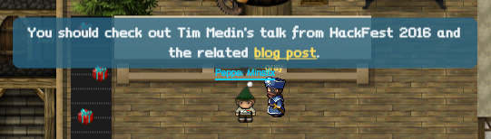
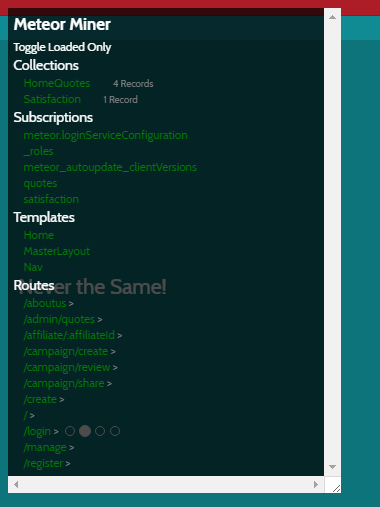
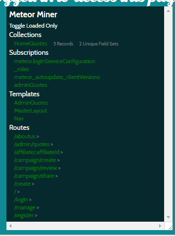
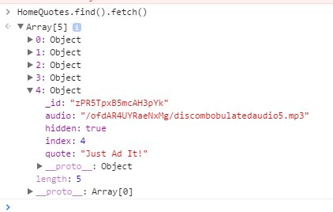

## SANS Holiday Hack Challenge 2016
# Part 04d : Full of Holes (Ads)

Santa has been rescued!! But the culprit has not been identified.

This part focuses on finding and exploiting several vulnerabilities in multiple SantaGram servers. The "flag" is a mp3 audio file hidden on each of these servers.

The urls of the various servers can be found in the "strings.xml" of the SantaGram APK we got in Part 2.

These are the servers in flag order
- [Analytics 1](../04a/#analytics-1)
- [Dungeon](../04b/#dungeon)
- [Debug](../04c/#debug)
- Ads
- [Exception](../04e/#exception)
- [Analytics 2](../04f/#analytics-2)

---

### Ads

Access the Ads site at http://ads.northpolewonderland.com/

Looking at the page source reveals that it is using the [Meteor Framework](https://www.meteor.com/)

I remember one of the elves talking about this, let's go visit him again.

This [blog post](https://pen-testing.sans.org/blog/2016/12/06/mining-meteor) talks about how some meteor sites reveals too much information.

The main idea is that Meteor is a client-side Javascript framework. It requests data from a server and stores them client side. It then decides whether to display these data to the user or not. The problem arise when developers request for more data than it is required, some of which may be confidential data (e.g. account credentials). 

The article also includes a link to a [Tampermonkey](https://tampermonkey.net/) script called "[Meteor Miner](https://github.com/nidem/MeteorMiner)"

First of all, install Tampermonkey which is a Chrome plugin. After that, install the Meteor Miner script by creating a new script in Tampermonkey and pasting the Meteor Miner code into it. I included a copy of the [script](meteorminer.js) here for convenience.

With the script enabled, browse the ads website again. You should see a popup that looks like this

The "Routes" reveals sub paths that we can explore. The "Collections" reveals datasets that the site have requested from the server. With these, you can explore the site and find what information are being leaked from each page.

The page that we are interested in is at the path "/admin/quotes"

List out the contents of the "HomeQuotes" collection using the following command in the browser console

> HomeQuotes.find().fetch()

The path of the audio file is in the 5th object
- ads.northpolewonderland.com/ofdAR4UYRaeNxMg/discombobulatedaudio5.mp3

Download and save "[discombobulatedaudio5.mp3](../05/discombobulatedaudio5.mp3)"