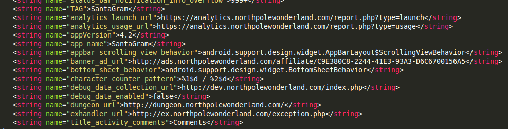

## SANS Holiday Hack Challenge 2016
# Part 04f : Full of Holes (Analytics 2)

Santa has been rescued!! But the culprit has not been identified.

This part focuses on finding and exploiting several vulnerabilities in multiple SantaGram servers. The "flag" is a mp3 audio file hidden on each of these servers.

The urls of the various servers can be found in the "strings.xml" of the SantaGram APK we got in Part 2.

These are the servers in flag order
- [Analytics 1](../04a/#analytics-1)
- [Dungeon](../04b/#dungeon)
- [Debug](../04c/#debug)
- [Ads](../04d/#ads)
- [Exception](../04e/#exception)
- Analytics 2

---

### Analytics 2

Unfortunately, I have not solved this challenge yet.

I'll update here once I figured it out.