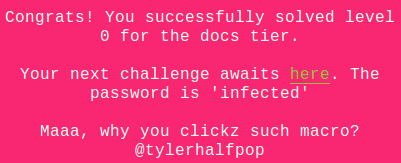
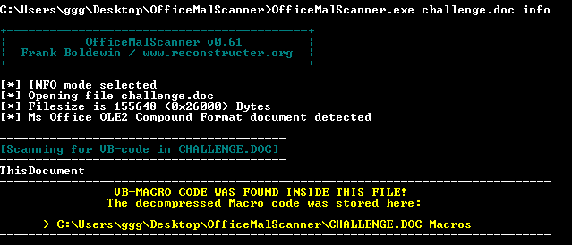
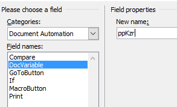
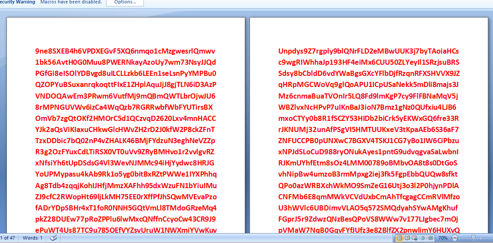
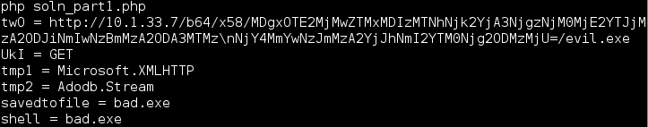

## LabyREnth CTF 2016
# Documents 1 : BadMacro



The challenge file is an Office Word document.

I used OfficeMalScanner to extract the vba macro code from it



The following [vba file](ThisDocument.vbs) was dumped

Looking at this code, it contains a deobfuscation function that is called multiple times with different array of byte values.

Let's take a look at the deobfuscation function QklkhFEQNB. I've replaced the variable names with names that made more sense.

```vba
Private Function QklkhFEQNB(enc As Variant, offset As Integer)
	Dim retValue, dictionary As String, i, index
	dictionary = ActiveDocument.Variables("ppKzr").Value()
	retValue = ""
	i = 1
	While i < UBound(enc) + 2
		index = i Mod Len(dictionary)
		If index = 0 Then index = Len(dictionary)
		retValue = retValue + Chr(Asc(Mid(dictionary, index + offset, 1)) Xor CInt(enc(i - 1)))
		i = i + 1
	Wend
	QklkhFEQNB = retValue
End Function
```

Take note that an ActiveDocument Variable named "ppkzr" is used as a dictionary for the deobfuscation function. This variable is stored in the word document itself. In order to retrieve it, we need to open the document in Microsoft Word

**Getting ActiveDocument Variable "ppKzr"**
- Open challenge.doc in Microsoft Office
- Click on an empty space in the document
- Under Insert (Quick Parts), select "Field"


- Select "Document Automation" Category
- Select "DocVariable" Field Name
- Enter "ppKzr" in the name box



Press ok and you should see the value show up in the word document. 



Copy it out and save it into a [file](ppkzr)

I then wrote a [php script](soln_part1.php) to use this value as a dictionary to deobfuscate all the strings that was used

```php
$ppKzr = file_get_contents('ppkzr');
if (strcmp($ppKzr, "toto") !== 0) {
	BkAIuNwQNDkohBY();
	$ppKzr = "toto";
}

function QklkhFEQNB($data, $offset){
	global $ppKzr;
	$dict = $ppKzr;
	$out = "";
	$i = 1;
	while ($i < (count($data)+1)){
		$index = $i % strlen($dict);
		if ($index == 0) $index = strlen($dict);
		$cur = substr($dict, $index + $offset - 1, 1); // have to -1 due to vbscript Mid using 1-based string indexing
		$out .= chr(ord($cur) ^ $data[$i - 1]);
		$i += 1;
	}
	return $out;
}

function BkAIuNwQNDkohBY(){
	$tmp = array(5, 5, 27, 65, 89, 98, 85, 86, 71, 75, 66, 92, 95, 98, 67, 64, 89, 83, 84, 95, 26, 78, 116, 78, 91, 5, 116, 32, 72, 2, 33, 48, 10, 29, 61, 8, 37, 20, 63, 44, 1, 12, 62, 38, 47, 52, 99, 57, 5, 121, 89, 37, 65, 32, 32, 11, 98, 42, 58, 32, 28, 9, 3, 117, 85, 4, 57, 10, 94, 0, 16, 8, 28, 42, 30, 121, 71, 6, 8, 9, 37, 2, 23, 34, 21, 120, 54, 7, 40, 35, 75, 50, 87, 3, 55, 47, 99, 52, 13, 0, 42, 30, 27, 126, 59, 3, 123, 29, 52, 44, 53, 29, 15, 50, 12, 35, 8, 48, 89, 54, 27, 62, 28, 8, 36, 49, 119, 104, 14, 5, 64, 34, 43, 22, 71, 5, 46, 7, 66, 42, 0, 1, 113, 97, 83, 31, 45, 95, 111, 31, 40, 51);
	$twO = QklkhFEQNB($tmp, 24);
	echo "twO = $twO \n";
	
	$UkI = QklkhFEQNB(array(42, 115, 2), 188);
	echo "UkI = $UkI \n";
	
	$tmp1 = QklkhFEQNB(array(116, 7, 6, 74, 60, 43, 42, 36, 64, 70, 110, 27, 28, 12, 12, 17, 23), 0);
	echo "tmp1 = $tmp1 \n";
	
	$tmp2 = QklkhFEQNB(array(15, 32, 32, 53, 35, 89, 22, 25, 65, 53, 51, 26), 176);
	echo "tmp2 = $tmp2 \n";
	
	$savedtofile = QklkhFEQNB(array(20, 39, 81, 118, 52, 78, 11), 17);
	echo "savedtofile = $savedtofile \n";
	
	$shell = QklkhFEQNB(array(20, 39, 81, 118, 52, 78, 11), 17);
	echo "shell = $shell \n";
}
```



The URL looks super suspicious. There seems like there is some hints in the url
- b64 for base64?
- x58 for xor58?

I wrote another [php script](soln_part2.php) which will do just that to retrieve the flag

```php
$data = "MDgxOTE2MjMwZTMxMDIzMTNhNjk2YjA3NjgzNjM0MjE2YTJjMzA2ODJiNmIwNzBmMzA2ODA3MTMz\nNjY4MmYwNzJmMzA2YjJhNmI2YTM0Njg2ODMzMjU=";
$data2 = base64_decode($data);
$out = "";
for ($i=0; $i<strlen($data2); $i+=2){
	$cur = substr($data2, $i, 2);
	$res = hexdec($cur) ^ 0x58;
	$out .= chr($res);
}
echo $out."\n";
```

The flag is **PAN{ViZib13_0nly2th0s3_Wh0_Kn0w_wh3r32l00k}**