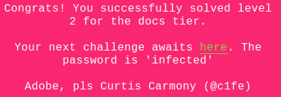
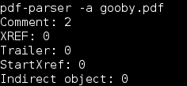
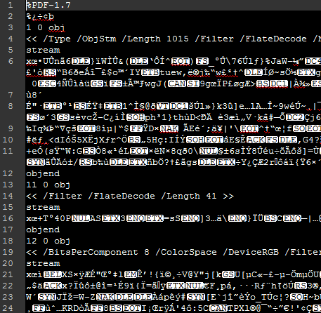
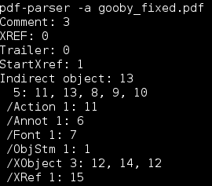
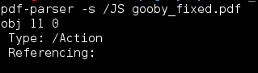
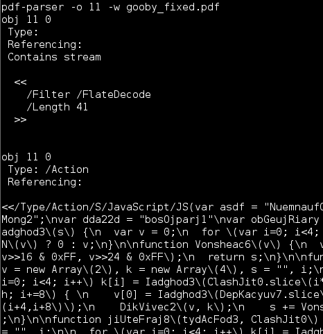
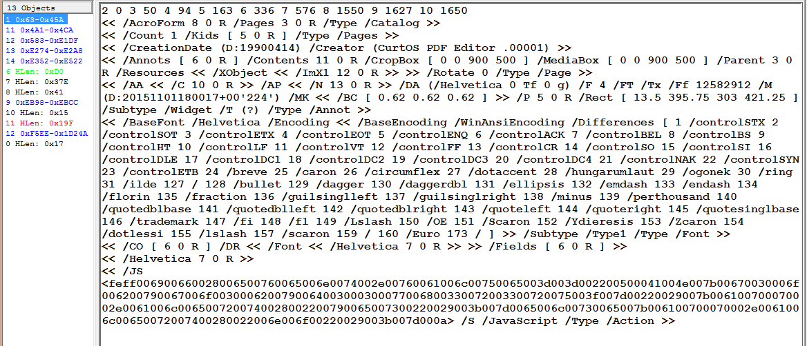
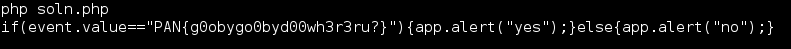

## LabyREnth CTF 2016
# Documents 3 : PDF



This time round the challenge file is a PDF document. Let's try running pdf-parser on it



This doesn't look right. Open it up in Notepad++ to see what's wrong



Ahh, all the "endobj" footer has been renamed to "objend". To fix the pdf file, replace all "objend" with "endobj"

Running pdf-parser on the fixed pdf returns proper results



Let's search for any embedded JavaScript code



Object 11 seems to contains JavaScript, let's look at it



Ahh jackpot, this looks like obfuscated JavaScript

I copied the code into a separate [JS file](bingojs.html) and beautified the code (View in raw mode if you cant see it)

Load the html file into a browser and it will alert out a URL "https://www.youtube.com/watch?v=dQw4w9WgXcQ"

Watch the video and you will get the flag!!


Yeap...... I got rick rolled -.-

That Javascript code was a red herring. There is actually another object (Object 1) with Javascript tag. For some reason, pdf-parser was unable to dump this object. I used PDF Stream Dumper and it shows right up



That series of hex characters at the bottom looks like a unicode string.

The following [php script](soln.php) will decode and reveal the flag

```php
$data = "006900660028006500760065006e0074002e00760061006c00750065003d003d002200500041004e007b00670030006f006200790067006f0030006200790064003000300077006800330072003300720075003f007d00220029007b006100700070002e0061006c0065007200740028002200790065007300220029003b007d0065006c00730065007b006100700070002e0061006c00650072007400280022006e006f00220029003b007d000a";
for ($i=0; $i<strlen($data); $i+=4){
    $cur= substr($data,$i,4);
    $byte = substr($cur,2,2);
    echo chr(hexdec($byte));
}
echo "\n";
```



The flag is **PAN{g0obygo0byd00wh3r3ru?}**