## LabyREnth CTF 2016
# Documents 4 : Doc

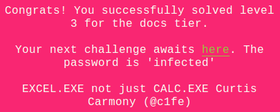

The challenge file is a docm file

Let's use OfficeMalScanner again to extract the vb code. As it is a "docm" file, we need to inflate it first.

> OfficeMalScanner fun.docm inflate

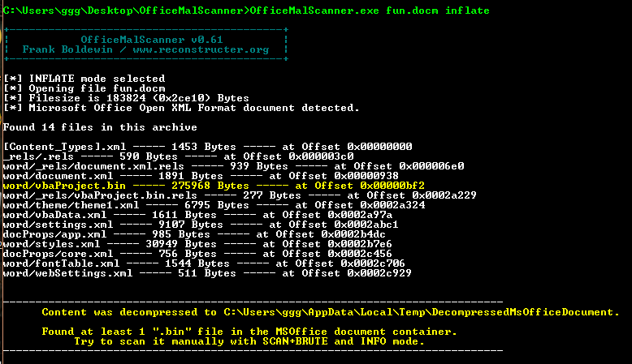

This will extract the files into a folder. The files that we are interested in is any *.bin files. There is one that was found (vbaProject.bin)

Grab that file and run OfficeMalScanner on it.

> OfficeMalScanner vbaProject.bin info

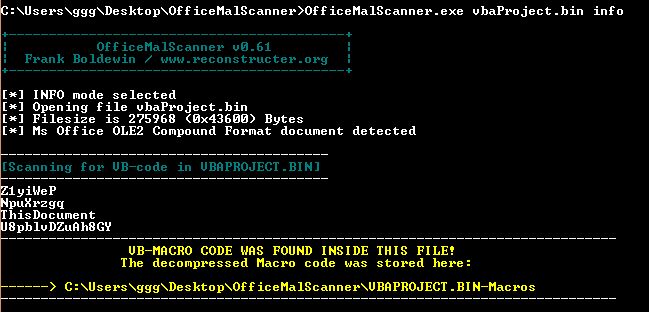

Four vb files are extracted from it. The 2 that contains the interesting code is [ThisDocument](orig/ThisDocument) and [Z1yiWeP](orig/Z1yiWeP). The other 2 are forms used in the application.

Looking at the code, we can see that it is obfuscated and the entry point should be the "Document_Open" subroutine in ThisDocument.

I've deobfuscated [ThisDocument](annotated/ThisDocument.vbs) and [Z1yiWeP](annotated/Z1yiWeP.vbs) here. (the rest of the writeup will using variable and function names from these 2 deobfuscated version of the code)

**Program Flow**

Now, Let's follow what the code is doing, starting from the entry point "Document_Open"

```vb
Public Sub Document_Open()
    On Error GoTo sjjQMD:
    If ActiveDocument.VBProject.VBComponents.Count > 4 Then
        checkStuffs
    Else
        writeAndPlayAudioFile
    End If
sjjQMD:
    If err.Number = 6068 Or err.Number = 50289 Then
        writeAndPlayAudioFile
    Else
        Resume Next
    End If
End Sub
```

If certain conditions are met, the **checkStuffs** function would be called. If not, an audio file is written to disk and played.

```vb
Private Sub checkStuffs() // XiqyXdC809pP5esSrC633ag92w0x6otQylY0
    sN2l0P = findSpecificProcedure
    If Not IsNull(sN2l0P) Then
        For Each vbComponents In ActiveDocument.VBProject.VBComponents
            If vbComponents.Type = 1 Then
                i = 1
                Set cm = vbComponents.CodeModule
                Do While i < cm.CountOfLines
                    pn = cm.ProcOfLine(i, 0) // returns the procedure (function) name that this line belongs to
                    If pn <> "" Then
                        callsCallsXorAndCompare pn, sN2l0P
                        i = i + cm.ProcCountLines(pn, 0)
                    Else
                        i = i + 1
                    End If
                Loop
            End If
        Next vbComponents
    End If
    writeAndPlayAudioFile
End Sub
```

The **checkStuffs** functions first calls the **findSpecficProcedure** and save the return value. A loop then loops through all available procedure names, passing them and the previous return value to the **callsCallsXorAndCompare** function. Let's look at the **findSpecificProcedure** function first

```vb
Private Function findSpecificProcedure() // zoycqKJvqznJMeMpHe7Z61xYJfLLmbObxBVy
    findSpecificProcedure = None
    For Each vbComponents In ActiveDocument.VBProject.VBComponents
        l = 1
        Set cm = vbComponents.CodeModule
        Do While l < cm.CountOfLines
            procedureName = cm.ProcOfLine(l, 0) // returns the procedure (function) name that this line belongs to
            If procedureName <> "" Then
                If lookForSomething(procedureName) Then
                    findSpecificProcedure = procedureName
                    GoTo CfHFE
                End If
                l = l + cm.ProcCountLines(procedureName, 0)
            Else
                l = l + 1
            End If
        Loop
    Next vbComponents
CfHFE:
End Function
```

The **findSpecificProcedure** functions loops through all available procedure names, passing them as arguments to the **lookForSomething** function. Do note that the procedure name is returned if the correct one is found.

```vb
Private Function lookForSomething(dd) As Boolean // BqNFmKCS7cTPv9XNFOd2mCLrdqCfmdNm6HBz
    lookForSomething = False
    On Error GoTo B3A:
    Dim A4xcPiKtrr() As Byte
    A4xcPiKtrr = Z1yiWeP.base64_encode(dd)
    lookForSomething = Z1yiWeP.checkValue(A4xcPiKtrr)
B3A:
End Function
```

The **lookForSomething** function then base64 encodes the input argument and calls **Z1yiWeP.checkValue** with the result as the argument.

```vb
Function checkValue(val) // Cj2XBWUOfIP7E9oOZKQEB0zFWe2Cf4NbfApB
    checkValue = False
    Dim res1() As Byte
    res1 = Z1yiWeP.singleByteXor(val, U8pblvDZuAh8GY.HelpContextId)
    Dim res2() As Byte
    res2 = Z1yiWeP.singleByteXor2(Int(U8pblvDZuAh8GY.ScrollHeight), res1)
    If strEquals(res2, base64_encode(U8pblvDZuAh8GY.Label1.Caption)) Then
        checkValue = True
    End If
End Function
```

The **checkValue** function performs 2 single byte xor of the input with "U8pblvDZuAh8GY.HelpContextId" and "U8pblvDZuAh8GY.ScrollHeight". The result is then compared to "U8pblvDZuAh8GY.Label1.Caption". This means "U8pblvDZuAh8GY.Label1.Caption" contains the encoded version of the procedure name that the **findSpecificProcedure** function was looking for.

Look back at the **checkStuff** function. After this procedure name is found, the **callsCallsXorAndCompare** function is called

```vb
Private Sub callsCallsXorAndCompare(m4dYL, fviLw9) // UxKo3LivfGHxI2OtWa3KtqOgY6cRb5yrbR00
    On Error GoTo NavnYIF0:
    Dim fjGeMmP8Z() As Byte
    fjGeMmP8Z = Z1yiWeP.base64_encode(m4dYL)
    Z1yiWeP.callsXorAndCompare fjGeMmP8Z, fviLw9
NavnYIF0:
    GoTo VadXU4
VadXU4:

Sub callsXorAndCompare(param1, param2) // pZVZ0Q8ygfA6jcSJRLEKZSyv40IDQzErCpah
    xorAndCompare param1, param2
End Sub
```

The input argument is base64 encoded and passed to the **Z1yiWeP.callsXorAndCompare** function which in turn calls the xorAndCompare function

```vb
Sub xorAndCompare(newProcname, prevProcname) // XWn5TNdoykQb0QoitVEG7sLOxIRSi97XmqmM
    Dim res1() As Byte
    res1 = Z1yiWeP.singleByteXor(newProcname, U8pblvDZuAh8GY.ScrollWidth)
    Dim res2() As Byte
    res2 = Z1yiWeP.singleByteXor2(U8pblvDZuAh8GY.Zoom, res1)
    Dim tmp1() As Byte
    tmp1 = Z1yiWeP.xor2Strings(res2, base64_encode(prevProcname))
    If Z1yiWeP.strEquals(tmp1, Z1yiWeP.base64_encode(StrReverse(U8pblvDZuAh8GY.Tag))) Then
        MsgBox Z1yiWeP.convertToUnicode(newProcname)
    End If
End Sub
```

This function first performs 2 single byte xors with the newProcname argument and "U8pblvDZuAh8GY.ScrollWidth" and "U8pblvDZuAh8GY.Zoom". The result is then xored with another string which is the base64 encoded version of the prevProcname. The results of these 3 xor operation is then compared with the value in "U8pblvDZuAh8GY.Tag".

**Decrypting the flag**

Therefore, the following is the psuedocode to recover the procedure names

```
pn1 = base64_decode(U8pblvDZuAh8GY.Label1.Caption)
pn1 = singleByteXor(pn1, U8pblvDZuAh8GY.ScrollHeight)
pn1 = singleByteXor(pn1, U8pblvDZuAh8GY.HelpContextId)

pn2 = base64_decode(str_reverse(U8pblvDZuAh8GY.Tag))
pn2 = stringXor(pn2, pn1)
pn2 = singleByteXor(pn2, U8pblvDZuAh8GY.Zoom)
pn2 = singleByteXor(pn2, U8pblvDZuAh8GY.ScrollWidth)
```

The question now is what are all these U8pblvDZuAh8GY.* values. Let's try to find out.

Open fun.docm in Microsoft Word and open the visual basic code editor (Alt+F11). Select the "fun" project.

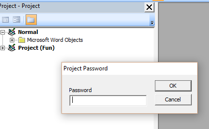

It is password protected. There is actually a trivial way to bypass this password protection.

First of all, downgrade the file to the old doc format. File -> Save As and select (Word 97-2003) format.

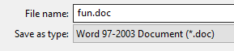

Right-click the doc file and open it in a text editor. I used Notepad++. Look for the string "DPB=".

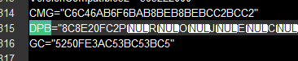

The value here is actually the hashed password that is protecting the files. Change the field name to something else (e.g. "AAA") and save the file.

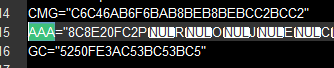

Now open the doc file in Word, fire up the code editor again (Alt+F11).

A bunch of errors should pop up complaining about an invalid key. Ignore the errors and continue to load the file if prompted. The structure of the project is now visible.

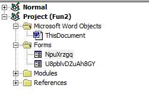

Do note that you still can't see the actual source code of any of the components here (An error would occur if you tried). However, we already have the source code through OfficeMalScanner. What we want to find out is what "U8pblvDZuAh8GY" is. The above picture shows that it is a Form. Click on it.

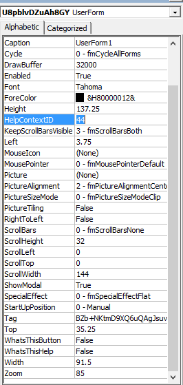

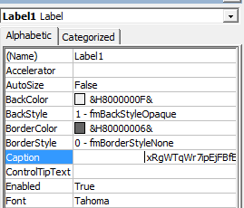

We can now see that those values referenced in the code are actually attributes of the form. Let's copy them down.

```
U8pblvDZuAh8GY.Label1.Caption = "xRgWTqWr7ipEjFBfESrOiaYFu9i9Jml3Q171"
U8pblvDZuAh8GY.ScrollHeight = 32
U8pblvDZuAh8GY.HelpContextId = 44
U8pblvDZuAh8GY.Tag = "BZb+NKtmD9XQ6uQAgJsuvvudb7tZgoD/RCJX"
U8pblvDZuAh8GY.Zoom = 85
U8pblvDZuAh8GY.ScrollWidth = 144
```

I wrote a [php script](soln.php) that would use these values to decrypt and retrieve the flag.

```php
$label1 = "xRgWTqWr7ipEjFBfESrOiaYFu9i9Jml3Q171"; // U8pblvDZuAh8GY.Label1.Caption
$tag = "BZb+NKtmD9XQ6uQAgJsuvvudb7tZgoD/RCJX"; // U8pblvDZuAh8GY.Tag

$pn1 = base64_decode($label1);
$pn1 = singleByteXor($pn1, 32); // U8pblvDZuAh8GY.ScrollHeight
$pn1 = singleByteXor($pn1, 44); // U8pblvDZuAh8GY.HelpContextId
echo "PN1 is $pn1 \n";

$pn2 = base64_decode(strrev($tag));
$pn2 = stringXor($pn2, $pn1);
$pn2 = singleByteXor($pn2, 85); // U8pblvDZuAh8GY.Zoom
$pn2 = singleByteXor($pn2, 144); // U8pblvDZuAh8GY.ScrollWidth
echo "PN2 is $pn2 \n";

function singleByteXor($msg, $key){
	$out = "";
	for ($i=0; $i<strlen($msg); $i++){
		$out .= chr(ord($msg[$i]) ^ $key);
	}
	return $out;
}

function stringXor($msg1, $msg2){
	$out = "";
	for ($i=0; $i<strlen($msg1); $i++){
		$out .= chr(ord($msg1[$i]) ^ ord($msg2[$i%strlen($msg2)]));
	}
	return $out;
}
```

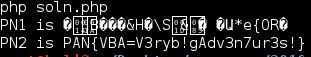

Running the script will get the flag **PAN{VBA=V3ryb!gAdv3n7ur3s!}**