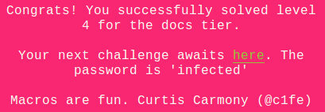
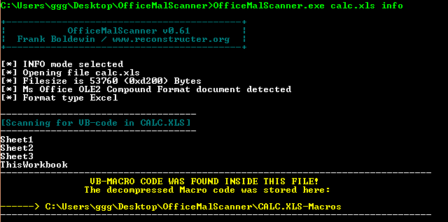
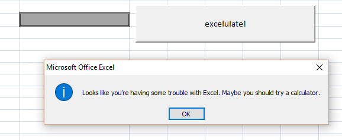
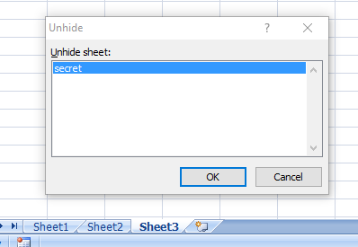
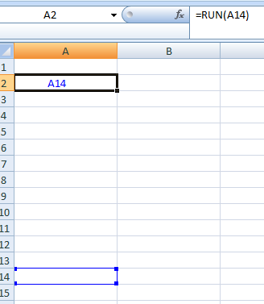
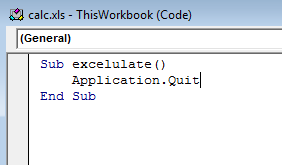
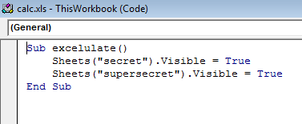
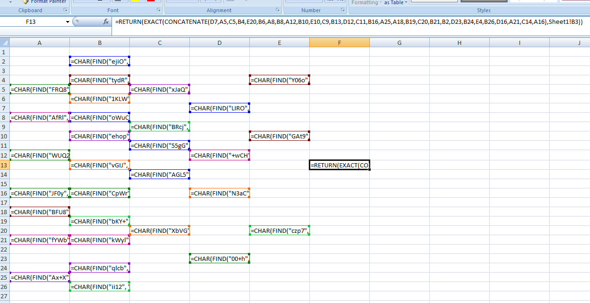
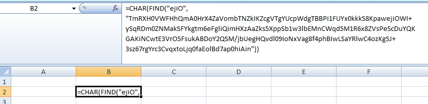
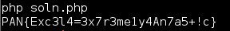

## LabyREnth CTF 2016
# Documents 5 : Calc

The challenge file is an excel (xls) file

Same thing as always for Office Documents, let's run OfficeMalScanner on it

Looking through the dumped vb files, nothing of interest pops up.

Let's try opening the file in Microsoft Excel.

It still looks like a pretty typical excel file. Open the VB Code editor (Alt+F11) and there is also no code except for a "exceluate" which simply quits excel.

Let's try enabling macro and see what happens. Press the "exceluate" and this shows up

When "Ok" is clicked, excel would exit and a calculater pops up.

Obviously, there is some code running but we cant seem to find it.

Open the file in excel again and try to unhide sheets

Ahha, there is a hidden sheet named "secret". Unhide it and look at it's contents.

There is a bunch of strange function calls, one of which references a "supersecret" sheet. However, there is no such sheets visible.

Apparently, Excel has a feature called [Very Hidden Sheets](http://www.excel-university.com/make-an-excel-worksheet-very-hidden/). To make a sheet very hidden or to unhide a very hidden sheet, one can only do it through the VB Code editor and not through the UI.

Now, open the VB Code Editor (Alt+F11) and change the exceluate function as follow

to 

Enable Macros and click the Exceluate button, the "supersecret" sheet should now be visible.

Looking at the referenced F13 cell, there is a concatenate call with a bunch of cell values. Each of these cell values decodes 1 character.

I've reimplemented the decoding logic into a [php script](soln.php).

Running the script will reveal the flag

The flag is **PAN{Exc3l4=3x7r3me1y4An7a5+!c}**