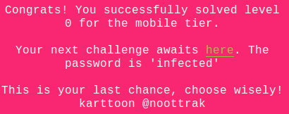
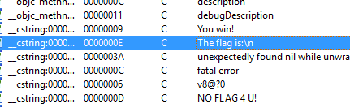
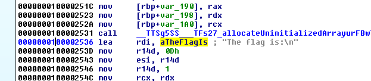
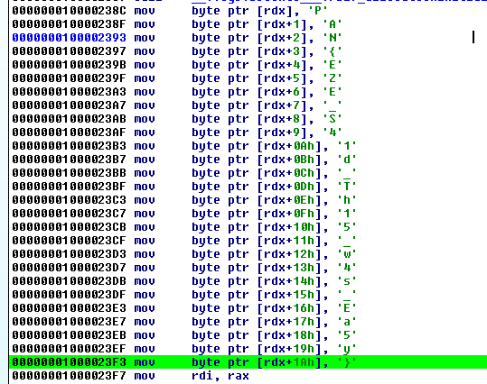

## LabyREnth CTF 2016
# Mobile 1 : LastChance

2 versions of an IOS app is provided
- The IPA file if unzipped will yield an ARM executable
- IOS Simulator app file which contains a x64 executable

As I am more comfortable reading x64, I opened the executable from the simulator app in IDA Pro.

Looking through the strings, the string "The flag is:\n" stands out

Cross-referencing that will bring IDA to the function that used this string

Scroll up a little in this function and you will notice a bunch of values being pushed onto the stack. Converting them to ascii characters (press 'Q') will reveal the flag.

The flag is **PAN{EZE_S41d_Th15_w4s_Ea5y}**