## LabyREnth CTF 2016
# Mobile 2 : Cups

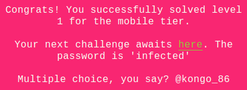

This challenge involves an Android App. There is a few ways to decompile an Android APK.

Personally, I prefer using apktool and then reading smali code.

```
apktool d ezFill.apk
```

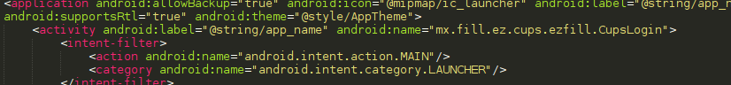

Looking at the AndroidManifest file, the starting class that will be run is called "mx.fill.ez.cups.ezfill.CupsLogin". Let's take a look at that first.

First of all, notice a bunch of email/passwords combos are being created in the constructor

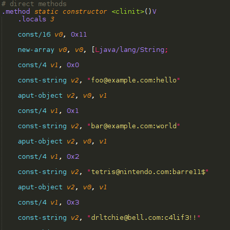

In the onCreate function, 2 handlers are being created and assigned to an EditText and a Button respectively

The EditText's onEditorAction handler is the "a" class

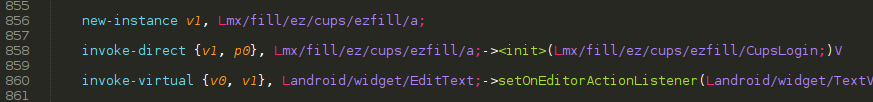

The Button's onClick handler is the "b" class


Let's look at both these handlers' code

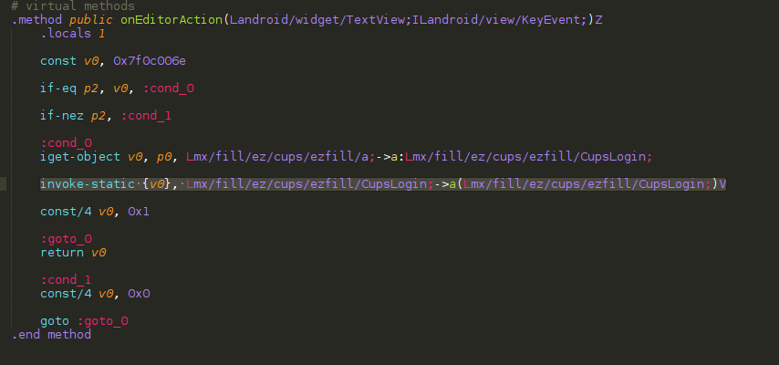

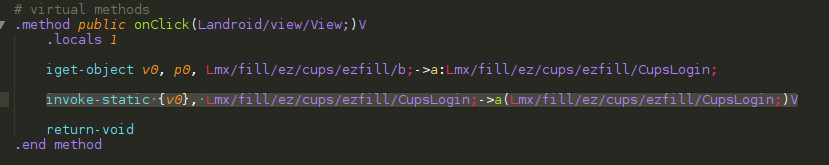

Both handlers eventually call the "a" method of CupsLogin class with the following method signature **Lmx/fill/ez/cups/ezfill/CupsLogin;->a(Lmx/fill/ez/cups/ezfill/CupsLogin;)V**

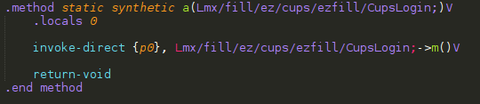

This method would then call the "m" method with the following method signature **Lmx/fill/ez/cups/ezfill/CupsLogin;->m()V**

The 'm' method basically takes the email and password input from the user and checks if it satisfies a few conditions
- password length > 4
- email contains the '@' char

If the inputs satisfied the condition, it will create a 'g' object (which is an AsyncTask) and executes it.

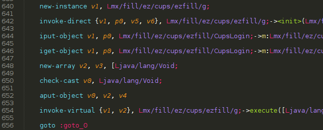

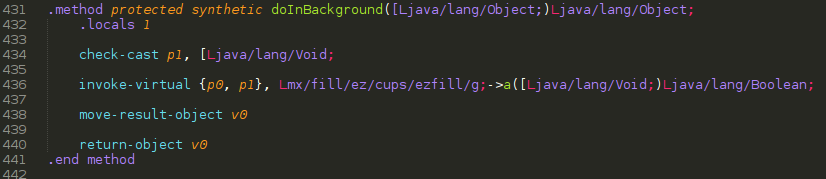

When executed, the 'g' object would then call its 'a' method with this signature **Lmx/fill/ez/cups/ezfill/g;->a([Ljava/lang/Void;)Ljava/lang/Boolean;**

This method basically checks if the input email and password matches any of those that was declared in the constructor earlier. However, this is not the important part. The more interesting part is what happens after this task is finished. (In it's PostExecute method)

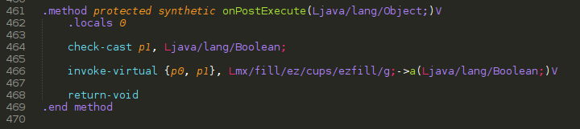

It calls another 'a' method with the following signature **Lmx/fill/ez/cups/ezfill/g;->a(Ljava/lang/Boolean;)V**

Once again, I will just summarize what this method does. This method takes the input email and password and creates a key which will be used to decrypt an array of values. The key is created using the following algorithm

```
Key is a 7 character string
[0] = email[4]
[1-6] = pw[0-5]
where pw must satisfy
pw[0] ^ pw[5] == 0x15
pw[1] ^ (pw[1] & 0xf) == 0x60
(pw[2]-5) ^ 3 == 0x73		==>	pw[2] = 0x75 (u)
pw[3] * 0x22 = 0xdf2		==>	pw[3] = 0x69 (i)
pw[4] == 0x64				==> pw[4] = 0x64 (d)

Have to brute force 4 chars to meet the above conditions	
```

From the algorithm, we only know 3 characters of the key. I wrote a [php script](soln.php) that will brute force the remaining 4 characters

```php
for ($pw0=0x20; $pw0<0x7f; $pw0++){
	for ($pw5=0x20; $pw5<0x7f; $pw5++){
		if (($pw0 ^ $pw5) != 0x15) continue;
		for ($pw1=0x20; $pw1<0x7f; $pw1++){
			if (($pw1 ^ ($pw1 & 0xf)) != 0x60) continue;
			for ($email4=0x20; $email4<0x7f; $email4++){
				$key = chr($email4).chr($pw0).chr($pw1)."uid".chr($pw5);
				$res = decrypt($key);
				if (strpos($res, "PAN") !== false){
					echo "FOUND! $res ($key) \n";
				}
			}
		}
	}
}

function decrypt($key){
	$enc = array(453, 431, 409, 342, 318, 293, 460, 273, 383, 369, 374, 466, 261, 380, 513, 267, 301, 266, 310, 437, 260, 325, 379, 333, 454, 350, 345, 460, 293, 303, 289, 290, 438, 373, 264, 309, 351);
	$out = "";
	for ($i=0; $i<count($enc); $i++){
		$cur = $enc[$i] - 2;
		$k = ord($key[$i % strlen($key)]);
		$k += (0x56-0x13);

		$cur = $cur ^ $k;
		$cur = logicalShiftRight($cur,2);
		if ($cur > 255) return false;
		$out .= chr($cur);
	}
	return $out;
}

function logicalShiftRight($val,$shift) {
    if ($val >= 0) { 
        return bindec(decbin($val>>$shift)); //simply right shift for positive number
    }

    $bin = decbin($val>>$shift);
    $bin = substr($bin, $shift); // zero fill on the left side
    return bindec($bin);
}
```

Running the script will yield a couple of possible values.

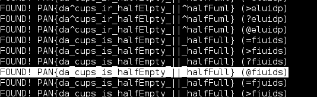

The one that made the most sense **PAN{da_cups_is_halfEmpty_||_halfFull}** is the flag

I've also incuded the smali files of ['CupsLogin'](CupsLogin.smali) and ['g'](g.smali) class. Comments are added to interesting parts of the code to help understanding what is happening (View them in raw mode :)).