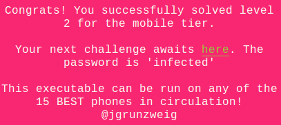
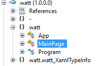
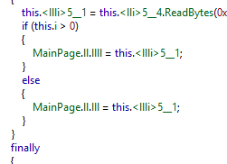
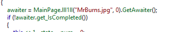
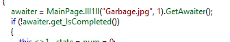
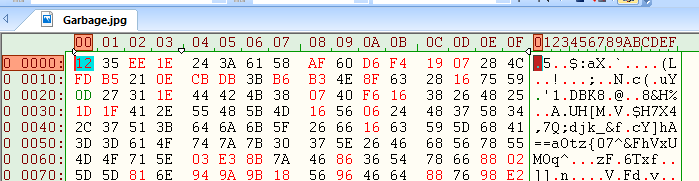
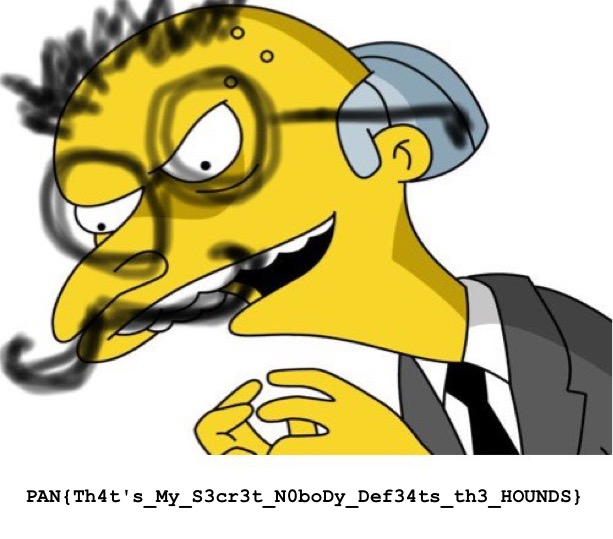

## LabyREnth CTF 2016
# Mobile 3 : Watt



This time round, its a Windows Mobile App!! This was my first time reversing a Windows Mobile App

First of all, the appxupload file is basically a zip file. Unzip till you see a bunch of files. The "watt.exe" is the important file.

As Windows Mobile apps are written in .Net, we can use ILSpy to decompile the binary.



ILSpy managed to decompile 3 classes ([Program](cscode/Program.cs), [App](cscode/App.cs), [MainPage](cscode/mainpage.cs))

The code in "Program" basically creates an "App" instance which loads "MainPage" as its current frame. Therefore, all the interesting code are actually in the "MainPage" class.

The "MainPage" class is heavily obfuscated. I've tried to deobfuscate most of the strings and changed some of the names to more meaningful names [here](cscode/mainpage_annotated.cs). The rest of the writeup will be using references to the names I renamed here.

I've also included the [deobfuscation script](deobfusStrings.php) which I used to deobfuscate some of the strings.

**Program Flow**

The **Connect** function adds an onClick event handler to a button. I figured that would be the entry point to look into. I renamed the event handler function to **handleEvent**

```c#
private void handleEvent(object sender, RoutedEventArgs e) {// llll checks if SystemProductName and SystemFirmwareVersion is correct and display result text
	string text = this.uiTextBox.get_Text();
	this.uiTextBlock.put_Text("Hounds released!"); // "Hounds released!"
	if (MainPage.systemChecker.checkProductName){c = 'X';}
	else {c = 'Y';}
		
	if (c <= 'X') {
		if (!MainPage.systemChecker.checkFirmwareVersion;) {
			if (this.getVisibleWidth() > 1000.0) {
					if (this.getVisibleHeight() == 5.0) {
						this.uiTextBlock.put_Text(this.getMsg(text, 5)); // display specific text based on length of "text" string
					}
				}
			}
		}
	}
}
```

This function retrieves the text in the uiTextBox and if it meets certain conditions, passes it as an argument to the **getMsg** function

```c#
private string getMsg(string i, int l) {// llll returns string based on length of i (special thing happens at length 12)
	string result;
	if (i.get_Length() == 18){return "Bark Bark";}
	else if (i.get_Length() > 19) {return '"Hi" -Josh';}
	else if (i.get_Length() == 16){return "The hounds escaped!";}
	else if (i.get_Length() == 12){
		string text = MainPage.unhex("7028467e4d4e512e472d05445723422e404505"); // some random char string?
		result = this.evaluateInput(i); // calls even more shit
		return result;
	}
	else if (i.get_Length() == 0){return "You've got to at least try.";}
	else { return "Something something you fail something something";}
}
```

This function returns a different string based on the string length of the input argument. However, if the string length is 12, the **evaluateInput** function is called instead

```c#
private string evaluateInput(string i) { // llll
	EasClientDeviceInformation easClientDeviceInformation = new EasClientDeviceInformation();
	string systemProductName = easClientDeviceInformation.get_SystemProductName();
	string result;
	if (systemProductName.get_Chars(0) == 'V';) {
		int num = (int)this.getVisibleHeight(); // visible height must be 5
		if (num < systemProductName.get_Length()) {
			char c = systemProductName.get_Chars(num);
			if (i.get_Chars(0) != 'B'){ result = this.retFailMsg(1); } // i[0] == "B"
			else{
				Func<Task> arg_B0_0;
				if ((arg_B0_0 = MainPage.<>c.<>9__12_0) == null) {
					arg_B0_0 = (MainPage.<>c.<>9__12_0 = new Func<Task>(MainPage.<>c.<>9.<llll>b__12_0));
				}
				Task task = Task.Run(arg_B0_0);
				task.Wait();
				string @string = Encoding.UTF8.GetString(new byte[] { MainPage.varStore.varA[6] }, 0, 1); // MainPage.ll.lll[6] // set by what?
				string systemManufacturer = MainPage.systemChecker.devInfo.get_SystemManufacturer();
				string text;
				if (systemManufacturer.get_Length() == 5) {
					if (systemManufacturer.Substring(2, 3) == "kia") {
						text = systemManufacturer.Substring(0, 2); // I'm guessing "No"
					}
					else { text = "ok"; }
				}
				else { text = "oN"; }

				if (i.Substring(1, 3) != "Adp") { result = this.retFailMsg(6); }
				else {
					// i[1-3] = "Adp" , decoded with my php script
					string text2 = i.Substring(4, 4);
					Func<Task> arg_18C_0;
					if ((arg_18C_0 = MainPage.<>c.<>9__12_1) == null) {
						arg_18C_0 = (MainPage.<>c.<>9__12_1 = new Func<Task>(MainPage.<>c.<>9.<llll>b__12_1));
					}
					Task task2 = Task.Run(arg_18C_0);
					task2.Wait();
					byte[] storedVarB = MainPage.varStore.varB; // MainPage.ll.llll;
					string text3 = "OGIJSLKJECEWOI123512312!@#!@$!@#!faosidfjoijoarisfASDJFOJASJDFOAJSf234242zv,noijwasfuzzlfasufohfsaf";
					if (i.get_Chars(9) == text3.get_Chars(46) && i.get_Chars(8) == text3.get_Chars(16)) { // i[9] = "r", i[8] = "3"
						if (text2 != text3.Substring(84, 4)) { result = this.retFailMsg(1); }
						else {
							// i[4-7] = "uzzl"
							if (i.get_Chars(10) + i.get_Chars(11) != '?' && i.get_Chars(10) != text3.get_Chars(23);){ result = this.retFailMsg(0); }
							else{
								string i2 = i + c.ToString() + text + @string; 
								result = this.xorOffset171AndWrite(i2, storedVarB); // storedVarB is varStore.varB
							}
						}
					}
					else result = this.retFailMsg(0); // return fail msg
				}
			}
		}
		else result = this.retFailMsg(3);// return fail msg
	}
	else result = this.retFailMsg(1); // return fail msg

	return result;
}
```

This is a huge function. Let's just focus on the parts that deals with the input argument **i**. Remember **i** is bascially the text from a uiTextBox. The code here seems to be checking if **i** is equal to a certain value. Also remember **i** needs to be of length 12 for the code to reach this point.

```c#
if (i.get_Chars(0) != 'B'){ result = this.retFailMsg(1); } 
```

Therefore, i[0] = "B"

```c#
if (i.Substring(1, 3) != "Adp") { result = this.retFailMsg(6); }
```

Therefore, i[0-3] = "BAdp"

```c#
string text2 = i.Substring(4, 4);
...
string text3 = "OGIJSLKJECEWOI123512312!@#!@$!@#!faosidfjoijoarisfASDJFOJASJDFOAJSf234242zv,noijwasfuzzlfasufohfsaf";
...
if (text2 != text3.Substring(84, 4)) { result = this.retFailMsg(1); } // uzzl
```

Therefore, i[0-7] = "BAdpuzzl"

```c#
if (i.get_Chars(9) == text3.get_Chars(46) && i.get_Chars(8) == text3.get_Chars(16)) { // i[9] = "r", i[8] = "3"
```

Therefore, i[0-9] = "BAdpuzzl3r"

```c#
if (i.get_Chars(10) + i.get_Chars(11) != '?' && i.get_Chars(10) != text3.get_Chars(23);){ result = this.retFailMsg(0); }
```

Therefore, i[0-10] = "BAdpuzzl3r!". 

Do note that the "i.get_Chars(11) != '?'" has higher precedence and will be performed first.

Therefore, i[0-11] = "BAdpuzzl3r!?"

We now have our complete "i" string which is 12 characters in length.

```c#
string i2 = i + c.ToString() + text + @string; 
result = this.xorOffset171AndWrite(i2, storedVarB); // storedVarB is varStore.varB
```

The final part of this function creates some kind of key **i2** and uses it to perform some xor operations with **storedVarB**. We already know **i**, let's try to get the other values, starting with **c**

```c#
string systemProductName = easClientDeviceInformation.get_SystemProductName();
...
int num = (int)this.getVisibleHeight(); // visible height must be 5
...
char c = systemProductName.get_Chars(num);
```

To find out what **systemProductName** and **num** contains, we need to look back at the **handleEvent** function

```c#
private void handleEvent(object sender, RoutedEventArgs e) {// llll checks if SystemProductName and SystemFirmwareVersion is correct and display result text
	string text = this.uiTextBox.get_Text();
	this.uiTextBlock.put_Text("Hounds released!"); // "Hounds released!"
	if (MainPage.systemChecker.checkProductName){c = 'X';}
	else {c = 'Y';}
		
	if (c <= 'X') {
		if (!MainPage.systemChecker.checkFirmwareVersion;) {
			if (this.getVisibleWidth() > 1000.0) {
					if (this.getVisibleHeight() == 5.0) {
						this.uiTextBlock.put_Text(this.getMsg(text, 5)); // display specific text based on length of "text" string
					}
				}
			}
		}
	}
}
```

In order to reach this part of the code, **systemChecker.checkProductName** must be true and **getVisibleHeight()** must be 5.

```c#
public static bool checkProductName { // ll1 // returns true if SystemProductName starts with "Virtual"
	get { return MainPage.systemChecker.devInfo.get_SystemProductName().startsWith("Virtual");}
}
```

Therefore, **systemProductName** must be "Virtual" and **num** must be 5. Thus, **c** = "Virtual"[5] is the char "a"

Now, onto the **text** value

```c#
string text;
if (systemManufacturer.get_Length() == 5) {
	if (systemManufacturer.Substring(2, 3) == "kia") {
		text = systemManufacturer.Substring(0, 2); // I'm guessing "No"
	}
	else { text = "ok"; }
}
else { text = "oN"; }
```

From the above code, I guessed that **text** must be "No" to form the manufacturer name "Nokia"

Finally, the **@string** variable

```c#
string @string = Encoding.UTF8.GetString(new byte[] { MainPage.varStore.varA[6] }, 0, 1); // MainPage.ll.lll[6] // set by what?
```

From this, **@string** is the 7th byte of the variable "varStore.varA"

with these information, we can conclude the following

```c#
// i is "BAdPuzzl3r!?"
// c.tostring is "Virtual"[5] = "a"
// text is "No"
// @string is MainPage.varStore.varA[6] UTF-8 encoded 7th byte of varA
string i2 = i + c.ToString() + text + @string; 
result = this.xorOffset171AndWrite(i2, storedVarB); // storedVarB is varStore.varB
```

The only unknown left is **varStore.varA** and **varStore.varB**. This was where I was stuck for awhile as I could not find any code that assigned values into varA and varB

This was when I tried to load the exe into .Net Reflector. Do note that .Net Reflector is a paid product. There is a 15-day trial version that you can download from their website.

I noticed the following code that was not in the decompiled code produced by ILSpy. I guess a paid product is still better =/



The **varStore** variables are being set here. **MainPage.ll** is the obfuscated name of varStore, **lll** is varA and **llll** is varB.

I also noticed the following code.





This got me thinking, maybe these 2 variables have to do with the 2 images **MrBurns.jpg** and **Garbage.jpg**.

These 2 images can be found in the Assets folder of the unzipped app. 

**MrBurns.jpg** looks like a normal jpg but **Garbage.jpg** looks like... well garbage.



It could be an encrypted jpg, let's try it out. Recalling the key derived before

```c#
// i is "BAdPuzzl3r!?"
// c.tostring is "Virtual"[5] = "a"
// text is "No"
// @string is MainPage.varStore.varA[6] UTF-8 encoded 7th byte of varA
string i2 = i + c.ToString() + text + @string; 
result = this.xorOffset171AndWrite(i2, storedVarB); // storedVarB is varStore.varB
```

Let's assume **varA** contains "MrBurns.jpg" and **varB** contains "Garbage.jpg". I reimplemented the **xorOffset171AndWrite** function in php and wrote a [php script](soln.php) to perform the decryption with the derived key

```php
$burns = file_get_contents("MrBurns.jpg");
$img = file_get_contents("Garbage.jpg");

$key = "BAdPuzzl3r!?"."a"."No".$burns[6];
$keylen = strlen($key);
echo "$key ($keylen) \n";
$res = xorOffset($img,$key);
file_put_contents("flag.jpg", $res);

function xorOffset($data, $key){
	$num = 171;
	$out = '';
	for ($i=0; $i<strlen($data); $i++){
		$curkey = (ord($key[$i % strlen($key)]) + $num) & 0xff;
		$out .= chr(ord($data[$i]) ^ $curkey);
		$num = ($num + 1) % 256;
	}
	return $out;
}
```

Running the script produces the following image



The flag is **PAN{Th4t's_My_S3cr3t_N0boDy_Def34ts_th3_HOUNDS}**