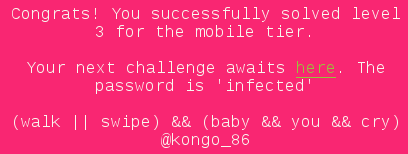
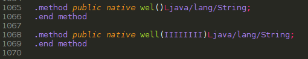
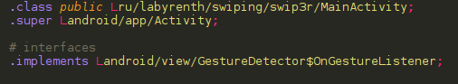
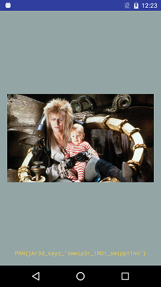

## LabyREnth CTF 2016
# Mobile 4 : Swip3r



Yay, it's another Android App!! My favourite :)

Same thing as the previous android app, I used apktool to decompile it to smali.

For some reason, apktool could not decode this app's resources file. So, use the '-r' flag to tell apktool to skip decoding resources

```
apktool d -r Swip3r.apk
```

There are only 2 smali files in the app directory. The one that we are interested in is "MainActivity.smali"

First of all, take note that there are 2 native functions 



I actually tried to reverse these functions in the "libswiping.so" file. However, on hindsight, there is actually no need to do that if you run the application in an emulator or real device. 

Another point to note is that this class implements the GestureListener



Therefore, let's look on the onFling handler function. This is where the interesting code are.

Once again, because this function is huge and long, I will just summarize what it does.

Using the x and y coordinates, thie method determines in which direction (up, down, left, right) did the user swipe on the screen. Based on the direction, the code behaves differently. We have to swipe in the correct order to get the flag.

I've reimplemented most of the swiping algorithm into a [php script](swipealgo.php)

```php
function swipeUp(){
	global $a,$b,$c,$d,$e,$f,$g,$h,$i,$j,$k,$l,$m,$n;

	if (($a == 0) && ($n == false)){
		$a = 1;
		$c = 0;
		$g = 4;
		$h = 0;
		$n = true;
		$d = 9;
	}

	if ($n == false){
		$a = 0xc; // 12
		$i = 0xd; // 13
		$f = 0x2e; // 46
		$e = 0x37; // 55
		$d = 5;
		$msg = well($h, $j, $b, $f, $l, $i, $e, $k);
		setText($msg);
	}

	if (($j == 0xf001) && ($b == ($l + 0xc))){
		if ($k == 0xb115){
			$l = 8;
			$b -= 18;
		}
		$msg = well($h, $j, $b, $f, $l, $i, $e, $k);
		setText($msg);
	}
	return true;
}

function swipeDown(){
	global $a,$b,$c,$d,$e,$f,$g,$h,$i,$j,$k,$l,$m,$n;

	if (($c == 1) && ($a == 2)){
		if ($d == 4){
			$c = 2;
			$a = 3;
			$f = 0xf411;
			$h = 0x38;
			$i = $h - 0x28;
			return true;
		}
		else return true;
	}

	if ($d == 9){
		$a = 10;
		$n = false;
		$a = 0x33;
		$m += 1;
		fail($m);
		return true;
	}

	$c = 0;
	$a = 0;
	$m += 1;
	fail($m);
	return true;
}

function swipeLeft(){
	global $a,$b,$c,$d,$e,$f,$g,$h,$i,$j,$k,$l,$m,$n;

	if (($a == 1) && ($n == true)){
		if (($g == 4) && ($h == 0)){
			$c = 1;
			$a = 2;
			$l = 7;
			$d = 4;
			return true;
		}
		else return true;
	}
	//cond_8
	$c = 0;
	$a = 0;
	$m += 1;
	fail($m);
	return true;
}

function swipeRight(){
	global $a,$b,$c,$d,$e,$f,$g,$h,$i,$j,$k,$l,$m,$n;

	if (($c == 2) && ($a == 3)){
		if ($f == 0xf411){
			$j = 0xf001;
			$k = 0xb115;
			$msg = decode($k);
			setText($msg);

			$h = 0x14d;
			$e = $h + 1;
			$b = 0x13;
			return true;
		}
		else return true;
	}
	else {
		// cond_a
		if (($a == 0x33) || ($l == 7)){
			// cond_b
			$f = 0x2d;
			$h = 0xde;
			$k = 0xbabe;
			$msg = well($h, $j, $b, $f, $l, $i, $e, $k);
			setText($msg);
			return true;
		}
		// cond_c
		$c = 0;
		$a = 0;
		$f = 9;
		$m += 1;
		fail($m);
		return true;
	}
}
```

Analyzing the values that are checked/changed during the swiping actions, I deduced that the correct order is **Up, Left, Down, Right, Up**

Now, install and run the apk in an emulator or real device and swipe the screens in that order to get the flag



The flag is **PAN{jAr3d_sayz_'swwip3r_!NO!_swipp11nn'}**

I've also included the ["MainActivity.smali"](MainActivity.smali) file with comments in certain parts.