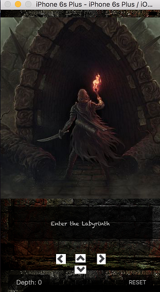
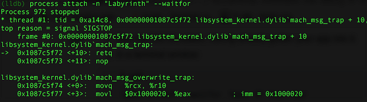
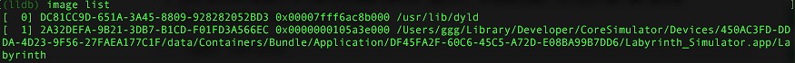
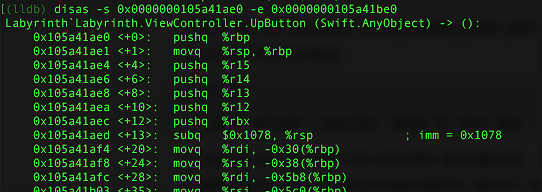
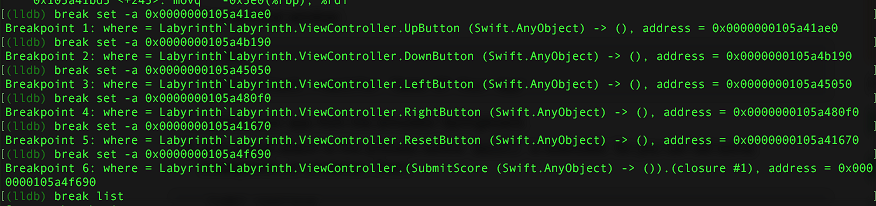
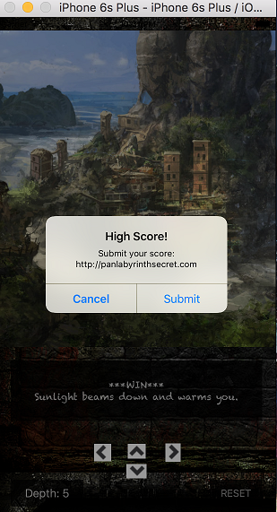

## LabyREnth CTF 2016
# Mobile 5 : IoGA (Labyrinth Maze)

Its another IOS App. I solved this by attaching a debugger and figuring out what the app is doing.

This writeup will be split in 3 parts. The first part will cover how to setup a debugger(lldb) to debug apps in the iOS Simulator. The second part will cover my analysis of what the app is doing. The last part will cover the solution on how to get the flag.

**Setting up Debugger**

This time round, we need to run this in the iOS Simulator. First of all, install XCode on a Mac and run ths iOS Simulator

Once the simulator is running, run the following command in a terminal to install the app

> xcrun simctl install booted (path to Labyrinth.Simulator.app)

Once installed, run the application to get a feel of what it is.




It is basically a maze game where you are trying to escape the maze. There are 4 arrow buttons (up, down, left, right) buttons on the screen. It would be good to be able to attach a debugger to see what these buttons do.

Before doing that, throw the x64 Simulator version of the executable into IDA Pro

Looking through the functions, there are actually several functions that seems to be the buttons' handlers


They are located at the following offsets from the image base
- UpButtonHandler (0x3AE0)
- DownButtonHandler (0xD190)
- LeftButtonHandler (0x7050)
- RightButtonHandler (0xA0F0)
- ResetButtonHandler (0x3670)
- SubmitScoreButtonHandler (0x11690)

Now, lets attach a debugger. I will be using lldb.

Restart the iOS Simulator but don't start the Labyrinth app yet. Open a terminal and type these commands

```
lldb
process attach -n "Labyrinth" --waitfor
```

This will cause lldb to wait for a process named "Labyrinth" to appear before attaching itself to it. 

Now start the Labyrinth app in the iOS Simulator and lldb should attach to it.



Now, let's set breakpoints in those handler functions

```
image list
```

This will show the base address where the Labyrinth app image was loaded. In this example run, it is loaded at 0x0000000105a3e000



Use the offsets above to calculate the address of functions. You can use disas to confirm your calculated address is correct (compare them against the code in IDA Pro)

```
disas -s 0x0000000105a41ae0 -e 0x0000000105a41be0
```



Set breakpoints at all 6 functions



Now, you are able to step through the code line by line to understand what the app is doing.

**What the App is doing**

This application is too complex to provide a step-by-step guide. Instead, I will summarize my analysis here.

I'll start by listing down some important variables that are used
- flintStones (Init-ed Flag)
- redPotions (Current Depth)
- bluePotions (Target Depth)
- kindlingWood (Complete Flag)
- sacredRunes (Storage for Treasure Texts)
- diamondJewels (Constant 8-byte String) (encrypted flag)
- poisonVials (Constant 8-byte String) (encrypted flag)

Next are some arrays of texts and images that will be used with a random number generator to select one of the text or image to display
- blankCanvas (RandomMessages_Up)
- broadSword (RandomMessages_Down)
- silverKnives (RandomMessages_Left)
- woodenStakes (RandomMessages_Right)
- herbalCharms (Tunnel Images)
- deathMsg (Death Messages)
- voodooDolls (Death Images)
- winMsg (Win Messages)
- goldChakra (Win Images)
- treasureMaps (Treasure Messages) * This is important

Upon the first 'Up' move, the app will initialize several values
- redPotions (Current Depth) to 0
- bluePotions (Target Depth) to a random number between 4 and 8
- set flintStones to true, kindlingWood to false

Each subsequent move (in any direction) would cause the following to happen
- Check for End Game conditon (redPotions >= bluePotions)
 - If Game Ends, go below to the Game End portion
- Increase redPotions (Current Depth) by 1
- Select a random message to display (selected from one of the RandomMessages array above based on the direction moved)
- Select a random image from herbalCharms to display
- Select 2 texts from treasureMaps array
 - Stores them in sacredRunes variable

Game Ends (when redPotions >= bluePotions)
- set kindlingWood (Complete Flag) to true
- if bluePotions % 3 != 0
 - Trigger Death (Shows a random death message and death image)
- if bluePotions % 3 == 0 (Remember bluePotions was generated randomly...)
 - Trigger Win (SubmitScore function is called) (go below for Win portion)

Win
- Retrieve the 2 texts stored in sacredRunes variable
- Create a URL in the following manner
 - 'http://pan' + sacredRunes + '.com'
- Make a HTTP request to the URL
- If there is a response, use the response to decrypt diamondJewels and poisonVials to get the flag



At any point in time, the "Reset" button can be clicked to reset the state to the beginning of the game.

**The Solution**

As you can see, the "winning" condition of this game is completely random. However that is not the important part. The important part is how the flag is decrypted.

From the "Win" section described above, a key to decrypt the flag is stored on a certain website that is generated using the texts in the treasureMaps array. This array contains 16 texts.

I wrote a [php script](soln_findkey.php) to generate all possible combinations of the URL to find the key.

```php
$treasures = array();
$treasures[] = strrev(base64_decode("bm9lZ251ZA==")); 	// dungeon
$treasures[] = strrev(base64_decode("aHRuaXJ5YmFs"));	// labyrinth
$treasures[] = strrev(base64_decode("bGl2ZQ=="));		// evil
$treasures[] = strrev(base64_decode("bGF0c3lyYw=="));	// crystal
$treasures[] = strrev(base64_decode("c2VkYWg="));		// hades
$treasures[] = strrev(base64_decode("ZWl3b2I="));		// bowie
$treasures[] = strrev(base64_decode("ZWNhcHM="));		// space
$treasures[] = strrev(base64_decode("ZXJ1c2FlcnQ="));	// treasure
$treasures[] = strrev(base64_decode("dG9vbA=="));		// loot
$treasures[] = strrev(base64_decode("dHNvbA=="));		// lost
$treasures[] = strrev(base64_decode("ZXphbQ=="));		// maze
$treasures[] = strrev(base64_decode("dGVyY2Vz"));		// secret

for ($a=0; $a<count($treasures); $a++){
	for ($b=0; $b<count($treasures); $b++){
		$url = "http://pan";
		$url .= $treasures[$a];
		$url .= $treasures[$b];
		$url .= ".com";
		
		$ch = curl_init();
		curl_setopt($ch, CURLOPT_URL, $url);
		curl_setopt($ch, CURLOPT_RETURNTRANSFER, 1);

		echo "Trying $url... \n";
		$res = curl_exec($ch);
		if ($res !== false){
			echo $res."\n";
			echo "from $url \n";
		}
		curl_close($ch);
	}
}
```

The key 'M4z3Cub3' was found on the domain http://panspacedungeon.com

This key is simply xored with the 2 8-byte constants stored in diamondJewels and poisonVials variable

This [php script](soln_decryptflag.php) does the decryption to retrieve the flag

```php
$key = array(ord('M'),ord('4'),ord('z'),ord('3'),ord('C'),ord('u'),ord('b'),ord('3'));
$msg1 = array(0x1d, 0x75, 0x34, 0x48, 0x4, 0x46, 0x16, 0x6c);
$msg2 = array(0x1e, 0x57, 0x12, 0x2, 0x25, 0x42, 0x1b, 0x4e);

$out = "";
for ($i=0; $i<8; $i++){
	$tmp = $msg1[$i] ^ $key[$i];
	$out .= chr($tmp);
}
for ($i=0; $i<8; $i++){
	$tmp = $msg2[$i] ^ $key[$i];
	$out .= chr($tmp);
}
echo $out."\n";
```

The flag is **PAN{G3t_Sch1f7y}**