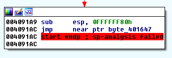
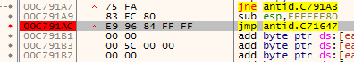
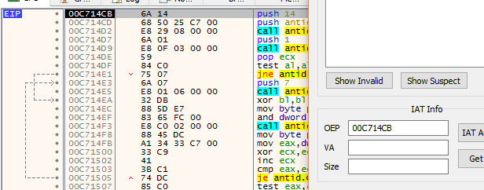
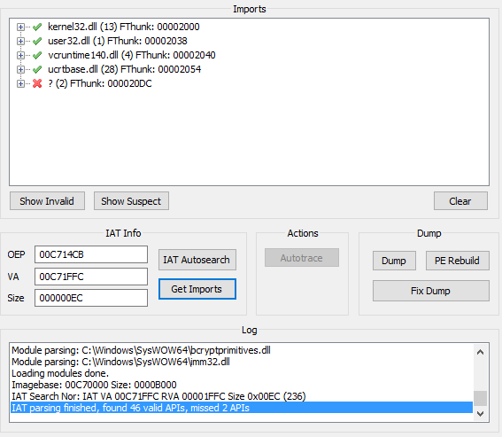
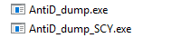
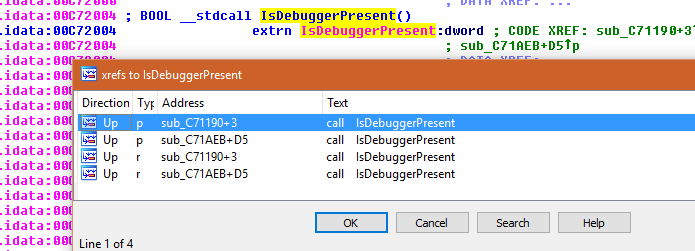
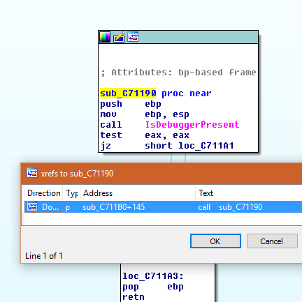
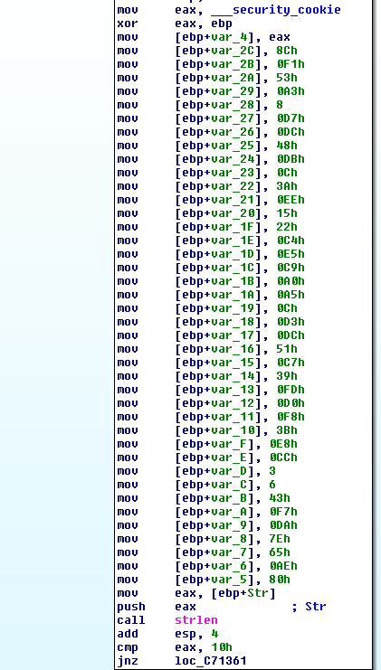
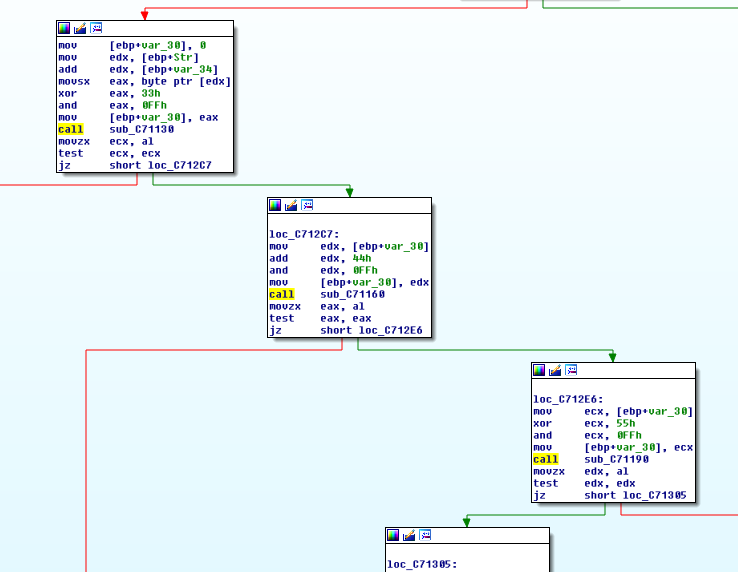
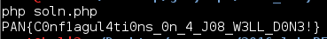

## LabyREnth CTF 2016
# Windows 1 : AntiD

First of all, let's throw the binary into IDA Pro.

IDA Pro complains about it and the resulting analysis only contains 1 function. This looks like the binary was packed (especially when the function ends with a tail jump).



Let's try to unpack it. I used x32dbg (From the x64dbg project) instead of olly because it comes with scylla pre-packed. You can use whichever debugger you are comfortable with. Do note, whichever debugger you use, it needs to have the capability to dump memory.

Start the debugger and put a breakpoint at the tail jump identified in IDA Pro. 



Run the debugger till the breakpoint and step over the tail jump. For this case, step over the call and take the next jump.

Now, dump the executable using syclla. If you are using x32dbg, scylla can be launched from "Plugins->Scylla"

Make sure the OEP field has the current EIP value. 



Now click "IAT Autosearch" and then "Get Imports". The windows should now be populated with some imported functions



Now, click "Dump" and saved the dumped executable somewhere. After that, click "Fix Dump" and select the previously dumped executable. A new executable with a prefix "_SCY" should be created.



Now, throw that "_scy" executable into IDA Pro. It should complain a little bit but once analysis is complete, you should be able to see the unpacked code

Look at the "Imported" functions tab. Notice that there a few anti debugger functions calls like "isDebuggerPresent" and "CheckRemoteDebuggerPresent"

Let's find some x-ref to "isDebuggerPresent" and examine them.



I took the first x-ref here.



X-ref this function again and go to the caller function

This function is interesting because it starts of by creating an array of values



This array is then passed through a series of xor/and/add operations. This looks like some kind of decoding function



I reimplmented the algorithm here into this [php script](soln.php)

```php
$encoded = array(
	0x8c,0xf1,0x53,0xa3, 0x08,0xd7,0xdc,0x48, 
	0xdb,0x0c,0x3a,0xee, 0x15,0x22,0xc4,0xe5,
	0xc9,0xa0,0xa5,0x0c, 0xd3,0xdc,0x51,0xc7,
	0x39,0xfd,0xd0,0xf8, 0x3b,0xe8,0xcc,0x03,
	0x06,0x43,0xf7,0xda, 0x7e,0x65,0xae,0x80);

$rollingKey = 0;
$out = array();
for ($i=0; $i<count($encoded); $i++){
	$cur = $encoded[$i];
	$tmp = $cur ^ ($rollingKey & 0xff);
	$tmp = ($tmp + 0x66) & 0xff;
	$tmp = ($tmp ^ 0x55) & 0xff;
	$tmp = ($tmp - 0x44) & 0xff;
	$tmp = ($tmp ^ 0x33) & 0xff;
	$out[] = $tmp;
	$rollingKey += $cur;
}

for ($i=0; $i<count($out); $i++){
	echo chr($out[$i]);
}
echo "\n";
```

Running the script yields the flag



The flag is **PAN{C0nf1agul4ti0ns_0n_4_J08_W3LL_D0N3!}**

