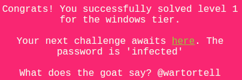
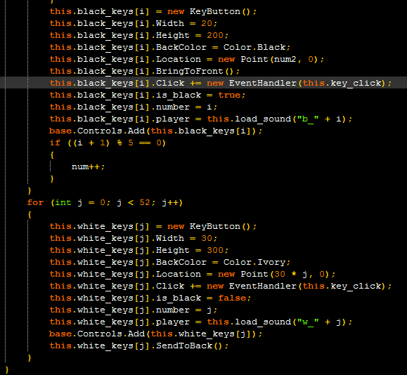
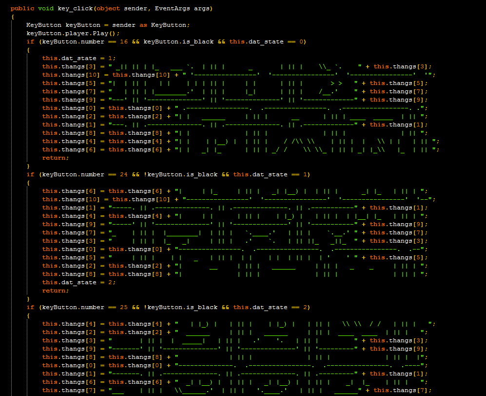
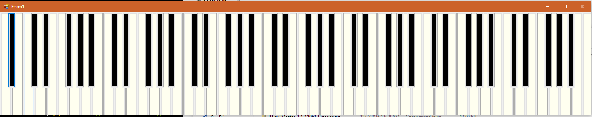
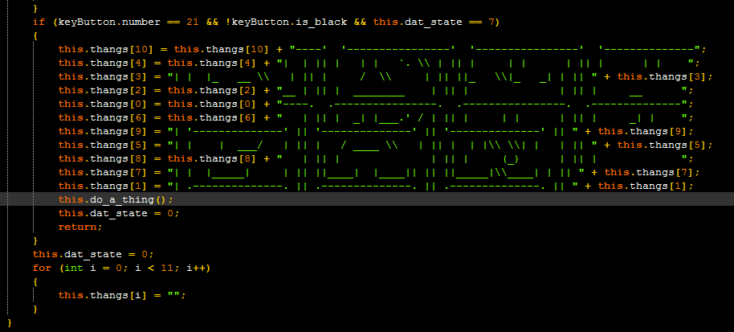
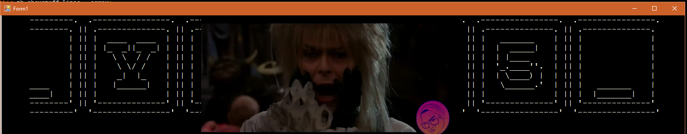
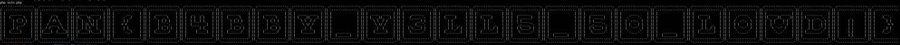

## LabyREnth CTF 2016
# Windows 2 : BabbySays



Throw the "BabbySay.exe" into IDA Pro and it identifies it as a .Net binary. 

In that case, I used ILSpy instead as ILSpy is able decompile .Net code

The interesting code is in the [Form1](form1.cs) class.

It first creates a bunch of "black" and "white" keys and assigned all of theirs' onClick event handler to the "key_click" function



The "key_click" function then checks for certain conditions and creates some kind of ascii art



If you run the executable file, you will understand this better. Once run, the execuable presents a piano UI



Looking at the code in the "key_click" function, it seems like it is listening for a specific series of 8 key presses before it calls the "do_a_thing" function. (the "dat_state" variable keeps track of the current state of the key-presses)



The correct sequence of keys is as follows (Keys are numbered starting from 0)
- Black[16]
- White[24]
- White[25]
- White[21]
- Black[16]
- White[24]
- White[25]
- White[21]

Once the correct sequence of keys is entered, the following is displayed



A music video starts playing and the flag is shown moving in the background.

In order to make reading the flag easier, I re-implemented the "ascii art" portion of the code into this [php script](soln.php)

```php
// create 11 lines
$lines = array();
for ($i=0; $i<11; $i++) $lines[] = '';

$lines[3] = " _|| || | |_   ___ `.  | || |      _       | || |    \\_ `.    " . $lines[3];
$lines[10] = $lines[10] . " '----------------'  '----------------'  '----------------'  '";
$lines[5] = "|  | || |   | |    | | | || |     | |      | || |       > >   " . $lines[5];
$lines[7] = "   | || | |________.'  | || |     |_|      | || |    /__.'    " . $lines[7];
$lines[9] = "---' || '--------------' || '--------------' || '-------------" . $lines[9];
$lines[0] = $lines[0] . " .----------------.  .----------------.  .-----------------. .";
$lines[2] = $lines[2] . "| |   ______     | || |      __      | || | ____  _____  | || ";
$lines[1] = "---. || .--------------. || .--------------. || .-------------" . $lines[1];
$lines[8] = $lines[8] . "| |              | || |              | || |              | || ";
$lines[4] = $lines[4] . "| |    | |__) |  | || |    / /\\ \\    | || |  |   \\ | |   | || ";
$lines[6] = $lines[6] . "| |   _| |_      | || | _/ /    \\ \\_ | || | _| |_\\   |_  | || ";

$lines[6] = $lines[6] . "|     | |_     | || |   _| |__) |  | || |      _| |_   | || | ";
$lines[10] = $lines[10] . "----------------'  '----------------'  '----------------'  '--";
$lines[1] = "-----. || .--------------. || .--------------. || .-----------" . $lines[1];
$lines[4] = $lines[4] . "|     | |      | || |    | |_) |   | || |  | |__| |_   | || | ";
$lines[9] = "-----' || '--------------' || '--------------' || '-----------" . $lines[9];
$lines[7] = "_    | || |  |________|  | || |   `.____.'   | || |    `.__.' " . $lines[7];
$lines[3] = "     | || |  |_   _|     | || |   .'    `.   | || ||_   _||_  " . $lines[3];
$lines[0] = $lines[0] . "----------------.  .----------------.  .----------------.  .--";
$lines[5] = "     | || |    | |   _   | || |  | |    | |  | || |  | '    ' " . $lines[5];
$lines[2] = $lines[2] . "|       __     | || |   ______     | || |   _    _     | || | ";
$lines[8] = $lines[8] . "|              | || |              | || |              | || | ";

$lines[4] = $lines[4] . "   | |_) |   | || |    | |_) |   | || |   \\ \\  / /   | || |   ";
$lines[2] = $lines[2] . "  ______     | || |   ______     | || |  ____  ____  | || |   ";
$lines[3] = "       | || |  |  _____|   | || |   .'    '.   | || |         " . $lines[3];
$lines[9] = "-------' || '--------------' || '--------------' || '---------" . $lines[9];
$lines[8] = $lines[8] . "             | || |              | || |              | || |  |";
$lines[0] = $lines[0] . "--------------.  .----------------.  .----------------.  .----";
$lines[1] = "-------. || .--------------. || .--------------. || .---------" . $lines[1];
$lines[6] = $lines[6] . "  _| |__) |  | || |   _| |__) |  | || |    _|  |_    | || |   ";
$lines[7] = "___    | || |   \\______.'  | || |   '.____.'   | || |   ______" . $lines[7];
$lines[10] = $lines[10] . "--------------'  '----------------'  '----------------'  '----";
$lines[5] = "       | || |  '_.____''.  | || |  | |    | |  | || |         " . $lines[5];

$lines[2] = $lines[2] . "           | || |  ____  ____  | || |    ______    | || |   __";
$lines[9] = "---------' || '--------------' || '--------------' || '-------" . $lines[9];
$lines[3] = "  _|     | || |  |_   _|     | || |  |  _____|   | || |       " . $lines[3];
$lines[8] = $lines[8] . "_______|   | || |              | || |              | || |     ";
$lines[10] = $lines[10] . "------------'  '----------------'  '----------------'  '------";
$lines[7] = "______|  | || |  |________|  | || |   \\______.'  | || |   ____" . $lines[7];
$lines[0] = $lines[0] . "------------.  .----------------.  .----------------.  .------";
$lines[5] = " |   _   | || |    | |   _   | || |  '_.____''.  | || |       " . $lines[5];
$lines[4] = $lines[4] . "           | || |   \\ \\  / /   | || |   `'  __) |  | || |    |";
$lines[1] = "---------. || .--------------. || .--------------. || .-------" . $lines[1];
$lines[6] = $lines[6] . "           | || |    _|  |_    | || |  | \\____) |  | || |   _|";

$lines[7] = "_______    | || |   |______|   | || |   \\______.'  | || |  |__" . $lines[7];
$lines[5] = "           | || |    \\ \\/ /    | || |   _  |__ '.  | || |    |" . $lines[5];
$lines[6] = $lines[6] . " |__/ |  | || |   _| |__/ |  | || |  | \\____) |  | || |       ";
$lines[4] = $lines[4] . " |       | || |    | |       | || |  | |____     | || |       ";
$lines[2] = $lines[2] . "___      | || |   _____      | || |   _______    | || |       ";
$lines[10] = $lines[10] . "----------'  '----------------'  '----------------'  '--------";
$lines[8] = $lines[8] . "         | || |              | || |              | || |  |____";
$lines[3] = "           | || | |_  _||_  _| | || |   / ____ `.  | || |  |_ " . $lines[3];
$lines[1] = "-----------. || .--------------. || .--------------. || .-----" . $lines[1];
$lines[9] = "-----------' || '--------------' || '--------------' || '-----" . $lines[9];
$lines[0] = $lines[0] . "----------.  .----------------.  .----------------.  .--------";

$lines[1] = "-------------. || .--------------. || .--------------. || .---" . $lines[1];
$lines[8] = $lines[8] . "___|   | || |              | || |              | || |  |______";
$lines[7] = " |_______/   | || |  |_______/   | || |   |______|   | || |   " . $lines[7];
$lines[9] = "-------------' || '--------------' || '--------------' || '---" . $lines[9];
$lines[3] = " |_   _ \\    | || |  |_   _ \\    | || | |_  _||_  _| | || |   " . $lines[3];
$lines[10] = $lines[10] . "--------'  '----------------'  '----------------'  '----------";
$lines[2] = $lines[2] . "       | || |   _______    | || |     ____     | || |         ";
$lines[5] = "   |  __'.   | || |    |  __'.   | || |    \\ \\/ /    | || |   " . $lines[5];
$lines[6] = $lines[6] . "       | || |  | \\____) |  | || |  |  `--'  |  | || |         ";
$lines[4] = $lines[4] . "       | || |  | |____     | || |  |  .--.  |  | || |         ";
$lines[0] = $lines[0] . "--------.  .----------------.  .----------------.  .----------";

$lines[6] = $lines[6] . "     | || |   _| |__/ |  | || |  \\  `--'  /  | || |   \\ `--' /";
$lines[3] = "|     .' _/    | || |  |_   _ \\    | || |  | |  | |    | || | " . $lines[3];
$lines[2] = $lines[2] . "     | || |   _____      | || |     ____     | || | _____  ___";
$lines[5] = "|    < <       | || |    |  __'.   | || |  |____   _|  | || | " . $lines[5];
$lines[10] = $lines[10] . "------'  '----------------'  '----------------'  '------------";
$lines[8] = $lines[8] . "_|   | || |              | || |              | || |           ";
$lines[1] = ".--------------. || .--------------. || .--------------. || .-" . $lines[1];
$lines[9] = "'--------------' || '--------------' || '--------------' || '-" . $lines[9];
$lines[4] = $lines[4] . "     | || |    | |       | || |  /  .--.  \\  | || |  | |    | ";
$lines[7] = "|     `.__\\    | || |  |_______/   | || |     |_____|  | || | " . $lines[7];
$lines[0] = $lines[0] . "------.  .----------------.  .----------------.  .------------";

$lines[10] = $lines[10] . "----'  '----------------'  '----------------'  '--------------";
$lines[4] = $lines[4] . "|  | || |   | |   `. \\ | || |     | |      | || |      | |    ";
$lines[3] = "| |  |_   __ \\   | || |     /  \\     | || ||_   \\|_   _| | || " . $lines[3];
$lines[2] = $lines[2] . "__ | || |  ________    | || |              | || |     __      ";
$lines[0] = $lines[0] . "----.  .----------------.  .----------------.  .--------------";
$lines[6] = $lines[6] . "   | || |  _| |___.' / | || |     | |      | || |     _| |    ";
$lines[9] = "| '--------------' || '--------------' || '--------------' || " . $lines[9];
$lines[5] = "| |    |  ___/   | || |   / ____ \\   | || |  | |\\ \\| |   | || " . $lines[5];
$lines[8] = $lines[8] . "   | || |              | || |     (_)      | || |             ";
$lines[7] = "| |  |_____|     | || ||____|  |____|| || ||_____|\\____| | || " . $lines[7];
$lines[1] = "| .--------------. || .--------------. || .--------------. || " . $lines[1];

for ($i=0; $i<count($lines); $i++){
	echo $lines[$i]."\n";
}
```

Running it will reveal the flag (remember to zoom out) 



The flag is **PAN{B4BBY_Y3LL5_5O_LOUD!}**