## LabyREnth CTF 2016
# Windows 3 : Squirtle

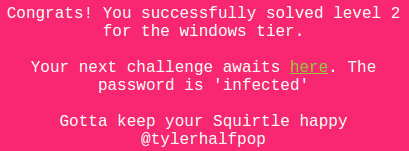

Let's throw the binary "SquirtleChallenge.exe" into IDA Pro and see what we get.

There are quite a number of interesting strings, one of which says "If you kept your Squirtle Pokemon happy then there is a suprise written inside answer.jpg"

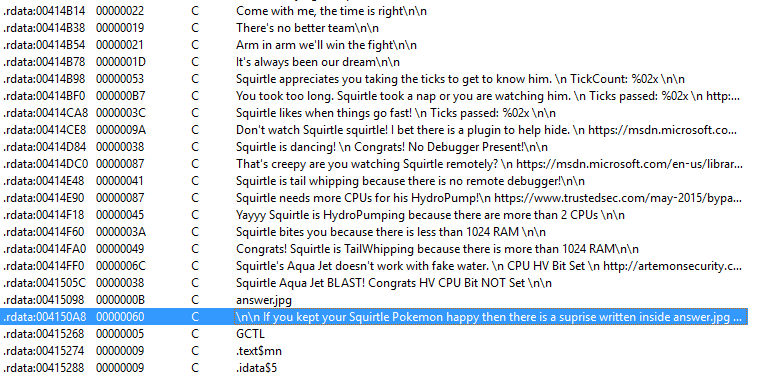

Do a x-ref check on it and it will lead to a huge function. Below is the graph overview of this function

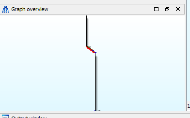

The ending straight parts of this function basically creates a huge array of values and then passes them through some kind of xor arithmetic decoding loop. I highly suspect that this is where the flag is decrypted.

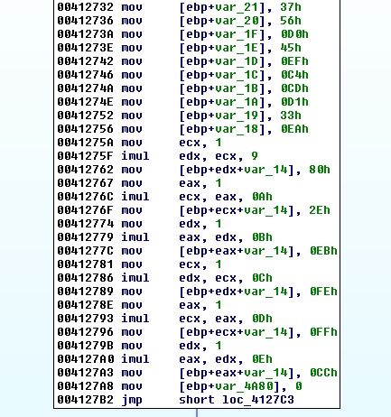

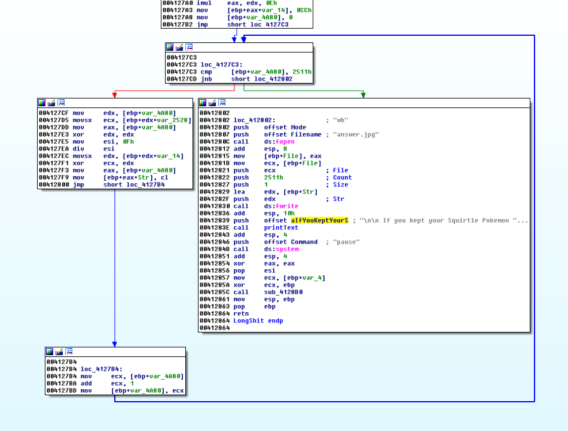

Let's look at the portion of code just before the above "flag array" was created. It basically contains a series of checks and based on the results of this checks, a specific string is displayed and some variable values are set.

Based on the previous string ("If you kept your Squirtle Pokemon happy then there is a suprise written inside answer.jpg"), the correct path should be the path that makes Squirtle happy. Looking at each check, there is only one string that outright suggests that Squirtle is happy.

Reversing these checking functions reveals the following checks in order
- User input (input "incorrect" as the password)
- checkOlly (checks if any window name contains the string "Olly")
- checkPEBDebuggerBit (checks the PEB Debugged bit)
- checkTimePart1 (Tick count must be > 0xfffff)

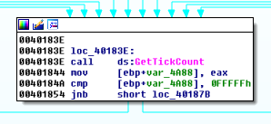

- checkTimePart2 (Sleep 0x3e8 seconds, then time difference from previous tick count < 0xff)


- isDebuggerPresent (calls the isDebuggerPresent function)
- checkRemoteDebugger (checks if a remote debugger is attached)
- checkNumProcessors (checks that there are at least 2 CPUs)
- checkRam (checks that there are at elast 1GB of RAM)
- checkHyperVisorBit (checks if system is running as a Virtual Machine)

As you can see, it is not possible to meet all these conditions in a normal run.

Let's use a debugger to dynamically change the return values of these checks as we go. Do note you can change the values in the registers by double-clicking them in the debugger and changing them to whatever values you want.

I used x32dbg of the x64dbg project. Let's put a breakpoint at the start of this function (offset 0x11d0)

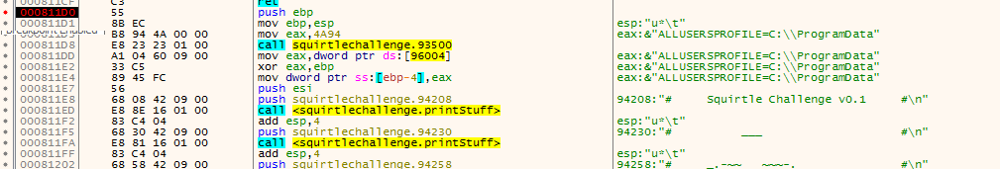

Put another breakpoint at the call to the first check (user input check) (offset 0x1070)

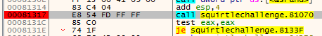

Enter the text "incorrect" to pass the first check

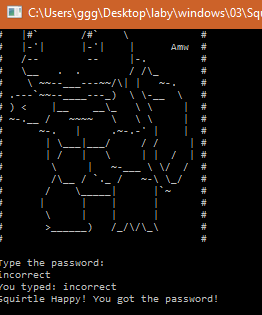

The next check checks for a window name containing the string "Olly". Change eax return value to "0" to pass this test

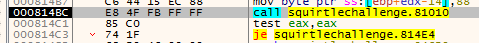

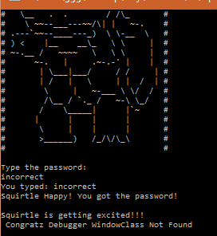

The next check checks the debugger bit in the PEB. However, this time round, change eax return value to "1" to pass this test

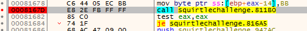

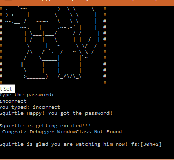

Now, for the 2 part time check. Firstly, the initial tick count has to be > 0xfffff which it should in a normal run

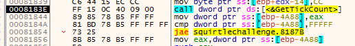

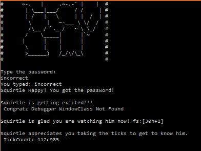

Secondly, change the pushed value to "1" (change the value on the stack after it was pushed) so that it will only sleep for 1 second

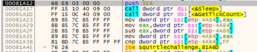

Thirdly, after the sub instruction, change the eax value to less than 0xff (I used 0xf0)

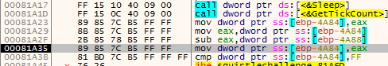

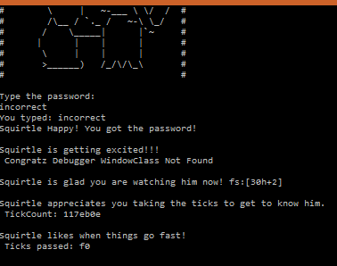

The next check calls the isDebuggerPresent function. Change eax return value to "0" to pass the test

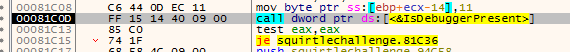

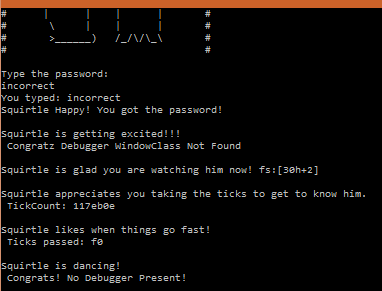

The next check checks for a remote debugger. Change the eax return value to "0" to pass the test

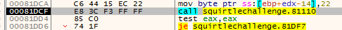

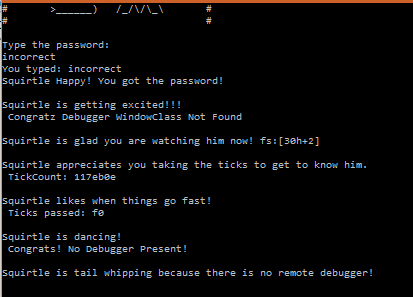

The next check checks if there is at least 2 CPU present. Change the eax return value to "0" to pass the test

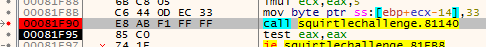

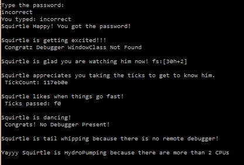

The next check checks if there is at least 1024MB of RAM present. Change the eax return value to "0" to pass the test

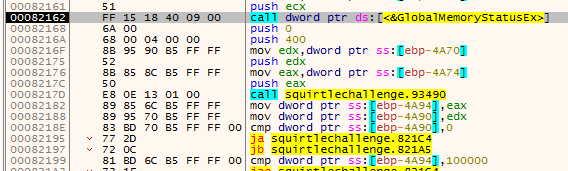

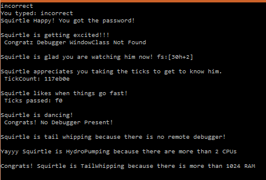

The next check checks whether the HyperVisor bit is set (whether the system is running as a VM). Change the eax return value to "0" to pass the test

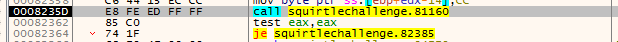

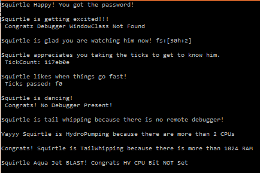

That was the last check. Let the debugger run to the end and the following message should be displayed.

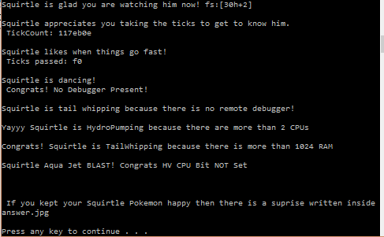

Press any key to quit the application and an "answer.jpg" file should be created in the directory

The jpg file looks like this

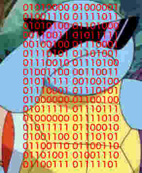

I wrote a [php script](soln.php) to decode the binary string into a ascii string.

```php
$bin = array(
	"01010000","01000001",
	"01001110","01111011",
	"01010100","01101000",
	"00110011","01011111",
	"00100100","01110001",
	"01110101","01101001",
	"01110010","01110100",
	"01001100","00110011",
	"01011111","00100100",
	"01110001","01110101",
	"01000000","01100100",
	"01011111","01110111",
	"01000000","01111010",
	"01011111","01100010",
	"01001100","01110101",
	"01100110","01100110",
	"01101001","01001110",
	"01100111","01111101"
);

$out = '';
for ($i=0; $i<count($bin); $i++){
	$cur = $bin[$i];
	$dec = bindec($cur);
	$out .= chr($dec);
}
echo $out."\n";
```

Running it will reveal the flag

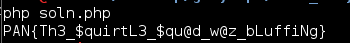

The flag is **PAN{Th3_$quirtL3_$qu@d_w@z_bLuffiNg}**