## LabyREnth CTF 2016
# Windows 4 : JugsOfBeer

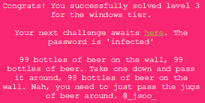

Normally, I would not recommend running any challenge binary when you have no idea what it does. But, in this case, I could not find any interesting leads from static analysis. Thus, I ran the binary. (Remember to run it on a disposable machine or VM)

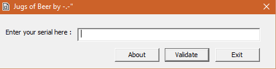

I entered some random characters into the textbox and clicked validate

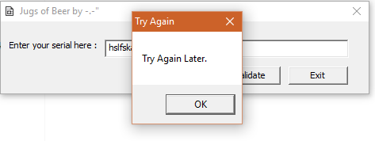

A messagebox appeared. It is very likely the interesting code is in the onclick handler of the "Validate" button. From this, we know that a MessageBox is created as a result of the click event. Let's trace from there.

Throw the binary into IDA Pro and view the imports, looking for MessageBox function

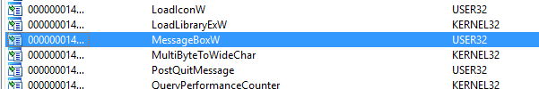

Do a x-ref on it and it will lead us to a huge function (Offset 0x1280). Take note of the different text being passed to the MessageBox function

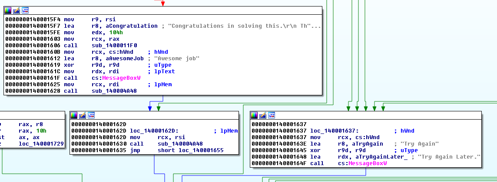

The messagebox we saw showed the message "Try Again". There are multiple back links from this code blob. Try to find the earliest one and take note of the offset (0x147a)

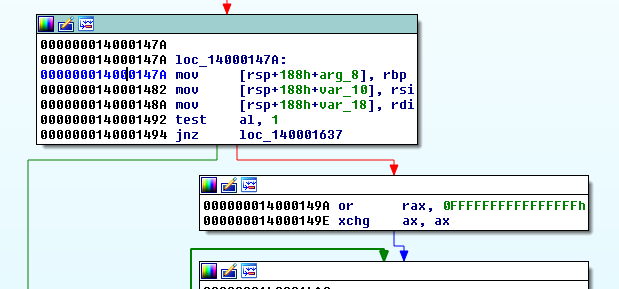

Run the binary in a debugger and set the breakpoint at the offset found above. This breakpoint will only be triggered when the validate button is pressed.

Let's enter some dummy data "aaaabbbbccccdddd" and click validate. The breakpoint should be hit. Now, it is possible to step through the code and figure out what is happening.

Firstly, the length of the input is checked to be at least 0x20 (32) characters long

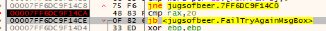

Next, each character of the input is AND-ed against 0xffff....cf . The result is then compared and has to be less than or equal to 2.

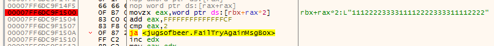

Testing this operation with a variety of characters reveals that it will only accept the characters '1', '2' and '3'. If there are any other characters, it will jump to the failure state. 

Let's change our testing input to "12312312312312312312312312312312". 

After passing the checks, the code loops through the input, processing 2 characters each time. These 2 characters are compared against each other. Let's call them 'XY'

If they are the same (X == Y), nothing happens and the loop carry on to the next iterations

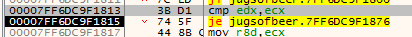

If they are different, the 2nd character (Y) is checked.
- if Y == 1, r10d = 0x13
- if Y == 2, r10d = 0xD
- if Y == 3, r10d = 0x7

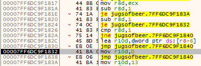

Some arithmetic operations are then carrid out on r10d value and an array stored at r8. 

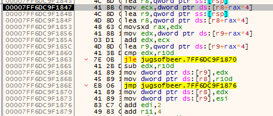

To better illustrate what the code is doing, let's call the array at r8 "Jugs", the pair of characters being processed 'X' and 'Y' and the r10d value as 'FULL'

```
If Jugs[Y] >= FULL, nothing happens and loop continues to next pair of characters
If Jugs[Y] < FULL,
	Jugs[Y] += Jugs[X]
	If Jugs[Y] <= FULL, Jugs[X] = 0
	If Jugs[Y] > FULL, Jugs[Y] = FULL and Jugs[X] = Jugs[Y] - FULL
```

Can you see what this resembles? It is the classic [Jugs of Water](https://en.wikipedia.org/wiki/Liquid_water_pouring_puzzles) problem. In this case, there are 3 Beer Jugs with capacity of [19, 13, 7]. The missing information that is needed to solve this problem is the initial state of the jugs and the final target state.

The initial state can be gotten by inspecting the jugs array space before any pouring operation takes place. The picture below shows that intial state as [0, 13, 7]

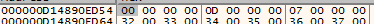

Looking at the code just before the ret shows that the target end state is [10, 10, 0]. (rsp+4 is pointing to the "jugs" array)

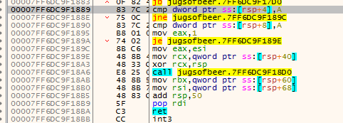

With these information on hand, I solved the problem the old-fashioned way...

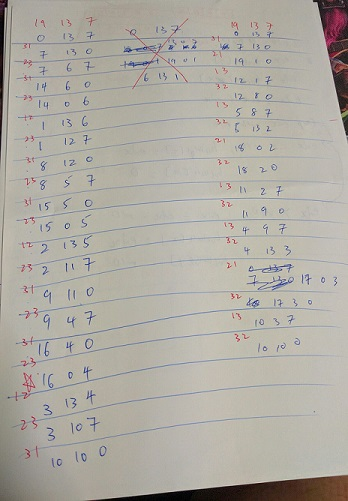

The correct solution is the one on the right. 

Input the correct sequence "31211332133221321332133221321332" into the program and the flag will be revealed

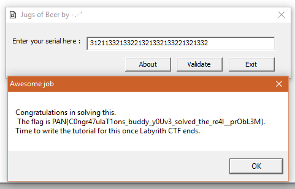

The flag is **PAN{C0ngr47ulaT1ons_buddy_y0Uv3_solved_the_re4l__prObL3M}**